```mermaid
flowchart TB
    subgraph DataSources["📥 Data Sources"]
        EP["🖥️ Endpoint Telemetry"]
        NW["🌐 Network Logs"]
        FW["🔥 NGFW Logs"]
        CL["☁️ Cloud Audit Logs"]
        ID["👤 Identity/Auth Logs"]
    end
    
    subgraph Platform["🏢 Cortex Platform"]
        XDR["Cortex XDR"]
        XSIAM["Cortex XSIAM"]
    end
    
    subgraph XQLEngine["⚙️ XQL Engine"]
        QP["Query Parser"]
        OPT["Optimizer"]
        EXE["Executor"]
    end
    
    subgraph Outputs["📊 Use Cases"]
        TH["🎯 Threat Hunting"]
        IR["🚨 Incident Response"]
        DE["🛡️ Detection Engineering"]
        DA["📈 Dashboards & Reports"]
    end
    
    EP --> XDR
    NW --> XDR
    FW --> XSIAM
    CL --> XDR
    CL --> XSIAM
    ID --> XDR
    ID --> XSIAM
    
    XDR --> XQLEngine
    XSIAM --> XQLEngine
    
    XQLEngine --> Outputs
```

```mermaid
flowchart LR
    DS["📦 Dataset"] --> F1["🔍 Filter"]
    F1 --> A["🔧 Alter"]
    A --> C["📊 Comp"]
    C --> F2["📋 Fields"]
    F2 --> S["↕️ Sort"]
    S --> L["✂️ Limit"]
    L --> R["✅ Results"]
    
    style DS fill:#e3f2fd
    style R fill:#c8e6c9
```

```mermaid
flowchart LR
    subgraph Query1["Process Events"]
        P1["Process Data<br/>agent_hostname<br/>action_process_pid"]
    end
    
    subgraph Query2["Network Events"]
        N1["Network Data<br/>agent_hostname<br/>local_process_pid"]
    end
    
    P1 --> J{"🔗 JOIN<br/>on matching<br/>keys"}
    N1 --> J
    
    J --> R["Correlated Results<br/>Process + Network"]
    
    style J fill:#fff3e0
```

```mermaid
flowchart TB
    subgraph XDR["🔵 Cortex XDR Datasets"]
        xdr["xdr_data<br/><i>All Telemetry</i>"]
        proc["process_event_data"]
        file["file_event_data"]
        reg["registry_event_data"]
        net["network_story"]
        cloud["cloud_audit_logs"]
        auth["auth_identity"]
    end
    
    subgraph XSIAM["🟣 XSIAM Additional Datasets"]
        traffic["panw_ngfw_traffic_raw"]
        threat["panw_ngfw_threat_raw"]
        url["panw_ngfw_url_raw"]
        wf["panw_ngfw_wildfire_raw"]
        gp["panw_ngfw_globalprotect_raw"]
        uid["panw_ngfw_userid_raw"]
        decrypt["panw_ngfw_decryption_raw"]
    end
    
    subgraph Normalized["📐 Normalized Datamodels"]
        dm_net["datamodel_network"]
        dm_auth["datamodel_authentication"]
        dm_proc["datamodel_process"]
        dm_file["datamodel_file"]
    end
    
    xdr --> proc
    xdr --> file
    xdr --> reg
    xdr --> net
    
    traffic --> dm_net
    threat --> dm_net
    auth --> dm_auth
    gp --> dm_auth
    proc --> dm_proc
    file --> dm_file
```

```mermaid
flowchart TB
    subgraph Investigation["🔍 Cross-Dataset Investigation Flow"]
        A["🚨 NGFW Threat Alert<br/>src_ip: 192.168.1.100"]
        B["📊 Traffic Logs<br/>Session Details"]
        C["🌐 URL Logs<br/>Web Activity"]
        D["🖥️ Endpoint Telemetry<br/>Process/File Activity"]
        E["👤 User-ID<br/>User Identity"]
        F["🔐 GlobalProtect<br/>VPN Context"]
    end
    
    A --> B
    A --> C
    B --> D
    E --> D
    F --> D
    
    D --> G["📋 Complete Attack Picture"]
    
    style G fill:#c8e6c9
```

```mermaid
flowchart TB
    subgraph Phase1["1️⃣ Detection & Triage"]
        A["🚨 Alert Received"]
        B["📋 Initial Assessment"]
        C["🎯 Scope Determination"]
    end
    
    subgraph Phase2["2️⃣ Investigation"]
        D["📅 Timeline Building"]
        E["🌳 Process Tree Analysis"]
        F["🌐 Network Analysis"]
        G["🔒 Persistence Check"]
        H["👤 User Activity Review"]
    end
    
    subgraph Phase3["3️⃣ Containment"]
        I["🔌 Isolate Systems"]
        J["🚫 Block IOCs"]
        K["🔑 Disable Accounts"]
    end
    
    subgraph Phase4["4️⃣ Recovery"]
        L["✅ Verify Clean"]
        M["🔓 Restore Access"]
        N["👁️ Enhanced Monitoring"]
    end
    
    A --> B --> C
    C --> D --> E --> F --> G --> H
    H --> I --> J --> K
    K --> L --> M --> N
```

```mermaid
flowchart TB
    subgraph ProcessTree["Process Tree Example"]
        A["explorer.exe<br/>PID: 1234<br/>👤 User Shell"]
        B["outlook.exe<br/>PID: 2345<br/>📧 Email Client"]
        C["winword.exe<br/>PID: 3456<br/>📄 Opened Attachment"]
        D["powershell.exe<br/>PID: 4567<br/>⚠️ Macro Executed"]
        E["whoami.exe<br/>PID: 5678<br/>🔍 Discovery"]
        F["net.exe<br/>PID: 6789<br/>🔍 Enumeration"]
        G["cmd.exe<br/>PID: 7890<br/>💀 C2 Shell"]
    end
    
    A --> B
    B --> C
    C --> D
    D --> E
    D --> F
    D --> G
    
    style D fill:#ffcdd2
    style E fill:#fff3e0
    style F fill:#fff3e0
    style G fill:#ffcdd2
```

```mermaid
flowchart LR
    subgraph RuleTypes["Detection Rule Types"]
        BIOC["🎯 BIOC<br/>Behavioral IOC"]
        ABIOC["📊 Analytics BIOC<br/>Statistical Detection"]
        CORR["🔗 Correlation Rule<br/>XSIAM Only"]
    end
    
    subgraph Triggers["Trigger Types"]
        RT["⚡ Real-time<br/>Per-event evaluation"]
        SCHED["⏰ Scheduled<br/>Periodic execution"]
    end
    
    BIOC --> RT
    ABIOC --> SCHED
    CORR --> SCHED
```

```mermaid
flowchart TB
    subgraph Optimization["⚡ Performance Optimization"]
        T["⏰ Time Filters First"]
        F["🎯 Specific Filters Early"]
        I["📊 Index-Friendly Patterns"]
        A["🔢 Aggregate Before Join"]
        L["✂️ Limit Results"]
    end
    
    T --> F --> I --> A --> L
```

# XQL Mastery Guide

## Cortex XDR & XSIAM Query Language for DFIR, Threat Hunting, and Incident Response

**Version:** 2.1 (Corrected) | **Last Updated:** January 2026 | **Author:** Raymond DePalma  
**Course:** AI for the Win | **License:** CC BY-NC-SA 4.0

A comprehensive reference for security practitioners using Palo Alto Networks Cortex XDR and XSIAM platforms. This guide covers fundamental query syntax through advanced threat hunting patterns, NGFW log analysis, and DFIR investigation workflows.

> ⚠️ **Dataset Availability Notes:**
> - `panw_ngfw_*` datasets are **XSIAM-only** and not available in standalone Cortex XDR
> - `process_event_data` and `file_event_data` are endpoint-agent datasets requiring XDR agent deployment
> - `cloud_audit_logs` requires cloud connector configuration
> - Function names may vary slightly between XDR and XSIAM versions—test in your environment

---

## Table of Contents

1. [Introduction to XQL](#1-introduction-to-xql)
2. [Query Fundamentals](#2-query-fundamentals)
3. [Dataset Reference](#3-dataset-reference)
4. [NGFW Log Analysis](#4-ngfw-log-analysis)
5. [Threat Hunting Queries](#5-threat-hunting-queries)
6. [DFIR Investigation Workflows](#6-dfir-investigation-workflows)
7. [Detection Engineering](#7-detection-engineering)
8. [MITRE ATT&CK Mapping](#8-mitre-attck-mapping)
9. [Performance Optimization](#9-performance-optimization)
10. [Quick Reference](#10-quick-reference)

---

## 1. Introduction to XQL

XQL (XDR Query Language) is Palo Alto Networks' query language for Cortex XDR and XSIAM platforms. It provides a unified interface for searching, correlating, and analyzing security telemetry across endpoints, network, cloud, and identity data sources.

### XQL in the Security Stack



### XDR vs. XSIAM: Key Differences

| Capability            | Cortex XDR                         | Cortex XSIAM                                    |
| --------------------- | ---------------------------------- | ----------------------------------------------- |
| **Primary Focus**     | Endpoint Detection & Response      | Security Operations Platform                    |
| **Data Ingestion**    | Agent-based endpoint telemetry     | Any log source via ingestion pipelines          |
| **NGFW Integration**  | Limited (alerts only)              | Full log ingestion (traffic, threat, URL, etc.) |
| **Datasets**          | xdr_data, process_event_data, etc. | All XDR datasets + panw_ngfw_*, datamodel_*     |
| **Correlation Rules** | BIOCs, Analytics BIOCs             | BIOCs + Correlation Rules + XSOAR playbooks     |
| **Storage**           | 30-180 days typical                | Configurable hot/warm/cold tiers                |

### When to Use XQL

XQL enables you to answer critical security questions across your environment:

| Use Case                  | Example Question                                                                    |
| ------------------------- | ----------------------------------------------------------------------------------- |
| **Threat Hunting**        | "Show me all PowerShell executions with encoded commands in the last 7 days"        |
| **Incident Response**     | "Build a timeline of all activity on WORKSTATION01 between 2:00 AM and 4:00 AM"     |
| **Detection Engineering** | "Find all processes spawned by Office applications that make network connections"   |
| **NGFW Analysis**         | "Identify hosts communicating with newly registered domains over the last 24 hours" |

---

## 2. Query Fundamentals

### Basic Query Structure

Every XQL query follows a pipeline pattern where data flows through a series of stages, each transforming or filtering the data. Think of it like an assembly line where raw data enters, gets processed through multiple stations, and emerges as refined results.



```xql
// Basic query structure - each stage processes output from the previous stage
dataset = <dataset_name>          // 1. Select data source
| filter <conditions>             // 2. Filter rows (WHERE clause)
| alter <new_field> = <expr>      // 3. Create/modify fields (calculated columns)
| comp <aggregation> by <field>   // 4. Aggregate data (GROUP BY)
| fields <field_list>             // 5. Select columns to return
| sort <field> desc               // 6. Order results
| limit 100                       // 7. Limit output rows
```

### Filter Operators

Filters are the foundation of every query. They determine which records flow through to subsequent stages. Understanding all available operators enables precise data selection.

#### Comparison Operators

```xql
// Equality and inequality - exact matching
| filter action_process_image_name = "powershell.exe"
| filter action_process_image_name != "explorer.exe"

// Numeric comparisons - for PIDs, sizes, counts
| filter action_process_pid > 1000
| filter action_file_size >= 1048576        // Files 1 MB or larger
| filter event_severity <= 3                 // Low severity events only

// String contains - case-insensitive partial matching
| filter action_process_image_name contains "power"
| filter action_process_command_line contains "http"

// String prefix/suffix matching with regex
| filter action_file_name ~= "^report"       // Starts with "report"
| filter action_file_name ~= "\\.exe$"       // Ends with ".exe" (note double backslash)

// Full regular expression patterns
| filter action_process_image_name ~= "^(cmd|powershell|pwsh)\\.exe$"
| filter action_process_command_line ~= "(?i)invoke-expression"  // (?i) = case-insensitive
```

> **Regex Escaping Note:** In XQL strings, backslashes must be double-escaped. To match a literal `.`, use `\\.` in your pattern.

#### List Operations

Working with lists allows you to check multiple values efficiently, which is essential when hunting for known-bad processes, ports, or IOCs.

```xql
// IN operator - match any value in the list
| filter action_process_image_name in ("cmd.exe", "powershell.exe", "wscript.exe")
| filter dst_port in (80, 443, 8080, 8443)

// NOT IN - exclude known-good values (allowlisting)
| filter action_process_image_name not in ("svchost.exe", "services.exe", "lsass.exe")

// Combining IN with other conditions
| filter action_process_image_name in ("cmd.exe", "powershell.exe")
    and actor_process_image_name not in ("explorer.exe", "cmd.exe")
```

#### NULL Handling

Null values represent missing data. Proper null handling prevents both false positives and false negatives in your queries.

```xql
// Check for presence of data (field has a value)
| filter action_file_path != null
| filter action_process_command_line != null

// Check for absence (field is empty)
| filter dns_query_name = null

// Coalesce - provide default value when null
| alter safe_path = coalesce(action_file_path, "Unknown")
```

#### Logical Operators

Combine conditions to build precise filters. Parentheses control evaluation order, just like in mathematics.

```xql
// AND - all conditions must be true
| filter action_process_image_name = "powershell.exe"
    and action_process_command_line contains "-enc"
    and actor_process_image_name != "explorer.exe"

// OR - any condition can be true
| filter dst_port = 22 or dst_port = 3389 or dst_port = 5985

// Parentheses for complex logic - evaluated inside-out
| filter (action_process_image_name = "cmd.exe" or action_process_image_name = "powershell.exe")
    and (action_process_command_line contains "http" or action_process_command_line contains "ftp")

// NOT operator - negate a condition
| filter not (action_process_image_name in ("svchost.exe", "services.exe"))
```

#### Time-Based Filtering

Time filtering is critical for scoping investigations and reducing query load. Always include time bounds on large datasets.

```xql
// Relative time (most common for hunting) - duration format: Xd, Xh, Xm, Xs
| filter _time >= now() - duration("24h")    // Last 24 hours
| filter _time >= now() - duration("7d")     // Last 7 days
| filter _time >= now() - duration("30m")    // Last 30 minutes

// Absolute time ranges - ISO 8601 format with timezone
| filter _time >= timestamp("2025-01-15T00:00:00Z")
| filter _time <= timestamp("2025-01-15T23:59:59Z")

// Combining for specific investigation windows
| filter _time >= timestamp("2025-01-15T02:00:00Z")
    and _time <= timestamp("2025-01-15T04:00:00Z")

// Time extraction for pattern analysis (off-hours activity)
// CORRECTED: Use timestamp_extract() not extract_time()
| alter hour_of_day = timestamp_extract(_time, "HOUR")
| filter hour_of_day >= 22 or hour_of_day <= 5  // 10 PM to 5 AM
```

> **Function Note:** The correct function is `timestamp_extract(_time, "PART")` where PART can be: YEAR, MONTH, DAY, HOUR, MINUTE, SECOND, DAYOFWEEK, DAYOFYEAR, WEEK.

### Field Manipulation with ALTER

The `alter` stage creates new fields or modifies existing ones. This is where you transform raw data into investigation-ready information.

#### String Functions

```xql
// Case conversion - useful for consistent matching
| alter lower_process = lowercase(action_process_image_name)
| alter upper_process = uppercase(action_process_image_name)

// String extraction using split and arrayindex
| alter file_extension = arrayindex(split(action_file_name, "."), -1)
| alter domain = arrayindex(split(dns_query_name, "."), -1)

// Length calculations - detect unusually long commands
| alter cmd_length = strlen(action_process_command_line)
| filter cmd_length > 500  // Commands over 500 chars are suspicious

// Concatenation - build full paths or descriptive fields
| alter full_path = concat(action_file_path, "\\", action_file_name)

// Substring extraction
| alter first_10_chars = substring(action_process_command_line, 0, 10)

// Replace patterns - clean up data
| alter clean_cmd = replace(action_process_command_line, "  ", " ")

// Trim whitespace
| alter trimmed = trim(action_process_command_line)
```

> **Function Note:** Use `strlen()` for string length, not `length()`.

#### Conditional Logic

Create categorizations and risk scores based on field values.

```xql
// Simple if-then-else - risk level assignment
| alter risk_level = if(event_severity >= 7, "HIGH", 
                     if(event_severity >= 4, "MEDIUM", "LOW"))

// Multiple conditions with coalesce
| alter data_source = coalesce(action_file_path, action_registry_key_name, "Unknown")

// Pattern-based categorization for reporting
| alter process_category = if(
    action_process_image_name in ("powershell.exe", "cmd.exe", "wscript.exe"), "Scripting",
    if(action_process_image_name in ("net.exe", "net1.exe", "nltest.exe"), "Discovery",
    if(action_process_image_name in ("psexec.exe", "wmic.exe"), "Remote Execution",
    "Other")))
```

#### Mathematical Operations

```xql
// Size conversions
| alter size_mb = action_file_size / 1048576
| alter size_gb = action_file_size / 1073741824

// Duration calculations (timestamps are in milliseconds)
| alter duration_minutes = (end_time - start_time) / 60000

// Rounding
| alter rounded_size = floor(action_file_size / 1024)

// Percentage calculations
| alter success_rate = (successful_count / total_count) * 100
```

### Aggregation with COMP

The `comp` (compute) stage performs aggregations, similar to SQL's GROUP BY with aggregate functions. This is essential for summarizing data and finding patterns.

```xql
// Count all records
| comp count() as event_count

// Count by group - find most common processes
| comp count() as event_count by action_process_image_name
| sort event_count desc

// Count distinct - unique values
| comp count_distinct(agent_hostname) as unique_hosts by action_process_image_name

// Multiple aggregations in one query
| comp 
    count() as total_events,
    count_distinct(agent_hostname) as unique_hosts,
    min(_time) as first_seen,
    max(_time) as last_seen,
    avg(action_file_size) as avg_size,
    sum(action_file_size) as total_bytes
    by action_process_image_name

// Values aggregation - collect unique values into array
// Note: values() typically caps at ~100 values by default
| comp values(agent_hostname) as affected_hosts by action_process_image_name
```

### Array Operations

Arrays are essential for working with multi-valued fields (like IP addresses) and collecting related data.

```xql
// Create arrays manually
| alter ports = arraycreate(80, 443, 8080, 8443)
| alter suspicious_processes = arraycreate("powershell.exe", "cmd.exe", "wscript.exe")

// Array length - CORRECTED: use arraylen() not array_length()
| alter host_count = arraylen(affected_hosts)

// Get specific element (0-indexed, negative counts from end)
| alter first_host = arrayindex(affected_hosts, 0)
| alter last_host = arrayindex(affected_hosts, -1)

// Expand arrays into individual rows - one row per array element
| arrayexpand affected_hosts as host

// Get distinct values in array
| alter unique_ports = arraydistinct(all_ports)

// Concatenate arrays - CORRECTED: use arraymerge() not arrayconcat()
| alter all_iocs = arraymerge(ip_iocs, domain_iocs)

// Filter array elements based on condition
// Note: The condition is passed as a string with @element placeholder
| alter high_ports = arrayfilter(all_ports, "@element > 1024")

// Transform each element in array
| alter port_strings = arraymap(all_ports, "to_string(@element)")
```

### Time Bucketing

For pattern analysis like beaconing detection, use the `bin()` function for time bucketing.

```xql
// CORRECTED: Use bin() function instead of manual floor/multiply
// Create 5-minute time buckets
| alter time_bucket = bin(_time, 5m)

// Create 1-hour time buckets
| alter hour_bucket = bin(_time, 1h)

// Create 1-day time buckets
| alter day_bucket = bin(_time, 1d)
```

### Joins

Joins correlate data across multiple queries or datasets. This is powerful for enriching endpoint data with network context or vice versa.



```xql
// Inner join - only records that match in both datasets
// Best practice: Pre-filter both sides and use specific join keys
dataset = process_event_data
| filter _time >= now() - duration("24h")
| filter action_process_image_name = "powershell.exe"
| join type = inner (
    dataset = network_story
    | filter _time >= now() - duration("24h")
    | filter dst_port in (80, 443)
    | fields agent_hostname as net_hostname, dst_ip, dst_port, local_process_pid
) as network on agent_hostname = network.net_hostname 
    and action_process_pid = network.local_process_pid
| fields _time, agent_hostname, action_process_image_name, 
         action_process_command_line, network.dst_ip, network.dst_port

// Left join - all records from first query, matching from second (or null)
dataset = xdr_data
| filter _time >= now() - duration("24h")
| filter action_process_image_name = "suspicious.exe"
| join type = left (
    dataset = xdr_data
    | filter _time >= now() - duration("24h")
    | filter event_type = "FILE_WRITE"
    | comp count() as files_written by agent_hostname, action_process_pid
) as files on agent_hostname = files.agent_hostname 
    and action_process_pid = files.action_process_pid
| alter files_written = coalesce(files.files_written, 0)  // Default to 0 if no match
```

> **Join Optimization Tip:** Always pre-filter both sides of a join to reduce data volume before the join operation. Rename fields in the subquery to avoid ambiguity.

### Union

Combine results from multiple queries into a single result set. Useful for comprehensive hunting across different data patterns.

```xql
// Union queries for comprehensive LOLBin hunting
dataset = xdr_data
| filter _time >= now() - duration("7d")
| filter action_process_image_name = "powershell.exe"
| filter action_process_command_line contains "-enc"
| alter detection_type = "Encoded PowerShell"

| union (
    dataset = xdr_data
    | filter _time >= now() - duration("7d")
    | filter action_process_image_name = "certutil.exe"
    | filter action_process_command_line contains "urlcache"
    | alter detection_type = "Certutil Download"
)

| union (
    dataset = xdr_data
    | filter _time >= now() - duration("7d")
    | filter action_process_image_name = "bitsadmin.exe"
    | filter action_process_command_line contains "/transfer"
    | alter detection_type = "BitsAdmin Transfer"
)

| fields _time, agent_hostname, detection_type, action_process_image_name, 
         action_process_command_line
| sort _time desc
```

### Window Functions

Window functions perform calculations across sets of rows related to the current row, without collapsing them like aggregations do. These are invaluable for detecting sequences and patterns.

```xql
// Rolling count within row window
| window count() as rolling_count 
    by agent_hostname 
    rows between 10 preceding and current row

// Time-based windows - count events in sliding 1-hour window
| window count() as hourly_count 
    by agent_hostname 
    range between duration("1h") preceding and current row

// Lag - get value from previous row (detect process chains)
| alter prev_process = lag(action_process_image_name, 1) 
    by agent_hostname 
    sort by _time

// Lead - get value from next row
| alter next_process = lead(action_process_image_name, 1) 
    by agent_hostname 
    sort by _time

// Row numbering for deduplication - keep only most recent per group
| window row_number() as row_num 
    by agent_hostname, action_process_image_name 
    sort by _time desc
| filter row_num = 1

// Detect rapid succession events (potential automation/scripting)
| alter time_since_last = _time - lag(_time, 1) by agent_hostname sort by _time
| filter time_since_last < duration("1s")  // Events within 1 second
```

---

## 3. Dataset Reference

Understanding available datasets and their fields is essential for effective querying. This section covers both Cortex XDR and XSIAM-specific datasets.

### Dataset Relationship Map



### Core XDR Datasets

#### xdr_data (Universal Telemetry)

The `xdr_data` dataset contains all endpoint telemetry and is the most commonly used dataset for threat hunting. It's a unified view across process, file, registry, and network events.

**Key Fields Reference:**

| Field                | Type      | Description           | Example                          |
| -------------------- | --------- | --------------------- | -------------------------------- |
| `_time`              | timestamp | Event timestamp       | 2025-01-15T14:30:00Z             |
| `agent_hostname`     | string    | Endpoint hostname     | WORKSTATION01                    |
| `agent_ip_addresses` | array     | Endpoint IP addresses | ["192.168.1.100"]                |
| `agent_os_type`      | string    | Operating system      | WINDOWS, LINUX, MACOS            |
| `event_type`         | string    | Type of event         | PROCESS, FILE, NETWORK, REGISTRY |
| `event_sub_type`     | string    | Event subtype         | PROCESS_EXECUTION, FILE_WRITE    |

**Process Fields:**

| Field                                | Description           | Example                      |
| ------------------------------------ | --------------------- | ---------------------------- |
| `action_process_image_name`          | Executed process name | powershell.exe               |
| `action_process_image_path`          | Full process path     | C:\Windows\System32\...      |
| `action_process_command_line`        | Full command line     | powershell.exe -enc SGVsbG8= |
| `action_process_pid`                 | Process ID            | 4532                         |
| `action_process_signature_status`    | Code signature        | SIGNED, UNSIGNED             |
| `action_process_signature_vendor`    | Signer                | Microsoft Corporation        |
| `actor_process_image_name`           | Parent process        | cmd.exe                      |
| `actor_process_command_line`         | Parent command line   | cmd.exe /c script.bat        |
| `causality_actor_process_image_name` | Root cause process    | explorer.exe                 |

**File Fields:**

| Field                | Description      | Example         |
| -------------------- | ---------------- | --------------- |
| `action_file_name`   | Target file name | payload.exe     |
| `action_file_path`   | Directory path   | C:\Users\Public |
| `action_file_sha256` | SHA256 hash      | a1b2c3...       |
| `action_file_size`   | Size in bytes    | 1048576         |

```xql
// Comprehensive process execution query
// OPTIMIZED: Time filter first, then most selective filters
dataset = xdr_data
| filter _time >= now() - duration("24h")
| filter event_type = "PROCESS"
| fields 
    _time,
    agent_hostname,
    causality_actor_process_image_name,
    actor_process_image_name,
    actor_process_command_line,
    action_process_image_name,
    action_process_command_line,
    action_process_signature_status,
    action_process_signature_vendor
| sort _time desc
| limit 1000
```

#### process_event_data

Focused dataset for process execution events with additional process-specific fields like integrity level and logon ID.

```xql
dataset = process_event_data
| filter _time >= now() - duration("7d")
| filter action_process_image_name = "powershell.exe"
| fields 
    _time,
    agent_hostname,
    actor_process_image_name,
    action_process_image_name,
    action_process_command_line,
    action_process_integrity_level,
    action_process_username,
    action_process_logon_id
| sort _time desc
```

#### file_event_data

File system operations including creation, modification, deletion, and renaming. Critical for ransomware detection and exfiltration analysis.

| Field                       | Description                                       |
| --------------------------- | ------------------------------------------------- |
| `event_type`                | FILE_CREATE, FILE_WRITE, FILE_DELETE, FILE_RENAME |
| `action_file_name`          | Target file name                                  |
| `action_file_path`          | Directory path                                    |
| `action_file_extension`     | File extension                                    |
| `action_file_size`          | Size in bytes                                     |
| `action_file_sha256`        | SHA256 hash                                       |
| `action_file_md5`           | MD5 hash                                          |
| `action_file_previous_name` | Previous name (for renames)                       |

```xql
// Suspicious file creation in user directories
// OPTIMIZED: Time first, specific path patterns
dataset = file_event_data
| filter _time >= now() - duration("24h")
| filter event_type in ("FILE_CREATE", "FILE_WRITE")
| filter action_file_path contains "\\Users\\" 
| filter action_file_path not contains "\\AppData\\"
| filter action_file_extension in ("exe", "dll", "bat", "ps1", "vbs", "js")
| fields _time, agent_hostname, actor_process_image_name, 
         action_file_path, action_file_name, action_file_sha256
| sort _time desc
```

#### registry_event_data

Windows registry modifications - essential for persistence detection.

| Field                        | Description                                                    |
| ---------------------------- | -------------------------------------------------------------- |
| `event_type`                 | REGISTRY_SET_VALUE, REGISTRY_CREATE_KEY, REGISTRY_DELETE_VALUE |
| `action_registry_key_name`   | Full registry key path                                         |
| `action_registry_value_name` | Value name                                                     |
| `action_registry_data`       | Value data (what's being written)                              |

```xql
// Registry persistence monitoring - EXPANDED with comprehensive persistence locations
dataset = registry_event_data
| filter _time >= now() - duration("7d")
| filter event_type = "REGISTRY_SET_VALUE"
| filter (
    // Run keys (all variants)
    action_registry_key_name ~= "(?i)\\\\CurrentVersion\\\\Run(Once|Services|Ex)?" or
    // Winlogon hooks
    action_registry_key_name contains "\\Winlogon" or
    // Services
    action_registry_key_name contains "\\Services\\" or
    // AppInit DLLs
    action_registry_key_name contains "\\AppInit_DLLs" or
    // IFEO (Image File Execution Options) - debugger persistence
    action_registry_key_name contains "\\Image File Execution Options\\" or
    // Shell extensions
    action_registry_key_name contains "\\Explorer\\Shell" or
    // COM hijacking
    action_registry_key_name contains "\\InprocServer32" or
    // Startup Approved (Win10+)
    action_registry_key_name contains "\\StartupApproved\\" or
    // Browser Helper Objects
    action_registry_key_name contains "\\Browser Helper Objects" or
    // Print Monitors
    action_registry_key_name contains "\\Print\\Monitors\\" or
    // LSA packages
    action_registry_key_name contains "\\Lsa\\Authentication Packages" or
    action_registry_key_name contains "\\Lsa\\Security Packages"
)
| fields _time, agent_hostname, actor_process_image_name,
         action_registry_key_name, action_registry_value_name, action_registry_data
| sort _time desc
```

#### network_story

Network connection telemetry including DNS queries, HTTP requests, and raw connections.

| Field                       | Description               |
| --------------------------- | ------------------------- |
| `local_ip`                  | Source IP address         |
| `local_port`                | Source port               |
| `dst_ip`                    | Destination IP address    |
| `dst_port`                  | Destination port          |
| `dns_query_name`            | DNS query (if DNS)        |
| `dns_query_type`            | DNS record type           |
| `action_external_hostname`  | Resolved hostname         |
| `action_process_image_name` | Process making connection |
| `bytes_sent`                | Bytes sent                |
| `bytes_received`            | Bytes received            |

```xql
// Network connection analysis with process context
dataset = network_story
| filter _time >= now() - duration("24h")
| filter dst_port in (80, 443, 8080, 8443)
| filter dst_ip != null
| comp 
    count() as connection_count,
    count_distinct(dst_port) as unique_ports,
    values(dst_port) as ports_used,
    sum(bytes_sent) as total_bytes_out,
    min(_time) as first_seen,
    max(_time) as last_seen
    by agent_hostname, dst_ip, action_process_image_name
| filter connection_count > 10
| sort connection_count desc
```

#### cloud_audit_logs

Cloud provider audit logs (AWS CloudTrail, Azure Activity, GCP Audit). Essential for cloud-native threat hunting.

| Field                   | Description              |
| ----------------------- | ------------------------ |
| `cloud_provider`        | AWS, AZURE, GCP          |
| `cloud_region`          | Cloud region             |
| `cloud_action`          | API action performed     |
| `cloud_caller_identity` | Identity making the call |
| `cloud_caller_ip`       | Source IP                |
| `cloud_resource_type`   | Target resource type     |
| `cloud_resource_name`   | Target resource name     |

```xql
// High-risk AWS API calls - EXPANDED with modern attack patterns
dataset = cloud_audit_logs
| filter _time >= now() - duration("7d")
| filter cloud_provider = "AWS"
| filter cloud_action in (
    // IAM Privilege Escalation
    "CreateUser", "CreateAccessKey", "AttachUserPolicy",
    "CreateRole", "AssumeRole", "GetSecretValue",
    "PutBucketPolicy", "DeleteTrail", "StopLogging",
    "CreatePolicyVersion", "SetDefaultPolicyVersion",
    "AttachRolePolicy", "AttachGroupPolicy",
    "PutUserPolicy", "PutRolePolicy", "PutGroupPolicy",
    "UpdateAssumeRolePolicy", "AddUserToGroup",
    // Secrets and Parameters
    "GetParameter", "GetParametersByPath",
    // Defense Evasion
    "UpdateTrail", "PutEventSelectors", "DeleteFlowLogs",
    // Persistence
    "CreateLoginProfile", "UpdateLoginProfile",
    "EnableMFADevice", "DeactivateMFADevice"
)
| fields _time, cloud_provider, cloud_action, cloud_caller_identity,
         cloud_caller_ip, cloud_resource_type, cloud_resource_name
| sort _time desc
```

#### auth_identity

Authentication events across endpoints and identity providers.

```xql
// Failed authentication analysis
dataset = auth_identity
| filter _time >= now() - duration("24h")
| filter auth_outcome = "FAILURE"
| comp count() as failure_count by auth_identity_name, agent_hostname, auth_method
| filter failure_count >= 5
| sort failure_count desc
```

---

## 4. NGFW Log Analysis

This section covers Palo Alto Networks Next-Generation Firewall (NGFW) log analysis in Cortex XSIAM. Understanding these datasets is critical for network-based threat hunting and correlation with endpoint telemetry. These datasets are **XSIAM-specific** and not available in standalone Cortex XDR.

### NGFW Data Flow Architecture


### NGFW Dataset Quick Reference

| Dataset                       | Purpose            | Key Use Cases                                     |
| ----------------------------- | ------------------ | ------------------------------------------------- |
| `panw_ngfw_traffic_raw`       | Session logs       | Exfiltration, lateral movement, policy violations |
| `panw_ngfw_threat_raw`        | IPS/AV alerts      | Attack detection, exploit attempts                |
| `panw_ngfw_url_raw`           | Web filtering      | Phishing, malware downloads, C2                   |
| `panw_ngfw_wildfire_raw`      | Malware verdicts   | Zero-day detection, file analysis                 |
| `panw_ngfw_globalprotect_raw` | VPN events         | Credential abuse, anomalous access                |
| `panw_ngfw_userid_raw`        | IP-to-user mapping | Identity correlation                              |
| `panw_ngfw_decryption_raw`    | SSL inspection     | Certificate anomalies, evasion                    |

---

### panw_ngfw_traffic_raw

Traffic logs record **all sessions** passing through the firewall, including allowed and denied connections. This is your primary dataset for understanding network behavior patterns.

**Key Fields Reference:**

| Field              | Type    | Description                   | Example Values                |
| ------------------ | ------- | ----------------------------- | ----------------------------- |
| `action`           | string  | Firewall action               | allow, deny, drop, reset-both |
| `src_ip`           | string  | Source IP address             | 192.168.1.100                 |
| `src_port`         | integer | Source port                   | 54321                         |
| `dst_ip`           | string  | Destination IP                | 8.8.8.8                       |
| `dst_port`         | integer | Destination port              | 443                           |
| `src_zone`         | string  | Source security zone          | Trust, DMZ                    |
| `dst_zone`         | string  | Destination zone              | Untrust                       |
| `app`              | string  | App-ID identified application | ssl, web-browsing, dns        |
| `protocol`         | string  | IP protocol                   | tcp, udp, icmp                |
| `bytes_sent`       | integer | Bytes from source             | 1234567                       |
| `bytes_received`   | integer | Bytes to source               | 987654                        |
| `packets_sent`     | integer | Packets from source           | 1000                          |
| `packets_received` | integer | Packets to source             | 800                           |
| `session_duration` | integer | Duration in seconds           | 120                           |
| `src_user`         | string  | Source username               | DOMAIN\jsmith                 |
| `rule_name`        | string  | Matching security rule        | Allow-Web                     |
| `nat_src_ip`       | string  | NAT source IP                 | 203.0.113.50                  |
| `device_name`      | string  | Firewall hostname             | PA-5220-01                    |
| `url_category`     | string  | URL category                  | business-and-economy          |

#### Traffic Analysis: Data Exfiltration Detection

Large outbound data transfers, especially to unusual destinations, can indicate data exfiltration.

```xql
// High-volume outbound connections - potential exfiltration
// OPTIMIZED: Time filter first, then zone filters for quick reduction
dataset = panw_ngfw_traffic_raw
| filter _time >= now() - duration("24h")
| filter src_zone = "Trust" and dst_zone = "Untrust"
| filter action = "allow"
| comp 
    sum(bytes_sent) as total_bytes_out,
    sum(bytes_received) as total_bytes_in,
    count() as session_count,
    count_distinct(dst_ip) as unique_destinations
    by src_ip, src_user
| alter 
    bytes_out_gb = round(total_bytes_out / 1073741824, 2),
    bytes_in_gb = round(total_bytes_in / 1073741824, 2),
    ratio = total_bytes_out / coalesce(total_bytes_in, 1)
| filter bytes_out_gb > 1  // More than 1 GB outbound
| sort total_bytes_out desc
```

```xql
// Exfiltration to cloud storage services
dataset = panw_ngfw_traffic_raw
| filter _time >= now() - duration("24h")
| filter action = "allow"
| filter app in ("dropbox", "google-drive-web", "onedrive", "box-upload", "mega")
| comp 
    sum(bytes_sent) as bytes_uploaded,
    count() as upload_sessions
    by src_ip, src_user, app
| alter mb_uploaded = round(bytes_uploaded / 1048576, 2)
| filter mb_uploaded > 100  // More than 100 MB uploaded
| sort bytes_uploaded desc
```

#### Traffic Analysis: Denied Connections

Denied connections reveal reconnaissance attempts, policy misconfigurations, and potential malware trying to phone home.

```xql
// Denied connections analysis - reconnaissance or misconfiguration
dataset = panw_ngfw_traffic_raw
| filter _time >= now() - duration("24h")
| filter action in ("deny", "drop", "reset-both", "reset-client", "reset-server")
| comp 
    count() as deny_count,
    count_distinct(dst_port) as unique_ports,
    values(dst_port) as attempted_ports
    by src_ip, dst_ip
| filter deny_count > 50  // Threshold for investigation
| sort deny_count desc
```

```xql
// Internal systems trying to reach blocked destinations
dataset = panw_ngfw_traffic_raw
| filter _time >= now() - duration("24h")
| filter action in ("deny", "drop")
| filter src_zone = "Trust"
| comp 
    count() as block_count,
    count_distinct(dst_ip) as unique_blocked_destinations,
    values(app) as blocked_apps
    by src_ip, src_user
| filter block_count > 20
| sort block_count desc
```

#### Traffic Analysis: Non-Standard Ports

Attackers often use standard protocols on non-standard ports to evade detection.

```xql
// Web traffic on non-standard ports - potential C2 or tunneling
dataset = panw_ngfw_traffic_raw
| filter _time >= now() - duration("24h")
| filter action = "allow"
| filter app in ("ssl", "web-browsing", "http")
| filter dst_port not in (80, 443, 8080, 8443)
| comp count() as session_count by src_ip, dst_ip, dst_port, app
| filter session_count > 5
| sort session_count desc
```

```xql
// DNS over non-standard ports - potential DNS tunneling evasion
dataset = panw_ngfw_traffic_raw
| filter _time >= now() - duration("24h")
| filter app = "dns"
| filter dst_port not in (53, 853)  // Not standard DNS or DoT
| fields _time, src_ip, dst_ip, dst_port, app, bytes_sent, bytes_received
| sort _time desc
```

#### Traffic Analysis: Zone Violations

Security zone violations indicate either misconfigurations or attackers pivoting through the network.

```xql
// DMZ-to-Trust violations - DMZ should not initiate to internal
dataset = panw_ngfw_traffic_raw
| filter _time >= now() - duration("24h")
| filter src_zone = "DMZ" and dst_zone = "Trust"
| filter action = "allow"  // These got through!
| fields _time, src_ip, src_zone, dst_ip, dst_zone, dst_port, app, rule_name
| sort _time desc
```

```xql
// Cross-zone SMB traffic - potential lateral movement
dataset = panw_ngfw_traffic_raw
| filter _time >= now() - duration("24h")
| filter dst_port in (445, 139)
| filter src_zone != dst_zone  // Crossing zone boundaries
| comp count() as smb_sessions by src_ip, src_zone, dst_ip, dst_zone, src_user
| sort smb_sessions desc
```

#### Traffic Analysis: Beaconing Detection

Regular interval connections are a hallmark of C2 beaconing behavior.

```xql
// Detect periodic beaconing behavior
// CORRECTED: Using bin() function for proper time bucketing
dataset = panw_ngfw_traffic_raw
| filter _time >= now() - duration("24h")
| filter action = "allow"
| filter dst_zone = "Untrust"
| filter dst_port in (80, 443, 8080, 8443)
// Exclude known CDN/cloud infrastructure to reduce noise
| filter dst_ip not contains "13.107."    // Microsoft
| filter dst_ip not contains "104.16."    // Cloudflare
// Create 5-minute time buckets using bin()
| alter time_bucket = bin(_time, 5m)
| comp count() as connections_per_bucket by src_ip, dst_ip, time_bucket
| comp 
    count() as total_buckets,
    avg(connections_per_bucket) as avg_per_interval,
    stdev(connections_per_bucket) as stddev_connections
    by src_ip, dst_ip
| filter total_buckets > 20  // Active for at least 20 intervals (100+ minutes)
| alter jitter_ratio = coalesce(stddev_connections / avg_per_interval, 0)
| filter jitter_ratio < 0.3  // Low variance = consistent beaconing
| sort jitter_ratio asc
```

> **Note:** The `stdev()` function name may vary by platform version. If you get an error, try `stddev()` instead.

---

### panw_ngfw_threat_raw

Threat logs capture security events from the firewall's security profiles: IPS signatures, antivirus, anti-spyware, vulnerability protection, and file blocking.

**Key Fields Reference:**

| Field         | Type    | Description           | Example Values                             |
| ------------- | ------- | --------------------- | ------------------------------------------ |
| `threat_type` | string  | Type of threat        | vulnerability, spyware, virus, wildfire    |
| `threat_name` | string  | Signature/threat name | CVE-2021-44228 Log4j RCE                   |
| `threat_id`   | integer | Threat signature ID   | 91991                                      |
| `severity`    | string  | Threat severity       | critical, high, medium, low, informational |
| `action`      | string  | Action taken          | alert, drop, reset-both, block-url         |
| `direction`   | string  | Traffic direction     | client-to-server, server-to-client         |
| `src_ip`      | string  | Source IP             | 192.168.1.100                              |
| `dst_ip`      | string  | Destination IP        | 10.0.0.50                                  |
| `src_user`    | string  | Source user           | DOMAIN\jsmith                              |
| `app`         | string  | Application           | web-browsing, ssl                          |
| `category`    | string  | Threat category       | code-execution, info-leak                  |
| `file_name`   | string  | Associated file       | malware.exe                                |
| `file_sha256` | string  | File hash             | a1b2c3...                                  |

#### Threat Analysis: Critical Severity Events

```xql
// Critical and high severity threats requiring immediate attention
dataset = panw_ngfw_threat_raw
| filter _time >= now() - duration("24h")
| filter severity in ("critical", "high")
| comp 
    count() as threat_count,
    values(threat_name) as threat_names,
    count_distinct(threat_id) as unique_signatures
    by src_ip, dst_ip, severity
| sort threat_count desc
```

```xql
// Threats that were only alerted (not blocked) - needs investigation
dataset = panw_ngfw_threat_raw
| filter _time >= now() - duration("7d")
| filter action in ("alert", "allow")  // Passed through!
| filter severity in ("critical", "high")
| fields _time, src_ip, dst_ip, threat_name, threat_id, severity, action, direction
| sort _time desc
```

#### Threat Analysis: Vulnerability Exploitation

```xql
// Active exploitation attempts
dataset = panw_ngfw_threat_raw
| filter _time >= now() - duration("7d")
| filter threat_type = "vulnerability"
| comp 
    count() as attempt_count,
    count_distinct(src_ip) as unique_attackers,
    count_distinct(dst_ip) as unique_targets
    by threat_name, threat_id, severity
| sort attempt_count desc
```

```xql
// CVE-specific hunting - search for specific vulnerabilities
dataset = panw_ngfw_threat_raw
| filter _time >= now() - duration("30d")
| filter threat_name contains "CVE-"
| alter cve_id = arrayindex(regextract(threat_name, "(CVE-\\d{4}-\\d+)"), 0)
| filter cve_id != null
| comp 
    count() as attempt_count,
    count_distinct(src_ip) as unique_sources,
    count_distinct(dst_ip) as unique_targets,
    min(_time) as first_seen,
    max(_time) as last_seen
    by cve_id, severity
| sort attempt_count desc
```

#### Threat Analysis: Spyware and C2

```xql
// Spyware/C2 communication - high priority
dataset = panw_ngfw_threat_raw
| filter _time >= now() - duration("24h")
| filter threat_type = "spyware"
| comp 
    count() as detection_count,
    values(threat_name) as malware_families,
    min(_time) as first_seen,
    max(_time) as last_seen
    by src_ip, src_user
| sort detection_count desc
```

```xql
// Correlate threat alerts with endpoint data
// OPTIMIZED: Pre-filter and aggregate endpoint data in subquery
dataset = panw_ngfw_threat_raw
| filter _time >= now() - duration("24h")
| filter severity = "critical"
| join type = left (
    dataset = xdr_data
    | filter _time >= now() - duration("24h")
    | filter event_type = "PROCESS"
    | filter agent_ip_addresses != null
    | comp 
        count() as process_count,
        values(action_process_image_name) as processes
        by agent_hostname, agent_ip_addresses
    | fields agent_hostname, agent_ip_addresses, processes, process_count
) as endpoint on src_ip = arrayindex(endpoint.agent_ip_addresses, 0)
| fields _time, src_ip, threat_name, severity, 
         endpoint.agent_hostname, endpoint.processes, endpoint.process_count
| sort _time desc
```

---

### panw_ngfw_url_raw

URL filtering logs record web access categorization and enforcement decisions. Essential for hunting phishing, malware distribution, and C2 over HTTP/S.

**Key Fields Reference:**

| Field          | Type   | Description       | Example Values                   |
| -------------- | ------ | ----------------- | -------------------------------- |
| `url`          | string | Full URL accessed | https://evil.com/malware.exe     |
| `url_category` | string | URL category      | malware, phishing, business      |
| `action`       | string | Action taken      | allow, block, continue, override |
| `src_ip`       | string | Source IP         | 192.168.1.100                    |
| `src_user`     | string | Username          | DOMAIN\jsmith                    |
| `http_method`  | string | HTTP method       | GET, POST                        |
| `user_agent`   | string | Browser/client    | Mozilla/5.0...                   |
| `referer`      | string | HTTP referer      | https://google.com               |
| `content_type` | string | Response type     | text/html, application/exe       |

#### URL Analysis: Malicious Categories

```xql
// Blocked access to malicious categories
dataset = panw_ngfw_url_raw
| filter _time >= now() - duration("24h")
| filter url_category in (
    "malware", 
    "phishing", 
    "command-and-control", 
    "grayware",
    "newly-registered-domain",
    "high-risk"
)
| comp 
    count() as block_count,
    values(url) as blocked_urls
    by src_ip, src_user, url_category
| sort block_count desc
```

```xql
// Users accessing risky categories (allowed)
dataset = panw_ngfw_url_raw
| filter _time >= now() - duration("7d")
| filter url_category in (
    "hacking", 
    "proxy-avoidance-and-anonymizers", 
    "peer-to-peer", 
    "questionable",
    "unknown"
)
| filter action = "allow"
| comp 
    count() as access_count,
    count_distinct(url) as unique_urls
    by src_user, url_category
| filter access_count > 10
| sort access_count desc
```

#### URL Analysis: Newly Registered Domains

Newly registered domains are commonly used for phishing and C2 infrastructure.

```xql
// Access to newly registered domains
dataset = panw_ngfw_url_raw
| filter _time >= now() - duration("24h")
| filter url_category = "newly-registered-domain"
| alter domain = arrayindex(split(arrayindex(split(url, "//"), 1), "/"), 0)
| comp 
    count() as access_count,
    count_distinct(src_ip) as unique_sources,
    values(src_user) as users
    by domain
| sort access_count desc
```

#### URL Analysis: Suspicious Downloads

```xql
// Executable file downloads
// CORRECTED: Fixed regex escaping for file extensions
dataset = panw_ngfw_url_raw
| filter _time >= now() - duration("24h")
| filter url ~= "\\.(exe|dll|bat|ps1|vbs|js|hta|scr|msi|jar|cab)(\\?|$)"
| filter action = "allow"
| fields _time, src_ip, src_user, url, url_category, content_type
| sort _time desc
```

```xql
// Downloads from suspicious user agents
dataset = panw_ngfw_url_raw
| filter _time >= now() - duration("24h")
| filter action = "allow"
| filter (
    user_agent contains "curl" or
    user_agent contains "wget" or
    user_agent contains "python" or
    user_agent contains "powershell" or
    user_agent = "" or
    user_agent = null
)
| filter http_method = "GET"
| fields _time, src_ip, src_user, url, user_agent
| sort _time desc
```

---

### panw_ngfw_wildfire_raw

WildFire logs contain malware analysis verdicts for files submitted to Palo Alto's cloud sandbox. This is your source of truth for zero-day malware detection.

**Key Fields Reference:**

| Field            | Type    | Description         | Example Values                                 |
| ---------------- | ------- | ------------------- | ---------------------------------------------- |
| `verdict`        | string  | WildFire verdict    | malicious, grayware, benign, phishing, pending |
| `file_name`      | string  | Analyzed file name  | invoice.pdf                                    |
| `file_sha256`    | string  | File SHA256 hash    | a1b2c3...                                      |
| `file_type`      | string  | File type           | PE, PDF, Office                                |
| `file_size`      | integer | Size in bytes       | 1048576                                        |
| `src_ip`         | string  | Source of file      | 192.168.1.100                                  |
| `dst_ip`         | string  | Destination         | 10.0.0.50                                      |
| `app`            | string  | Application context | smtp, web-browsing                             |
| `direction`      | string  | Transfer direction  | download, upload                               |
| `malware_family` | string  | Identified family   | Emotet, Trickbot                               |

#### WildFire Analysis: Malicious Files

```xql
// Malicious file detections
dataset = panw_ngfw_wildfire_raw
| filter _time >= now() - duration("24h")
| filter verdict = "malicious"
| fields _time, src_ip, dst_ip, file_name, file_sha256, 
         file_type, malware_family, app, direction
| sort _time desc
```

```xql
// Malware family tracking over time
dataset = panw_ngfw_wildfire_raw
| filter _time >= now() - duration("30d")
| filter verdict = "malicious"
| filter malware_family != null
| comp 
    count() as detection_count,
    count_distinct(src_ip) as affected_hosts,
    count_distinct(file_sha256) as unique_samples,
    min(_time) as first_seen,
    max(_time) as last_seen
    by malware_family
| sort detection_count desc
```

#### WildFire Analysis: IOC Hash Lookup

```xql
// Search for known bad hashes
// Replace example hashes with actual IOCs
dataset = panw_ngfw_wildfire_raw
| filter _time >= now() - duration("30d")
| filter file_sha256 in (
    "d4a1b2c3d4e5f6a7b8c9d0e1f2a3b4c5d6e7f8a9b0c1d2e3f4a5b6c7d8e9f0a1",
    "a1b2c3d4e5f6a7b8c9d0e1f2a3b4c5d6e7f8a9b0c1d2e3f4a5b6c7d8e9f0a1b2"
)
| fields _time, src_ip, dst_ip, file_name, file_sha256, verdict, malware_family
| sort _time desc
```

---

### panw_ngfw_globalprotect_raw

GlobalProtect VPN logs track remote access authentication and connection events. Critical for detecting credential abuse and anomalous remote access.

**Key Fields Reference:**

| Field            | Type    | Description                | Example Values                               |
| ---------------- | ------- | -------------------------- | -------------------------------------------- |
| `event_type`     | string  | Connection event type      | connect, disconnect, auth-success, auth-fail |
| `src_ip`         | string  | Client public IP           | 203.0.113.50                                 |
| `private_ip`     | string  | Assigned VPN IP            | 10.100.0.50                                  |
| `user`           | string  | VPN username               | jsmith                                       |
| `machine_name`   | string  | Client hostname            | LAPTOP-ABC123                                |
| `client_os`      | string  | Client OS                  | Windows 10, macOS                            |
| `gateway`        | string  | GP gateway                 | gp-east.company.com                          |
| `login_duration` | integer | Session duration (seconds) | 28800                                        |
| `reason`         | string  | Failure reason             | invalid-credential                           |

#### GlobalProtect Analysis: Authentication Failures

```xql
// Failed VPN authentications - potential brute force
dataset = panw_ngfw_globalprotect_raw
| filter _time >= now() - duration("24h")
| filter event_type = "auth-fail"
| comp 
    count() as failure_count,
    count_distinct(src_ip) as unique_source_ips,
    values(reason) as failure_reasons,
    values(src_ip) as source_ips
    by user
| filter failure_count >= 5
| sort failure_count desc
```

```xql
// Distributed brute force - same user from many IPs
dataset = panw_ngfw_globalprotect_raw
| filter _time >= now() - duration("24h")
| filter event_type = "auth-fail"
| comp count_distinct(src_ip) as unique_ips, count() as attempts by user
| filter unique_ips > 3 and attempts > 10
| sort attempts desc
```

#### GlobalProtect Analysis: Anomalous Access

```xql
// VPN connections from unusual locations (geographic anomaly)
dataset = panw_ngfw_globalprotect_raw
| filter _time >= now() - duration("7d")
| filter event_type = "connect"
| comp 
    count() as connection_count,
    values(src_ip) as source_ips,
    count_distinct(src_ip) as unique_locations
    by user
| filter unique_locations > 3  // User connecting from many different IPs
| sort unique_locations desc
```

```xql
// Concurrent VPN sessions - potential credential sharing
dataset = panw_ngfw_globalprotect_raw
| filter _time >= now() - duration("24h")
| filter event_type = "connect"
| alter hour_bucket = bin(_time, 1h)
| comp 
    count() as concurrent_sessions,
    values(src_ip) as client_ips,
    values(machine_name) as machines
    by user, hour_bucket
| filter concurrent_sessions > 1
| sort concurrent_sessions desc
```

```xql
// Off-hours VPN access
// CORRECTED: Using timestamp_extract() instead of extract_time()
dataset = panw_ngfw_globalprotect_raw
| filter _time >= now() - duration("7d")
| filter event_type = "connect"
| alter hour = timestamp_extract(_time, "HOUR")
| alter day_of_week = timestamp_extract(_time, "DAYOFWEEK")
| filter hour >= 22 or hour <= 5 or day_of_week in (0, 6)  // Nights and weekends
| fields _time, user, src_ip, machine_name, gateway, hour, day_of_week
| sort _time desc
```

---

### panw_ngfw_userid_raw

User-ID logs map IP addresses to usernames through various identification methods (Active Directory, Syslog, Captive Portal, etc.).

**Key Fields Reference:**

| Field    | Type   | Description           | Example Values             |
| -------- | ------ | --------------------- | -------------------------- |
| `user`   | string | Identified username   | DOMAIN\jsmith              |
| `ip`     | string | Associated IP address | 192.168.1.100              |
| `source` | string | ID source             | AD, SYSLOG, CAPTIVE_PORTAL |
| `action` | string | Mapping action        | login, logout, timeout     |
| `domain` | string | User domain           | COMPANY                    |

```xql
// User-ID mapping changes - identify users on multiple IPs
dataset = panw_ngfw_userid_raw
| filter _time >= now() - duration("24h")
| filter action = "login"
| comp 
    count() as login_count,
    count_distinct(ip) as unique_ips,
    values(ip) as ip_addresses
    by user
| filter unique_ips > 5  // User mapped to many IPs
| sort unique_ips desc
```

---

### panw_ngfw_decryption_raw

Decryption logs track SSL/TLS inspection events, including successful decryption, bypass decisions, and errors.

**Key Fields Reference:**

| Field         | Type   | Description       | Example Values                     |
| ------------- | ------ | ----------------- | ---------------------------------- |
| `action`      | string | Decrypt action    | decrypt, no-decrypt, decrypt-error |
| `src_ip`      | string | Client IP         | 192.168.1.100                      |
| `dst_ip`      | string | Server IP         | 93.184.216.34                      |
| `server_name` | string | SNI hostname      | www.example.com                    |
| `tls_version` | string | TLS version       | TLSv1.2, TLSv1.3                   |
| `reason`      | string | No-decrypt reason | trusted-root, certificate-pinning  |
| `error`       | string | Decryption error  | cert-validation-failed             |

```xql
// Decryption failures - certificate issues or evasion attempts
dataset = panw_ngfw_decryption_raw
| filter _time >= now() - duration("24h")
| filter action = "decrypt-error"
| comp 
    count() as error_count,
    values(error) as error_types
    by dst_ip, server_name
| sort error_count desc
```

```xql
// Sites bypassing decryption (excluding legitimate bypasses)
dataset = panw_ngfw_decryption_raw
| filter _time >= now() - duration("24h")
| filter action = "no-decrypt"
| filter reason not in ("trusted-root", "certificate-pinning", "technical-limitation")
| comp count() as bypass_count by server_name, reason
| sort bypass_count desc
```

---

### Cross-Dataset Correlation

The true power of XSIAM comes from correlating NGFW logs with endpoint telemetry to build complete attack pictures.



```xql
// Full correlation: Threat alert -> User -> Endpoint activity
// OPTIMIZED: Pre-filter and use specific join conditions
dataset = panw_ngfw_threat_raw
| filter _time >= now() - duration("24h")
| filter severity in ("critical", "high")
| fields _time, src_ip, threat_name, severity, threat_type

// Get user identity
| join type = left (
    dataset = panw_ngfw_userid_raw
    | filter _time >= now() - duration("24h")
    | dedup ip
    | fields ip as uid_ip, user as uid_user
) as uid on src_ip = uid.uid_ip

// Get endpoint process activity
| join type = left (
    dataset = xdr_data
    | filter _time >= now() - duration("24h")
    | filter event_type = "PROCESS"
    | filter agent_ip_addresses != null
    | comp 
        count() as process_count,
        values(action_process_image_name) as processes
        by agent_hostname, agent_ip_addresses
    | fields agent_hostname as ep_hostname, agent_ip_addresses as ep_ips, 
             processes as ep_processes, process_count as ep_process_count
) as endpoint on src_ip = arrayindex(endpoint.ep_ips, 0)

| fields _time, src_ip, uid.uid_user, threat_name, severity,
         endpoint.ep_hostname, endpoint.ep_processes, endpoint.ep_process_count
| sort _time desc
```

---
 techniques that adversaries use to maintain their foothold across restarts, changed credentials, and other interruptions.

#### T1547.001 - Registry Run Keys / Startup Folder

Registry-based persistence is one of the most common techniques.

```xql
// Comprehensive registry persistence detection
// EXPANDED: All known persistence locations
dataset = registry_event_data
| filter _time >= now() - duration("7d")
| filter event_type = "REGISTRY_SET_VALUE"
| filter (
    // Run keys (all variants)
    action_registry_key_name ~= "(?i)\\\\CurrentVersion\\\\Run(Once|Services|ServiceOnce|Ex)?" or
    // Winlogon hooks
    action_registry_key_name ~= "(?i)\\\\Winlogon\\\\(Shell|Userinit|Notify)" or
    // AppInit DLLs (legacy but still works)
    action_registry_key_name contains "\\AppInit_DLLs" or
    // IFEO - debugger persistence
    action_registry_key_name ~= "(?i)\\\\Image File Execution Options\\\\.*\\\\Debugger" or
    // Silent Process Exit monitoring
    action_registry_key_name contains "\\SilentProcessExit\\" or
    // Shell extensions
    action_registry_key_name ~= "(?i)\\\\Explorer\\\\Shell(Execute|)\\\\(Open|)" or
    // Context menu handlers
    action_registry_key_name contains "\\shellex\\ContextMenuHandlers" or
    // COM hijacking
    action_registry_key_name ~= "(?i)\\\\(InprocServer32|LocalServer32)$" or
    // Browser Helper Objects
    action_registry_key_name contains "\\Browser Helper Objects\\" or
    // Print Monitors
    action_registry_key_name ~= "(?i)\\\\Print\\\\Monitors\\\\.*\\\\Driver$" or
    // LSA authentication packages
    action_registry_key_name ~= "(?i)\\\\Lsa\\\\(Authentication Packages|Security Packages|Notification Packages)$" or
    // Startup Approved (Win10+)
    action_registry_key_name contains "\\StartupApproved\\" or
    // Active Setup
    action_registry_key_name contains "\\Active Setup\\Installed Components\\" or
    // Natural Language 6 (NL6) DLLs
    action_registry_key_name contains "\\Natural Language\\6\\"
)

// TUNING: Exclude common legitimate installers
| filter actor_process_image_name not in (
    "msiexec.exe", "setup.exe", "installer.exe", "update.exe",
    "TiWorker.exe", "TrustedInstaller.exe"
)
| filter action_registry_data not contains "\\Microsoft\\"
| filter action_registry_data not contains "\\Windows\\"

| alter 
    persistence_type = if(
        action_registry_key_name contains "\\Run", "RunKey",
        if(action_registry_key_name contains "\\Winlogon", "Winlogon",
        if(action_registry_key_name contains "\\Services", "Service",
        if(action_registry_key_name contains "\\InprocServer", "COM",
        "Other")))),
    mitre_technique = "T1547.001"
| fields _time, agent_hostname, actor_process_image_name, persistence_type,
         action_registry_key_name, action_registry_value_name, action_registry_data
| sort _time desc
```

#### T1053.005 - Scheduled Task/Job

Scheduled tasks for persistence and execution.

```xql
// Scheduled task creation
dataset = xdr_data
| filter _time >= now() - duration("7d")
| filter event_type = "PROCESS"
| filter action_process_image_name = "schtasks.exe"
| filter action_process_command_line ~= "(?i)/create"
// Extract task details
| alter 
    task_name = arrayindex(regextract(action_process_command_line, "(?i)/tn\\s+[\"']?([^\"'/]+)"), 0),
    task_action = arrayindex(regextract(action_process_command_line, "(?i)/tr\\s+[\"']?([^\"']+)"), 0),
    run_as_system = if(action_process_command_line ~= "(?i)/ru\\s+(SYSTEM|NT AUTHORITY)", true, false),
    is_hidden = if(action_process_command_line ~= "(?i)/rl\\s+highest", true, false)

// TUNING: Exclude known legitimate scheduled tasks
| filter task_name not contains "Microsoft"
| filter task_name not contains "Adobe"
| filter task_name not contains "Google"
| filter actor_process_image_name not in ("msiexec.exe", "TrustedInstaller.exe")

| alter 
    risk_score = if(run_as_system and task_action contains "powershell", 90,
                 if(task_action ~= "(?i)(http|\\\\temp\\\\|\\\\users\\\\)", 80,
                 if(run_as_system, 70, 50))),
    mitre_technique = "T1053.005"
| fields _time, agent_hostname, actor_process_image_name, task_name, 
         task_action, run_as_system, risk_score
| sort risk_score desc, _time desc
```

#### T1543.003 - Windows Service

Service creation for persistence.

```xql
// Service creation
dataset = xdr_data
| filter _time >= now() - duration("7d")
| filter event_type = "PROCESS"
| filter (
    // sc.exe create
    (action_process_image_name = "sc.exe" and
     action_process_command_line ~= "(?i)\\s+create\\s+") or
    // PowerShell New-Service
    (action_process_image_name in ("powershell.exe", "pwsh.exe") and
     action_process_command_line ~= "(?i)new-service")
)
// Extract service details
| alter 
    service_name = if(action_process_image_name = "sc.exe",
        arrayindex(regextract(action_process_command_line, "(?i)create\\s+([^\\s]+)"), 0),
        arrayindex(regextract(action_process_command_line, "(?i)-name\\s+[\"']?([^\"'\\s]+)"), 0)),
    binary_path = arrayindex(regextract(action_process_command_line, "(?i)(binpath|binarypath)=\\s*[\"']?([^\"']+)"), 1)

// TUNING: Exclude legitimate service installers
| filter actor_process_image_name not in ("msiexec.exe", "TrustedInstaller.exe", "services.exe")
| filter binary_path not contains "\\Windows\\"
| filter binary_path not contains "\\Program Files"

| alter mitre_technique = "T1543.003"
| fields _time, agent_hostname, actor_process_image_name, service_name, 
         binary_path, action_process_command_line
| sort _time desc
```

---

### Privilege Escalation (TA0004)

Privilege Escalation consists of techniques that adversaries use to gain higher-level permissions on a system or network.

#### T1548.002 - Bypass User Account Control (UAC)

UAC bypass techniques using auto-elevating binaries.

```xql
// UAC bypass via auto-elevating binaries
dataset = xdr_data
| filter _time >= now() - duration("7d")
| filter event_type = "PROCESS"
// Known UAC bypass vectors
| filter action_process_image_name in (
    "fodhelper.exe",     // Fodhelper bypass
    "computerdefaults.exe",  // ComputerDefaults bypass
    "eventvwr.exe",      // Event Viewer bypass
    "sdclt.exe",         // Sdclt bypass
    "slui.exe",          // Slui bypass
    "wsreset.exe"        // WSReset bypass
)
// Unusual parent - should normally be explorer
| filter actor_process_image_name not in ("explorer.exe", "userinit.exe")

| alter mitre_technique = "T1548.002"
| fields _time, agent_hostname, actor_process_image_name,
         action_process_image_name, action_process_command_line
| sort _time desc
```

---

### Defense Evasion (TA0005)

Defense Evasion consists of techniques that adversaries use to avoid detection throughout their compromise.

#### T1562.001 - Disable or Modify Security Tools

Tampering with security tools to avoid detection.

```xql
// Security tool tampering
dataset = xdr_data
| filter _time >= now() - duration("7d")
| filter event_type = "PROCESS"
| filter (
    // Windows Defender tampering
    (action_process_command_line ~= "(?i)(set-mppreference|add-mppreference)" and
     action_process_command_line ~= "(?i)(exclusion|disablerealtimemonitoring)") or
    (action_process_image_name = "powershell.exe" and
     action_process_command_line ~= "(?i)defender.*disable") or
    
    // Stopping security services
    (action_process_image_name = "sc.exe" and
     action_process_command_line ~= "(?i)(stop|delete|config.*disabled)") or
    (action_process_image_name = "net.exe" and
     action_process_command_line ~= "(?i)stop\\s+(windefend|mpssvc|wscsvc|sense)") or
    
    // Firewall disable
    (action_process_image_name = "netsh.exe" and
     action_process_command_line ~= "(?i)(firewall.*off|advfirewall.*off|firewall.*disable)") or
    
    // Event log tampering
    (action_process_image_name = "wevtutil.exe" and
     action_process_command_line ~= "(?i)(cl\\s|clear-log)") or
    
    // AMSI bypass indicators
    (action_process_command_line ~= "(?i)amsi(initfailed|scanpbuffer|utils)")
)

| alter 
    evasion_type = if(action_process_command_line ~= "(?i)defender", "Defender",
                   if(action_process_command_line ~= "(?i)firewall", "Firewall",
                   if(action_process_command_line ~= "(?i)wevtutil", "EventLog",
                   if(action_process_command_line ~= "(?i)amsi", "AMSI",
                   "Service")))),
    mitre_technique = "T1562.001"
| fields _time, agent_hostname, actor_process_image_name, evasion_type,
         action_process_image_name, action_process_command_line
| sort _time desc
```

#### T1070.001 - Clear Windows Event Logs

Clearing logs to hide evidence.

```xql
// Event log clearing
dataset = xdr_data
| filter _time >= now() - duration("7d")
| filter event_type = "PROCESS"
| filter (
    // wevtutil clear
    (action_process_image_name = "wevtutil.exe" and
     action_process_command_line ~= "(?i)(cl\\s|clear-log)") or
    // PowerShell Clear-EventLog
    (action_process_image_name in ("powershell.exe", "pwsh.exe") and
     action_process_command_line ~= "(?i)clear-eventlog") or
    // PowerShell Remove-EventLog
    (action_process_image_name in ("powershell.exe", "pwsh.exe") and
     action_process_command_line ~= "(?i)remove-eventlog")
)
| alter mitre_technique = "T1070.001"
| fields _time, agent_hostname, actor_process_image_name,
         action_process_image_name, action_process_command_line
| sort _time desc
```

---

### Credential Access (TA0006)

Credential Access consists of techniques for stealing credentials like account names and passwords.

#### T1003.001 - LSASS Memory

LSASS process access for credential dumping.

```xql
// LSASS access detection
// CORRECTED: Using proper event_sub_type for process access
dataset = xdr_data
| filter _time >= now() - duration("7d")
// Look for processes accessing LSASS
| filter target_process_image_name = "lsass.exe"
| filter event_sub_type in ("OPEN_PROCESS")

// TUNING: Exclude legitimate security software
| filter action_process_image_name not in (
    // Endpoint security agents
    "csfalconservice.exe", "csfalconcontainer.exe",  // CrowdStrike
    "mssense.exe", "sensecncproxy.exe",              // Windows Defender ATP
    "cyserver.exe", "cylancesvc.exe",                // Cylance
    "coreserviceshell.exe", "traps.exe",             // Palo Alto
    "cb.exe", "carbonblack.exe",                      // Carbon Black
    "sfc.exe", "smss.exe", "csrss.exe",               // Windows system
    "taskmgr.exe", "procexp.exe", "procexp64.exe"     // Admin tools
)
| filter action_process_signature_status != "SIGNED" or
        action_process_signature_vendor not contains "Microsoft"

| alter mitre_technique = "T1003.001"
| fields _time, agent_hostname, action_process_image_name, 
         action_process_signature_status, action_process_signature_vendor,
         actor_process_image_name
| sort _time desc
```

```xql
// Known credential dumping tools
dataset = xdr_data
| filter _time >= now() - duration("7d")
| filter event_type = "PROCESS"
| filter (
    // Mimikatz patterns
    action_process_command_line ~= "(?i)(sekurlsa::|lsadump::|kerberos::)" or
    action_process_command_line ~= "(?i)(privilege::debug|token::elevate)" or
    // Procdump targeting LSASS
    (action_process_image_name = "procdump.exe" and
     action_process_command_line ~= "(?i)lsass") or
    // Comsvcs.dll MiniDump
    (action_process_image_name = "rundll32.exe" and
     action_process_command_line ~= "(?i)comsvcs.*minidump") or
    // Task Manager dump
    (action_process_image_name = "taskmgr.exe" and
     action_process_command_line contains "lsass")
)
| alter mitre_technique = "T1003.001"
| fields _time, agent_hostname, actor_process_image_name,
         action_process_image_name, action_process_command_line
| sort _time desc
```

#### T1003.003 - NTDS

Active Directory database theft.

```xql
// NTDS.dit extraction attempts
dataset = xdr_data
| filter _time >= now() - duration("7d")
| filter event_type = "PROCESS"
| filter (
    // ntdsutil
    (action_process_image_name = "ntdsutil.exe" and
     action_process_command_line ~= "(?i)(ac i ntds|ifm|snapshot)") or
    // vssadmin create shadow
    (action_process_image_name = "vssadmin.exe" and
     action_process_command_line ~= "(?i)create shadow") or
    // esentutl for DB extraction
    (action_process_image_name = "esentutl.exe" and
     action_process_command_line ~= "(?i)(ntds|/y.*ntds)") or
    // PowerShell VSS methods
    (action_process_image_name in ("powershell.exe", "pwsh.exe") and
     action_process_command_line ~= "(?i)(vss|shadow.*copy|ntds\\.dit)")
)
| alter mitre_technique = "T1003.003"
| fields _time, agent_hostname, actor_process_image_name,
         action_process_image_name, action_process_command_line
| sort _time desc
```

---

### Discovery (TA0007)

Discovery consists of techniques an adversary may use to gain knowledge about the system and internal network.

#### Comprehensive Discovery Detection

```xql
// Reconnaissance command aggregation
dataset = xdr_data
| filter _time >= now() - duration("24h")
| filter event_type = "PROCESS"
| filter action_process_image_name in (
    // System discovery
    "whoami.exe", "hostname.exe", "systeminfo.exe",
    // Network discovery
    "ipconfig.exe", "netstat.exe", "route.exe", "arp.exe", "nslookup.exe",
    // User/group discovery
    "net.exe", "net1.exe", "quser.exe", "query.exe",
    // Domain discovery
    "nltest.exe", "dsquery.exe", "dsget.exe", "gpresult.exe",
    // Process discovery
    "tasklist.exe", "qprocess.exe", "wmic.exe"
)
// Aggregate by host to find burst activity
| comp 
    count() as discovery_commands,
    count_distinct(action_process_image_name) as unique_tools,
    values(action_process_image_name) as tools_used,
    min(_time) as first_command,
    max(_time) as last_command
    by agent_hostname, actor_process_image_name

// Threshold: multiple discovery tools in short time
| filter discovery_commands >= 5 and unique_tools >= 3
| alter 
    duration_seconds = (last_command - first_command) / 1000,
    mitre_tactic = "Discovery"
| filter duration_seconds < 300  // Within 5 minutes
| sort discovery_commands desc
```

---

### Lateral Movement (TA0008)

Lateral Movement techniques allow adversaries to move through the network to reach their objectives.

#### T1021.002 - SMB/Windows Admin Shares

PsExec and similar tools use SMB to execute commands on remote systems.

```xql
// PsExec and similar remote execution tools
dataset = xdr_data
| filter _time >= now() - duration("7d")
| filter event_type = "PROCESS"
| filter (
    // PsExec variants
    action_process_image_name in (
        "psexec.exe", "psexec64.exe", 
        "paexec.exe",                    // Open-source alternative
        "csexec.exe",                    // CobaltStrike
        "remcom.exe"                     // RemCom
    ) or
    // PsExec service (indicates PsExec ran on this host)
    action_process_image_name = "psexesvc.exe" or
    // Impacket-style tools
    action_process_image_name ~= "(?i)(wmiexec|smbexec|atexec|dcomexec)" or
    // Services.exe spawning cmd after remote connection
    (actor_process_image_name = "services.exe" and
     action_process_image_name = "cmd.exe")
)
| alter mitre_technique = "T1021.002"
| fields _time, agent_hostname, actor_process_image_name,
         action_process_image_name, action_process_command_line
| sort _time desc
```

```xql
// SMB lateral movement from network perspective (XSIAM)
dataset = panw_ngfw_traffic_raw
| filter _time >= now() - duration("24h")
| filter dst_port = 445
| filter src_zone = "Trust" and dst_zone = "Trust"  // Internal to internal
| filter action = "allow"
| comp 
    count() as smb_sessions,
    sum(bytes_sent) as total_bytes
    by src_ip, dst_ip, src_user
| filter smb_sessions > 10
| sort smb_sessions desc
```

#### T1021.006 - Windows Remote Management (WinRM)

WinRM/PowerShell Remoting enables powerful remote command execution.

```xql
// WinRM/PowerShell Remoting
dataset = xdr_data
| filter _time >= now() - duration("7d")
| filter event_type = "PROCESS"
| filter (
    // WinRM host process spawning shells
    (actor_process_image_name = "wsmprovhost.exe" and
     action_process_image_name in ("powershell.exe", "cmd.exe")) or
    // PowerShell remoting cmdlets
    (action_process_image_name in ("powershell.exe", "pwsh.exe") and
     action_process_command_line ~= "(?i)(Enter-PSSession|Invoke-Command|New-PSSession).*(-ComputerName|-cn\\s)")
)
| alter 
    is_incoming = if(actor_process_image_name = "wsmprovhost.exe", true, false),
    target_host = arrayindex(regextract(action_process_command_line, 
        "(?i)-ComputerName\\s+[\"']?([^\"'\\s,]+)"), 0),
    mitre_technique = "T1021.006"
| fields _time, agent_hostname, actor_process_image_name,
         action_process_image_name, action_process_command_line, 
         is_incoming, target_host
| sort _time desc
```

---

### Command and Control (TA0011)

Command and Control techniques allow adversaries to communicate with compromised systems.

#### Enhanced Beaconing Detection

```xql
// Statistical beaconing detection with coefficient of variation
// CORRECTED: Using bin() function for time bucketing
dataset = network_story
| filter _time >= now() - duration("24h")
| filter dst_port in (80, 443, 8080, 8443)
| filter dst_ip != null
// Exclude known CDN/cloud infrastructure
| filter dst_ip not ~= "^(13\\.107\\.|104\\.16\\.|172\\.217\\.|52\\.)"
// Create 5-minute time buckets
| alter time_bucket = bin(_time, 5m)
// Count connections per bucket
| comp count() as conns_per_interval by agent_hostname, dst_ip, time_bucket
// Calculate statistics across buckets
| comp 
    count() as active_intervals,
    sum(conns_per_interval) as total_connections,
    avg(conns_per_interval) as avg_per_interval,
    stdev(conns_per_interval) as stddev_conns,
    min(conns_per_interval) as min_conns,
    max(conns_per_interval) as max_conns
    by agent_hostname, dst_ip
// Filter for beaconing patterns
| filter active_intervals >= 12  // At least 1 hour of activity
| filter total_connections >= 20  // Minimum connection threshold
| alter coefficient_of_variation = coalesce(stddev_conns / avg_per_interval, 0)
// Low CV indicates consistent timing (beaconing)
| filter coefficient_of_variation < 0.5
// Calculate "score" for prioritization
| alter beacon_score = (active_intervals * 10) / (coefficient_of_variation + 0.1)
| sort beacon_score desc
| limit 100
```

#### T1071.004 - DNS Tunneling Detection

DNS tunneling encodes data in DNS queries to bypass network controls.

```xql
// Enhanced DNS tunneling detection
dataset = network_story
| filter _time >= now() - duration("24h")
| filter dst_port = 53
| filter dns_query_name != null
// Calculate query characteristics
| alter 
    query_length = strlen(dns_query_name),
    label_count = arraylen(split(dns_query_name, "."))
// Suspicious indicators
| filter (
    query_length > 50 or           // Long queries
    label_count > 5                // Many subdomains (encoding)
)
// Extract base domain for grouping
| alter 
    domain_parts = split(dns_query_name, "."),
    base_domain = concat(
        arrayindex(split(dns_query_name, "."), -2), ".", 
        arrayindex(split(dns_query_name, "."), -1)
    )
| comp 
    count() as total_queries,
    count_distinct(dns_query_name) as unique_queries,
    avg(query_length) as avg_length,
    sum(strlen(dns_query_name)) as total_chars  // Proxy for data volume
    by agent_hostname, base_domain
// High unique query ratio indicates data encoding
| filter total_queries > 100
| alter uniqueness_ratio = unique_queries / total_queries
| filter uniqueness_ratio > 0.8  // 80%+ unique queries is suspicious
| alter mitre_technique = "T1071.004"
| sort total_chars desc
```

---

### Exfiltration (TA0010)

Exfiltration techniques allow adversaries to steal data from compromised networks.

#### T1048 - Exfiltration Over Alternative Protocol

```xql
// Large outbound data transfers
dataset = panw_ngfw_traffic_raw
| filter _time >= now() - duration("24h")
| filter action = "allow"
| filter dst_zone = "Untrust"
| comp 
    sum(bytes_sent) as bytes_out,
    sum(bytes_received) as bytes_in,
    count() as session_count,
    count_distinct(dst_ip) as unique_destinations
    by src_ip, src_user, app
| alter 
    gb_out = round(bytes_out / 1073741824, 2),
    upload_ratio = bytes_out / coalesce(bytes_in, 1)
// Large uploads with high upload ratio
| filter gb_out > 0.5 and upload_ratio > 2
| alter mitre_technique = "T1048"
| sort bytes_out desc
```

```xql
// Cloud storage uploads
dataset = panw_ngfw_url_raw
| filter _time >= now() - duration("24h")
| filter url_category in (
    "personal-storage-and-backup", 
    "cloud-storage",
    "file-sharing"
)
| filter http_method in ("POST", "PUT")
| filter action = "allow"
| comp count() as upload_count by src_ip, src_user, url_category
| filter upload_count > 20
| alter mitre_technique = "T1567"
| sort upload_count desc
```

---

### Impact (TA0040)

Impact techniques disrupt availability or compromise integrity by manipulating business and operational processes.

#### T1486 - Data Encrypted for Impact (Ransomware)

```xql
// Mass file operations - ransomware indicator
dataset = file_event_data
| filter _time >= now() - duration("1h")
| filter event_type in ("FILE_RENAME", "FILE_WRITE", "FILE_DELETE")
// Time bucket per minute
| alter minute_bucket = bin(_time, 1m)
| comp count() as file_ops by agent_hostname, actor_process_image_name, minute_bucket
| filter file_ops > 50  // More than 50 file operations per minute
| alter mitre_technique = "T1486"
| sort file_ops desc
```

```xql
// Suspicious file extension changes (ransomware encryption)
dataset = file_event_data
| filter _time >= now() - duration("24h")
| filter event_type = "FILE_RENAME"
| filter (
    // Known ransomware extensions
    action_file_name ~= "\\.(encrypted|locked|crypted|enc|crypt|cry|locky|cerber|zepto|thor|osiris|aesir|zzzzz|micro|xxx|ccc|abc|xyz|cryptolocker|cryptowall|wannacry|petya|ryuk|conti|lockbit|blackcat|hive|revil|sodinokibi|darkside|maze|egregor|avaddon|ragnar|clop)$" or
    // Random extensions (5-10 chars) - common pattern
    action_file_name ~= "\\.[a-zA-Z0-9]{5,10}$"
)
| comp 
    count() as rename_count,
    values(action_file_name) as sample_files
    by agent_hostname, actor_process_image_name
| filter rename_count > 10
| alter mitre_technique = "T1486"
| sort rename_count desc
```

#### T1490 - Inhibit System Recovery

Ransomware typically deletes backups and shadow copies before encryption.

```xql
// Shadow copy and backup deletion
dataset = xdr_data
| filter _time >= now() - duration("7d")
| filter event_type = "PROCESS"
| filter (
    // vssadmin delete shadows
    (action_process_image_name = "vssadmin.exe" and
     action_process_command_line ~= "(?i)delete.*shadows") or
    // wmic shadowcopy delete
    (action_process_image_name = "wmic.exe" and
     action_process_command_line ~= "(?i)shadowcopy.*delete") or
    // PowerShell shadow copy deletion
    (action_process_image_name in ("powershell.exe", "pwsh.exe") and
     action_process_command_line ~= "(?i)(Win32_ShadowCopy|vssadmin|delete.*shadow)") or
    // bcdedit recovery disable
    (action_process_image_name = "bcdedit.exe" and
     action_process_command_line ~= "(?i)(recoveryenabled.*no|ignoreallfailures)") or
    // wbadmin delete backup
    (action_process_image_name = "wbadmin.exe" and
     action_process_command_line contains "delete")
)
| alter mitre_technique = "T1490"
| fields _time, agent_hostname, actor_process_image_name,
         action_process_image_name, action_process_command_line
| sort _time desc
```

---

### Additional Detection: Ransomware Canary Files

```xql
// Ransomware canary file detection
// Detects access to honeypot files that should never be touched
dataset = file_event_data
| filter _time >= now() - duration("24h")
| filter event_type in ("FILE_READ", "FILE_WRITE", "FILE_DELETE", "FILE_OPEN")
// Define canary file patterns (customize for your environment)
| filter (
    action_file_name ~= "(?i)^(DO_NOT_DELETE|CANARY|HONEYPOT)" or
    action_file_path contains "\\CANARY\\" or
    // Hidden canary in common targets
    action_file_path ~= "(?i)\\\\(Finance|HR|Legal)\\\\.*\\.canary\\."
)
| alter detection_type = "Ransomware Canary Access"
| fields _time, agent_hostname, actor_process_image_name, 
         action_file_path, action_file_name, event_type
| sort _time desc
```

---

## 6. DFIR Investigation Workflows

This section provides structured investigation workflows and queries for common incident response scenarios.

### DFIR Investigation Process



### Initial Triage: IOC Sweeps

When you receive IOCs (IP addresses, hashes, domains), these queries help you quickly determine scope.

#### IP Address IOC Sweep

```xql
// Comprehensive IP IOC search across all datasets
// Replace MALICIOUS_IP with your IOC

// Endpoint network connections
dataset = network_story
| filter _time >= now() - duration("30d")
| filter dst_ip = "MALICIOUS_IP" or local_ip = "MALICIOUS_IP"
| fields _time, agent_hostname, local_ip, dst_ip, dst_port, 
         action_process_image_name, dns_query_name
| alter source = "endpoint_network"

| union (
    // NGFW traffic logs (XSIAM only)
    dataset = panw_ngfw_traffic_raw
    | filter _time >= now() - duration("30d")
    | filter src_ip = "MALICIOUS_IP" or dst_ip = "MALICIOUS_IP"
    | fields _time, src_ip as agent_hostname, src_ip as local_ip, 
             dst_ip, dst_port, app as action_process_image_name, 
             src_user as dns_query_name
    | alter source = "ngfw_traffic"
)

| union (
    // NGFW threat logs (XSIAM only)
    dataset = panw_ngfw_threat_raw
    | filter _time >= now() - duration("30d")
    | filter src_ip = "MALICIOUS_IP" or dst_ip = "MALICIOUS_IP"
    | fields _time, src_ip as agent_hostname, src_ip as local_ip,
             dst_ip, dst_port, threat_name as action_process_image_name,
             severity as dns_query_name
    | alter source = "ngfw_threat"
)

| sort _time asc
| limit 1000
```

#### File Hash IOC Sweep

```xql
// Search for malicious file hash
// Replace MALICIOUS_HASH with your SHA256 IOC

dataset = xdr_data
| filter _time >= now() - duration("30d")
| filter action_file_sha256 = "MALICIOUS_HASH"
    or action_process_sha256 = "MALICIOUS_HASH"
| fields _time, agent_hostname, event_type, 
         action_file_path, action_file_name,
         action_process_image_name, action_process_command_line
| alter source = "endpoint"

| union (
    dataset = panw_ngfw_wildfire_raw
    | filter _time >= now() - duration("30d")
    | filter file_sha256 = "MALICIOUS_HASH"
    | fields _time, src_ip as agent_hostname, verdict as event_type,
             direction as action_file_path, file_name as action_file_name,
             malware_family as action_process_image_name,
             app as action_process_command_line
    | alter source = "wildfire"
)

| sort _time asc
```

#### Domain IOC Sweep

```xql
// Search for malicious domain
// Replace MALICIOUS_DOMAIN with your IOC (e.g., "evil.com")

dataset = network_story
| filter _time >= now() - duration("30d")
| filter dns_query_name contains "MALICIOUS_DOMAIN"
    or action_external_hostname contains "MALICIOUS_DOMAIN"
| fields _time, agent_hostname, dns_query_name, dst_ip, 
         action_process_image_name
| alter source = "endpoint_dns"

| union (
    dataset = panw_ngfw_url_raw
    | filter _time >= now() - duration("30d")
    | filter url contains "MALICIOUS_DOMAIN"
    | fields _time, src_ip as agent_hostname, url as dns_query_name,
             dst_ip, src_user as action_process_image_name
    | alter source = "ngfw_url"
)

| sort _time asc
```

### Timeline Building

Timelines are essential for understanding attack progression. These queries help you build comprehensive timelines.

#### Complete Host Timeline

```xql
// Full activity timeline for a specific host
// Replace HOSTNAME and adjust time range as needed

dataset = xdr_data
| filter _time >= timestamp("2025-01-15T00:00:00Z")
| filter _time <= timestamp("2025-01-16T00:00:00Z")
| filter agent_hostname = "HOSTNAME"
| alter event_summary = concat(
    event_type, " | ",
    coalesce(action_process_image_name, ""),
    coalesce(concat(" -> ", action_file_name), ""),
    coalesce(concat(" [", action_registry_value_name, "]"), "")
)
| fields 
    _time,
    event_type,
    event_sub_type,
    actor_process_image_name,
    action_process_image_name,
    action_process_command_line,
    action_file_path,
    action_file_name,
    action_registry_key_name,
    event_summary
| sort _time asc
| limit 10000
```

#### Process Execution Timeline

```xql
// Process-focused timeline showing execution chains
dataset = xdr_data
| filter _time >= timestamp("2025-01-15T02:00:00Z")
| filter _time <= timestamp("2025-01-15T04:00:00Z")
| filter agent_hostname = "HOSTNAME"
| filter event_type = "PROCESS"
| fields 
    _time,
    causality_actor_process_image_name as root_process,
    actor_process_image_name as parent_process,
    action_process_image_name as child_process,
    action_process_command_line as command_line,
    action_process_pid as pid,
    action_process_username as user,
    action_process_signature_status as signature
| sort _time asc
```

### Process Tree Reconstruction

Understanding process relationships helps identify the attack chain and root cause.



```xql
// Build process tree for investigation
dataset = xdr_data
| filter _time >= timestamp("2025-01-15T02:00:00Z")
| filter _time <= timestamp("2025-01-15T04:00:00Z")
| filter agent_hostname = "HOSTNAME"
| filter event_type = "PROCESS"
| fields 
    _time,
    causality_actor_process_image_name,
    causality_actor_process_pid,
    actor_process_image_name,
    actor_process_pid,
    action_process_image_name,
    action_process_pid,
    action_process_command_line,
    action_process_signature_status
| dedup action_process_image_name, action_process_pid
| sort _time asc
```

```xql
// Find all descendants of a specific malicious process
dataset = xdr_data
| filter _time >= now() - duration("24h")
| filter agent_hostname = "HOSTNAME"
| filter (
    causality_actor_process_image_name = "malicious.exe" or
    actor_process_image_name = "malicious.exe"
)
| fields _time, actor_process_image_name, action_process_image_name,
         action_process_command_line, action_process_pid
| sort _time asc
```

### Persistence Analysis

Check all common persistence mechanisms on a compromised host.

```xql
// Comprehensive persistence check - Registry
dataset = registry_event_data
| filter _time >= now() - duration("30d")
| filter agent_hostname = "HOSTNAME"
| filter event_type = "REGISTRY_SET_VALUE"
| filter (
    // Run keys
    action_registry_key_name ~= "(?i)\\\\CurrentVersion\\\\Run" or
    // Winlogon
    action_registry_key_name contains "\\Winlogon" or
    // Services
    action_registry_key_name contains "\\Services\\" or
    // AppInit DLLs
    action_registry_key_name contains "\\AppInit_DLLs" or
    // Image File Execution Options
    action_registry_key_name contains "\\Image File Execution" or
    // Shell extensions
    action_registry_key_name contains "\\Explorer\\Shell" or
    // COM hijacking
    action_registry_key_name contains "\\InprocServer32" or
    // StartupApproved
    action_registry_key_name contains "\\StartupApproved"
)
| alter persistence_type = "registry"
| fields _time, persistence_type, actor_process_image_name,
         action_registry_key_name, action_registry_value_name, action_registry_data

| union (
    // Scheduled task persistence
    dataset = xdr_data
    | filter _time >= now() - duration("30d")
    | filter agent_hostname = "HOSTNAME"
    | filter action_process_image_name = "schtasks.exe"
    | filter action_process_command_line contains "/create"
    | alter persistence_type = "scheduled_task"
    | fields _time, persistence_type, actor_process_image_name,
             action_process_command_line as action_registry_key_name,
             "" as action_registry_value_name, "" as action_registry_data
)

| union (
    // Startup folder persistence
    dataset = file_event_data
    | filter _time >= now() - duration("30d")
    | filter agent_hostname = "HOSTNAME"
    | filter action_file_path contains "\\Start Menu\\Programs\\Startup"
    | alter persistence_type = "startup_folder"
    | fields _time, persistence_type, actor_process_image_name,
             action_file_path as action_registry_key_name,
             action_file_name as action_registry_value_name,
             action_file_sha256 as action_registry_data
)

| union (
    // Service creation persistence
    dataset = xdr_data
    | filter _time >= now() - duration("30d")
    | filter agent_hostname = "HOSTNAME"
    | filter action_process_image_name = "sc.exe"
    | filter action_process_command_line contains "create"
    | alter persistence_type = "service"
    | fields _time, persistence_type, actor_process_image_name,
             action_process_command_line as action_registry_key_name,
             "" as action_registry_value_name, "" as action_registry_data
)

| sort _time desc
```

### Network Investigation

Analyze network activity from compromised hosts to identify C2, lateral movement, and exfiltration.

```xql
// All network connections from compromised host
dataset = network_story
| filter _time >= timestamp("2025-01-15T00:00:00Z")
| filter agent_hostname = "HOSTNAME"
| comp 
    count() as connection_count,
    sum(bytes_sent) as bytes_out,
    sum(bytes_received) as bytes_in,
    min(_time) as first_seen,
    max(_time) as last_seen
    by dst_ip, dst_port, action_process_image_name
| alter total_mb = round((bytes_out + bytes_in) / 1048576, 2)
| sort connection_count desc
```

```xql
// DNS queries from compromised host
dataset = network_story
| filter _time >= timestamp("2025-01-15T00:00:00Z")
| filter agent_hostname = "HOSTNAME"
| filter dns_query_name != null
| comp count() as query_count by dns_query_name
| sort query_count desc
| limit 100
```

```xql
// Lateral movement indicators (connections to internal systems on admin ports)
dataset = network_story
| filter _time >= timestamp("2025-01-15T00:00:00Z")
| filter agent_hostname = "HOSTNAME"
| filter dst_port in (445, 135, 139, 3389, 5985, 5986, 22, 23)
| comp count() as conn_count by dst_ip, dst_port, action_process_image_name
| sort conn_count desc
```

### User Activity Investigation

Review all activity associated with a potentially compromised user account.

```xql
// All process executions by user
dataset = xdr_data
| filter _time >= now() - duration("7d")
| filter action_process_username contains "COMPROMISED_USER"
| filter event_type = "PROCESS"
| comp 
    count() as execution_count,
    count_distinct(agent_hostname) as hosts_used,
    values(agent_hostname) as host_list
    by action_process_image_name
| sort execution_count desc
```

```xql
// VPN activity for user (XSIAM)
dataset = panw_ngfw_globalprotect_raw
| filter _time >= now() - duration("30d")
| filter user contains "COMPROMISED_USER"
| fields _time, event_type, src_ip, private_ip, machine_name, gateway, reason
| sort _time desc
```

```xql
// Authentication events for user
dataset = auth_identity
| filter _time >= now() - duration("30d")
| filter auth_identity_name contains "COMPROMISED_USER"
| fields _time, auth_identity_name, agent_hostname, auth_outcome, auth_method
| sort _time desc
```

---

## 7. Detection Engineering

This section covers building custom detection rules using XQL for Cortex XDR and XSIAM platforms.

### Detection Rule Types



| Rule Type            | Platform    | Trigger   | Use Case                          |
| -------------------- | ----------- | --------- | --------------------------------- |
| **BIOC**             | XDR + XSIAM | Real-time | Known-bad patterns, IOC matching  |
| **Analytics BIOC**   | XDR + XSIAM | Scheduled | Statistical anomalies, thresholds |
| **Correlation Rule** | XSIAM only  | Scheduled | Cross-dataset correlation         |

### BIOC (Behavioral IOC) Structure

BIOCs are real-time detection rules that evaluate each event as it's ingested.

```xql
// Example BIOC: Encoded PowerShell Execution
// Name: Encoded PowerShell Command Execution
// MITRE: T1059.001 - PowerShell
// Severity: High
// Description: Detects PowerShell execution with base64 encoded commands

dataset = xdr_data
| filter event_type = "PROCESS"
| filter action_process_image_name in ("powershell.exe", "pwsh.exe")
| filter action_process_command_line ~= "(?i)-e(nc|ncodedcommand)?\\s+[A-Za-z0-9+/=]{50,}"
// TUNING: Add exclusions for common FPs
| filter actor_process_image_name not in ("ccmexec.exe", "svchost.exe")
| alter 
    xdr_alert_name = "Encoded PowerShell Command Execution",
    xdr_alert_severity = "HIGH",
    xdr_alert_category = "Execution",
    mitre_tactic = "Execution",
    mitre_technique = "T1059.001",
    mitre_technique_name = "PowerShell"
```

### Detection Rule Best Practices

**1. Be Specific to Reduce False Positives:**

```xql
// ❌ Too broad - will generate many false positives
dataset = xdr_data
| filter action_process_image_name = "powershell.exe"

// ✅ Better - specific patterns with context
dataset = xdr_data
| filter action_process_image_name = "powershell.exe"
| filter action_process_command_line ~= "(?i)-enc\\s+[A-Za-z0-9+/=]{50,}"
| filter actor_process_image_name not in ("explorer.exe", "svchost.exe", "ccmexec.exe")
```

**2. Include Allowlisting:**

```xql
// Include known-good exceptions
dataset = xdr_data
| filter action_process_image_name = "certutil.exe"
| filter action_process_command_line contains "urlcache"
// Exclude known legitimate uses
| filter action_process_command_line not contains "windowsupdate.com"
| filter action_process_command_line not contains "microsoft.com"
| filter actor_process_image_name not in ("ccmexec.exe", "sccm.exe", "msiexec.exe")
```

**3. Add Context for Analysts:**

```xql
dataset = xdr_data
| filter action_process_image_name = "schtasks.exe"
| filter action_process_command_line contains "/create"
| alter 
    // Extract key details for analysts
    task_name = arrayindex(regextract(action_process_command_line, "(?i)/tn\\s+[\"']?([^\"'/]+)"), 0),
    task_action = arrayindex(regextract(action_process_command_line, "(?i)/tr\\s+[\"']?([^\"']+)"), 0),
    // Risk scoring
    risk_score = if(
        action_process_command_line ~= "(?i)/ru\\s+(SYSTEM|NT AUTHORITY)", 80,
        if(action_process_command_line contains ".ps1", 60,
        if(action_process_command_line contains "\\temp\\", 70, 40))),
    // MITRE context
    mitre_technique = "T1053.005",
    mitre_tactic = "Persistence"
```

### Analytics BIOC Examples

Analytics BIOCs run on a schedule and can detect patterns across multiple events.

```xql
// Analytics BIOC: Brute Force Detection
// Runs every 15 minutes, looks back 30 minutes

dataset = auth_identity
| filter _time >= now() - duration("30m")
| filter auth_outcome = "FAILURE"
| comp 
    count() as failure_count,
    count_distinct(agent_hostname) as unique_hosts,
    values(agent_hostname) as target_hosts
    by auth_identity_name
| filter failure_count >= 10
| alter 
    xdr_alert_name = "Potential Brute Force Attack",
    xdr_alert_severity = if(failure_count >= 50, "HIGH", "MEDIUM"),
    mitre_technique = "T1110"
```

```xql
// Analytics BIOC: Rare Process Execution
// Detects processes that have only run on 1-2 hosts (potential malware)

dataset = xdr_data
| filter _time >= now() - duration("24h")
| filter event_type = "PROCESS"
| filter action_process_signature_status = "UNSIGNED"
| comp 
    count() as execution_count,
    count_distinct(agent_hostname) as unique_hosts,
    values(agent_hostname) as hosts
    by action_process_image_name, action_process_sha256
| filter unique_hosts <= 2 and execution_count >= 5
| alter 
    xdr_alert_name = "Rare Unsigned Process Execution",
    xdr_alert_severity = "MEDIUM",
    mitre_technique = "T1204"
```

### Multi-Stage Attack Detection

Detect attack chains by looking for sequences of related events.

```xql
// Detect: Phishing -> Macro -> PowerShell -> Discovery chain

dataset = xdr_data
| filter _time >= now() - duration("1h")
| filter event_type = "PROCESS"
// Stage 1: Office spawns PowerShell
| filter actor_process_image_name in ("winword.exe", "excel.exe")
| filter action_process_image_name in ("powershell.exe", "cmd.exe")
| join type = inner (
    // Stage 2: PowerShell spawns discovery tools
    dataset = xdr_data
    | filter _time >= now() - duration("1h")
    | filter event_type = "PROCESS"
    | filter actor_process_image_name in ("powershell.exe", "cmd.exe")
    | filter action_process_image_name in (
        "whoami.exe", "net.exe", "ipconfig.exe", "systeminfo.exe"
    )
    | fields agent_hostname as disc_hostname, action_process_image_name as disc_process
) as discovery on agent_hostname = discovery.disc_hostname
| alter 
    attack_chain = "Phishing -> Macro -> PowerShell -> Discovery",
    xdr_alert_name = "Multi-Stage Phishing Attack Chain",
    xdr_alert_severity = "CRITICAL",
    mitre_tactics = arraycreate("Initial Access", "Execution", "Discovery")
| fields _time, agent_hostname, attack_chain, 
         actor_process_image_name, action_process_image_name,
         discovery.disc_process
```

---

## 8. MITRE ATT&CK Mapping

This section provides a comprehensive mapping of XQL detection patterns to MITRE ATT&CK techniques.

### MITRE ATT&CK Coverage Map


### Complete MITRE Technique Reference

| Technique ID             | Technique Name                  | XQL Filter Pattern                                                                                                        | Dataset                              |
| ------------------------ | ------------------------------- | ------------------------------------------------------------------------------------------------------------------------- | ------------------------------------ |
| **Initial Access**       |                                 |                                                                                                                           |                                      |
| T1566.001                | Spearphishing Attachment        | `actor_process_image_name in ("winword.exe", "excel.exe") and action_process_image_name in ("powershell.exe", "cmd.exe")` | xdr_data                             |
| T1566.002                | Spearphishing Link              | `url_category in ("phishing", "newly-registered-domain")`                                                                 | panw_ngfw_url_raw                    |
| T1189                    | Drive-by Compromise             | `actor_process_image_name in ("chrome.exe", "firefox.exe", "msedge.exe")` + unexpected child                              | xdr_data                             |
| **Execution**            |                                 |                                                                                                                           |                                      |
| T1059.001                | PowerShell                      | `action_process_image_name in ("powershell.exe", "pwsh.exe")`                                                             | xdr_data                             |
| T1059.003                | Windows Command Shell           | `action_process_image_name = "cmd.exe"`                                                                                   | xdr_data                             |
| T1059.005                | Visual Basic                    | `action_process_image_name in ("wscript.exe", "cscript.exe")`                                                             | xdr_data                             |
| T1059.007                | JavaScript                      | `action_process_image_name in ("wscript.exe", "cscript.exe") and action_process_command_line contains ".js"`              | xdr_data                             |
| T1047                    | WMI                             | `action_process_image_name = "wmic.exe" or actor_process_image_name = "wmiprvse.exe"`                                     | xdr_data                             |
| T1053.005                | Scheduled Task                  | `action_process_image_name = "schtasks.exe" and action_process_command_line contains "/create"`                           | xdr_data                             |
| T1218.005                | Mshta                           | `action_process_image_name = "mshta.exe"`                                                                                 | xdr_data                             |
| T1218.010                | Regsvr32                        | `action_process_image_name = "regsvr32.exe" and action_process_command_line contains "scrobj"`                            | xdr_data                             |
| T1218.011                | Rundll32                        | `action_process_image_name = "rundll32.exe"`                                                                              | xdr_data                             |
| **Persistence**          |                                 |                                                                                                                           |                                      |
| T1547.001                | Registry Run Keys               | `action_registry_key_name ~= "(?i)\\\\CurrentVersion\\\\Run"`                                                             | registry_event_data                  |
| T1543.003                | Windows Service                 | `action_process_image_name = "sc.exe" and action_process_command_line contains "create"`                                  | xdr_data                             |
| T1053.005                | Scheduled Task                  | `action_process_image_name = "schtasks.exe"`                                                                              | xdr_data                             |
| T1546.003                | WMI Event Subscription          | `action_process_command_line contains "CommandLineEventConsumer"`                                                         | xdr_data                             |
| **Privilege Escalation** |                                 |                                                                                                                           |                                      |
| T1548.002                | UAC Bypass                      | `action_process_image_name in ("fodhelper.exe", "eventvwr.exe", "sdclt.exe")` + unusual parent                            | xdr_data                             |
| T1134                    | Access Token Manipulation       | `action_process_command_line contains "token::"`                                                                          | xdr_data                             |
| **Defense Evasion**      |                                 |                                                                                                                           |                                      |
| T1562.001                | Disable Security Tools          | `action_process_command_line ~= "(?i)(set-mppreference.*disable                                                           | defender.*off)"`                     | xdr_data |
| T1070.001                | Clear Windows Event Logs        | `action_process_image_name = "wevtutil.exe" and action_process_command_line ~= "(?i)cl\\s"`                               | xdr_data                             |
| T1140                    | Deobfuscate/Decode              | `action_process_image_name = "certutil.exe" and action_process_command_line contains "decode"`                            | xdr_data                             |
| T1036.005                | Match Legitimate Name           | Unsigned process with legitimate name                                                                                     | xdr_data                             |
| **Credential Access**    |                                 |                                                                                                                           |                                      |
| T1003.001                | LSASS Memory                    | `target_process_image_name = "lsass.exe" and event_sub_type = "OPEN_PROCESS"`                                             | xdr_data                             |
| T1003.002                | SAM                             | `action_process_command_line ~= "(?i)(reg.*save.*sam                                                                      | sam.*save)"`                         | xdr_data |
| T1003.003                | NTDS                            | `action_process_command_line ~= "(?i)(ntdsutil                                                                            | ntds\\.dit)"`                        | xdr_data |
| T1003.006                | DCSync                          | `action_process_command_line contains "lsadump::dcsync"`                                                                  | xdr_data                             |
| T1110                    | Brute Force                     | `auth_outcome = "FAILURE"` aggregated by user                                                                             | auth_identity                        |
| **Discovery**            |                                 |                                                                                                                           |                                      |
| T1082                    | System Information              | `action_process_image_name in ("systeminfo.exe", "hostname.exe")`                                                         | xdr_data                             |
| T1083                    | File and Directory              | `action_process_image_name in ("dir.exe", "tree.exe")`                                                                    | xdr_data                             |
| T1016                    | System Network Config           | `action_process_image_name in ("ipconfig.exe", "netstat.exe", "route.exe")`                                               | xdr_data                             |
| T1087                    | Account Discovery               | `action_process_image_name in ("net.exe", "net1.exe") and action_process_command_line contains "user"`                    | xdr_data                             |
| T1069                    | Permission Groups               | `action_process_command_line ~= "(?i)(net.*group                                                                          | group.*/domain)"`                    | xdr_data |
| **Lateral Movement**     |                                 |                                                                                                                           |                                      |
| T1021.001                | RDP                             | `dst_port = 3389`                                                                                                         | network_story, panw_ngfw_traffic_raw |
| T1021.002                | SMB/Admin Shares                | `dst_port = 445`                                                                                                          | network_story, panw_ngfw_traffic_raw |
| T1021.006                | WinRM                           | `dst_port in (5985, 5986)`                                                                                                | network_story, panw_ngfw_traffic_raw |
| T1570                    | Lateral Tool Transfer           | `action_process_image_name in ("psexec.exe", "paexec.exe")`                                                               | xdr_data                             |
| **Collection**           |                                 |                                                                                                                           |                                      |
| T1560                    | Archive Collected Data          | `action_process_image_name in ("7z.exe", "winrar.exe", "zip.exe")`                                                        | xdr_data                             |
| T1119                    | Automated Collection            | `action_process_command_line ~= "(?i)(robocopy                                                                            | xcopy)"`                             | xdr_data |
| **Exfiltration**         |                                 |                                                                                                                           |                                      |
| T1048                    | Exfil Over Alternative Protocol | `dst_port not in (80, 443) and bytes_sent > threshold`                                                                    | panw_ngfw_traffic_raw                |
| T1567                    | Exfiltration to Cloud           | `url_category in ("cloud-storage", "file-sharing")`                                                                       | panw_ngfw_url_raw                    |
| **Command and Control**  |                                 |                                                                                                                           |                                      |
| T1071.001                | Web Protocols                   | `dst_port in (80, 443)` with beaconing pattern                                                                            | network_story                        |
| T1071.004                | DNS                             | `dst_port = 53` with long queries                                                                                         | network_story                        |
| T1573                    | Encrypted Channel               | `app = "ssl"` to unusual destinations                                                                                     | panw_ngfw_traffic_raw                |
| T1090                    | Proxy                           | `url_category = "proxy-avoidance-and-anonymizers"`                                                                        | panw_ngfw_url_raw                    |
| **Impact**               |                                 |                                                                                                                           |                                      |
| T1486                    | Data Encrypted for Impact       | File rename to encrypted extensions                                                                                       | file_event_data                      |
| T1490                    | Inhibit System Recovery         | `action_process_command_line ~= "(?i)(vssadmin.*delete                                                                    | bcdedit.*recoveryenabled)"`          | xdr_data |
| T1489                    | Service Stop                    | `action_process_image_name = "sc.exe" and action_process_command_line contains "stop"`                                    | xdr_data                             |

---

## 9. Performance Optimization

Writing efficient XQL queries is essential for fast results and reduced system load.

### Query Optimization Principles



### Time Filtering (Most Important)

Always filter by time as early as possible. Time is the primary index in XQL.

```xql
// ❌ BAD: Time filter too late - scans unnecessary data
dataset = xdr_data
| filter action_process_image_name = "powershell.exe"
| filter _time >= now() - duration("7d")

// ✅ GOOD: Time filter first - uses index
dataset = xdr_data
| filter _time >= now() - duration("7d")
| filter action_process_image_name = "powershell.exe"
```

### Filter Specificity

Place the most selective filters first (after time) to reduce data volume early.

```xql
// ❌ BAD: Broad filter first
dataset = xdr_data
| filter _time >= now() - duration("7d")
| filter event_type = "PROCESS"  // Millions of events
| filter action_process_image_name = "powershell.exe"  // More selective

// ✅ GOOD: Most selective filter first (after time)
dataset = xdr_data
| filter _time >= now() - duration("7d")
| filter action_process_image_name = "powershell.exe"  // Very selective
| filter event_type = "PROCESS"                         // Redundant but confirms
```

### Avoid Expensive Operations

Some operations are more expensive than others. Avoid them when possible.

```xql
// ❌ BAD: Regex on large dataset with broad pattern
dataset = xdr_data
| filter _time >= now() - duration("7d")
| filter action_process_command_line ~= ".*powershell.*invoke.*"

// ✅ GOOD: Use contains for simple patterns
dataset = xdr_data
| filter _time >= now() - duration("7d")
| filter action_process_command_line contains "powershell"
| filter action_process_command_line contains "invoke"
```

```xql
// ❌ BAD: Filter after aggregation
dataset = xdr_data
| filter _time >= now() - duration("7d")
| comp count() by action_process_image_name
| filter action_process_image_name = "powershell.exe"  // Aggregated everything first

// ✅ GOOD: Filter before aggregation
dataset = xdr_data
| filter _time >= now() - duration("7d")
| filter action_process_image_name = "powershell.exe"  // Filter first
| comp count() by agent_hostname  // Then aggregate
```

### Limit Results

Always use limits to prevent overwhelming results and improve query speed.

```xql
// ✅ GOOD: Use limit for investigation queries
dataset = xdr_data
| filter _time >= now() - duration("7d")
| filter action_process_image_name = "powershell.exe"
| sort _time desc
| limit 1000  // Cap results

// ✅ GOOD: Use limit with comp for top-N analysis
dataset = xdr_data
| filter _time >= now() - duration("7d")
| comp count() as exec_count by action_process_image_name
| sort exec_count desc
| limit 50  // Top 50 only
```

### Optimize Joins

Joins are expensive. Pre-filter both sides and use specific join keys.

```xql
// ❌ BAD: Large datasets on both sides of join
dataset = xdr_data
| filter _time >= now() - duration("7d")
| join (
    dataset = network_story
    | filter _time >= now() - duration("7d")
) on agent_hostname  // Joining huge datasets with single key

// ✅ GOOD: Filter both sides first, use specific join keys
dataset = xdr_data
| filter _time >= now() - duration("7d")
| filter action_process_image_name = "powershell.exe"  // Pre-filter
| join type = inner (
    dataset = network_story
    | filter _time >= now() - duration("7d")
    | filter dst_port in (80, 443)  // Pre-filter
    | fields agent_hostname as net_host, dst_ip, dst_port, local_process_pid
) as net on agent_hostname = net.net_host 
    and action_process_pid = net.local_process_pid  // Multiple specific keys
```

### Use bin() for Time Bucketing

```xql
// ❌ BAD: Manual time bucketing with floor/multiply
| alter time_bucket = floor(_time / duration("5m")) * duration("5m")

// ✅ GOOD: Use bin() function
| alter time_bucket = bin(_time, 5m)
```

### Performance Checklist

| Optimization            | Impact     | Implementation                                |
| ----------------------- | ---------- | --------------------------------------------- |
| Time filter first       | 🔥 Critical | Always `filter _time >=` before other filters |
| Selective filters early | 🔥 Critical | Most specific conditions after time           |
| Avoid `.*` regex        | ⚠️ High     | Use `contains` for simple substring matching  |
| Pre-filter joins        | ⚠️ High     | Filter both sides before joining              |
| Use `limit`             | ⚠️ High     | Cap results for investigation queries         |
| Filter before `comp`    | ⚡ Medium   | Reduce data before aggregation                |
| Use `bin()` for time    | ⚡ Medium   | Optimized time bucketing function             |
| Avoid `not ~=`          | ⚡ Medium   | Negative regex is expensive                   |

---

## 10. Quick Reference

### Common Filter Patterns

```xql
// Time ranges
| filter _time >= now() - duration("24h")
| filter _time >= now() - duration("7d")
| filter _time >= timestamp("2025-01-15T00:00:00Z")

// String matching
| filter field = "exact_value"
| filter field contains "partial"
| filter field ~= "regex_pattern"
| filter field in ("val1", "val2", "val3")

// Null handling
| filter field != null
| filter field = null

// Numeric
| filter count > 100
| filter size >= 1048576

// Logical
| filter (cond1 or cond2) and cond3
| filter not (field in ("val1", "val2"))
```

### Common Aggregations

```xql
// Counting
| comp count() as total
| comp count() as cnt by groupfield
| comp count_distinct(field) as unique

// Statistics
| comp sum(bytes) as total_bytes
| comp avg(duration) as avg_duration
| comp min(_time) as first, max(_time) as last
| comp stdev(value) as std_deviation

// Collecting values
| comp values(field) as all_values by groupfield
```

### Essential Fields by Dataset

**xdr_data:**
- `_time`, `agent_hostname`, `event_type`, `event_sub_type`
- `action_process_image_name`, `action_process_command_line`, `action_process_pid`
- `actor_process_image_name`, `causality_actor_process_image_name`
- `action_file_path`, `action_file_name`, `action_file_sha256`
- `action_process_signature_status`, `action_process_signature_vendor`

**network_story:**
- `_time`, `agent_hostname`, `local_ip`, `dst_ip`, `dst_port`
- `dns_query_name`, `action_process_image_name`
- `bytes_sent`, `bytes_received`

**panw_ngfw_traffic_raw (XSIAM):**
- `_time`, `src_ip`, `dst_ip`, `src_port`, `dst_port`
- `action`, `app`, `src_zone`, `dst_zone`
- `bytes_sent`, `bytes_received`, `src_user`

**panw_ngfw_threat_raw (XSIAM):**
- `_time`, `src_ip`, `dst_ip`, `threat_name`, `threat_id`
- `severity`, `action`, `threat_type`, `category`

### Function Quick Reference

| Function           | Correct Name            | Example                            |
| ------------------ | ----------------------- | ---------------------------------- |
| String length      | `strlen()`              | `strlen(cmd_line)`                 |
| Array length       | `arraylen()`            | `arraylen(hosts)`                  |
| Merge arrays       | `arraymerge()`          | `arraymerge(arr1, arr2)`           |
| Time bucket        | `bin()`                 | `bin(_time, 5m)`                   |
| Extract time part  | `timestamp_extract()`   | `timestamp_extract(_time, "HOUR")` |
| Standard deviation | `stdev()` or `stddev()` | `stdev(values)`                    |

### Suspicious Process Quick Filters

```xql
// PowerShell encoded
| filter action_process_image_name in ("powershell.exe", "pwsh.exe")
| filter action_process_command_line ~= "(?i)-e(nc)?\\s+[A-Za-z0-9+/=]{40,}"

// Common LOLBins
| filter action_process_image_name in (
    "certutil.exe", "bitsadmin.exe", "mshta.exe",
    "regsvr32.exe", "rundll32.exe", "wmic.exe",
    "cmstp.exe", "msiexec.exe", "installutil.exe",
    "curl.exe", "tar.exe"
)

// Discovery tools
| filter action_process_image_name in (
    "whoami.exe", "hostname.exe", "ipconfig.exe",
    "systeminfo.exe", "net.exe", "nltest.exe",
    "netstat.exe", "route.exe", "arp.exe"
)
```

### Time Extract Values

```xql
// CORRECTED: Use timestamp_extract() with these part names
| alter hour = timestamp_extract(_time, "HOUR")         // 0-23
| alter minute = timestamp_extract(_time, "MINUTE")     // 0-59
| alter day = timestamp_extract(_time, "DAY")           // 1-31
| alter month = timestamp_extract(_time, "MONTH")       // 1-12
| alter year = timestamp_extract(_time, "YEAR")         // e.g., 2025
| alter day_of_week = timestamp_extract(_time, "DAYOFWEEK")  // 0=Sun, 6=Sat
| alter day_of_year = timestamp_extract(_time, "DAYOFYEAR")  // 1-366
| alter week = timestamp_extract(_time, "WEEK")         // 1-53
```

---

## Resources

### Official Documentation
- [Cortex XQL Language Reference](https://docs-cortex.paloaltonetworks.com/r/Cortex-XQL-Language-Reference)
- [Cortex XDR Documentation](https://docs.paloaltonetworks.com/cortex/cortex-xdr)
- [Cortex XSIAM Documentation](https://docs.paloaltonetworks.com/cortex/cortex-xsiam)

### Threat Intelligence
- [Unit 42 Threat Research](https://unit42.paloaltonetworks.com/)
- [MITRE ATT&CK Framework](https://attack.mitre.org/)
- [LOLBAS Project](https://lolbas-project.github.io/)

### Community Resources
- [Palo Alto Networks Live Community](https://live.paloaltonetworks.com/)
- [Cortex XSOAR Marketplace](https://cortex.marketplace.pan.dev/)

---

## Changelog

| Version | Date         | Changes                                                                        |
| ------- | ------------ | ------------------------------------------------------------------------------ |
| 2.1     | January 2026 | Corrected syntax errors, fixed function names, added tuning, expanded coverage |
| 2.0     | January 2026 | Major expansion: NGFW datasets, XSIAM coverage, Mermaid diagrams               |
| 1.0     | Original     | Initial XQL guide for XDR                                                      |

---

## Corrections Summary (v2.0 → v2.1)

This version includes the following corrections from the original v2.0:

### Syntax Fixes
1. **`extract_time()` → `timestamp_extract()`** - Corrected time extraction function name
2. **`array_length()` → `arraylen()`** - Corrected array length function
3. **`arrayconcat()` → `arraymerge()`** - Corrected array merge function
4. **`length()` → `strlen()`** - Corrected string length function
5. **Time bucketing** - Changed from `floor(_time / duration) * duration` to `bin(_time, interval)`
6. **Regex escaping** - Fixed double-backslash escaping in regex patterns
7. **Removed truncated code fragment** - Cleaned up orphaned code at end of Section 4

### Logic Improvements
1. **Enhanced false positive tuning** - Added exclusions for SCCM, Microsoft tools, security software
2. **Expanded registry persistence paths** - Added IFEO, StartupApproved, Print Monitors, LSA packages
3. **Improved LSASS detection** - Corrected event_sub_type usage, added security tool exclusions
4. **Modern LOLBin coverage** - Added curl.exe, tar.exe, and other Windows 10+ native tools
5. **Enhanced beaconing detection** - Added coefficient of variation calculation

### Performance Optimizations
1. **Filter order** - Ensured time filters appear first in all queries
2. **Join optimization** - Added pre-filtering on both sides of joins
3. **Regex vs contains** - Replaced broad regex with contains where appropriate

---

**Author:** Raymond DePalma  
**Course:** AI for the Win  
**License:** CC BY-NC-SA 4.0

*This guide is part of the [AI for the Win](https://github.com/depalmar/ai_for_the_win) open-source security AI training program.*# XQL Mastery Guide

## Cortex XDR & XSIAM Query Language for DFIR, Threat Hunting, and Incident Response

**Version:** 2.1 (Corrected) | **Last Updated:** January 2026 | **Author:** Raymond DePalma  
**Course:** AI for the Win | **License:** CC BY-NC-SA 4.0

A comprehensive reference for security practitioners using Palo Alto Networks Cortex XDR and XSIAM platforms. This guide covers fundamental query syntax through advanced threat hunting patterns, NGFW log analysis, and DFIR investigation workflows.

> ⚠️ **Dataset Availability Notes:**
> - `panw_ngfw_*` datasets are **XSIAM-only** and not available in standalone Cortex XDR
> - `process_event_data` and `file_event_data` are endpoint-agent datasets requiring XDR agent deployment
> - `cloud_audit_logs` requires cloud connector configuration
> - Function names may vary slightly between XDR and XSIAM versions—test in your environment

---

## Table of Contents

1. [Introduction to XQL](#1-introduction-to-xql)
2. [Query Fundamentals](#2-query-fundamentals)
3. [Dataset Reference](#3-dataset-reference)
4. [NGFW Log Analysis](#4-ngfw-log-analysis)
5. [Threat Hunting Queries](#5-threat-hunting-queries)
6. [DFIR Investigation Workflows](#6-dfir-investigation-workflows)
7. [Detection Engineering](#7-detection-engineering)
8. [MITRE ATT&CK Mapping](#8-mitre-attck-mapping)
9. [Performance Optimization](#9-performance-optimization)
10. [Quick Reference](#10-quick-reference)

---

## 1. Introduction to XQL

XQL (XDR Query Language) is Palo Alto Networks' query language for Cortex XDR and XSIAM platforms. It provides a unified interface for searching, correlating, and analyzing security telemetry across endpoints, network, cloud, and identity data sources.

### XQL in the Security Stack


### XDR vs. XSIAM: Key Differences

| Capability            | Cortex XDR                         | Cortex XSIAM                                    |
| --------------------- | ---------------------------------- | ----------------------------------------------- |
| **Primary Focus**     | Endpoint Detection & Response      | Security Operations Platform                    |
| **Data Ingestion**    | Agent-based endpoint telemetry     | Any log source via ingestion pipelines          |
| **NGFW Integration**  | Limited (alerts only)              | Full log ingestion (traffic, threat, URL, etc.) |
| **Datasets**          | xdr_data, process_event_data, etc. | All XDR datasets + panw_ngfw_*, datamodel_*     |
| **Correlation Rules** | BIOCs, Analytics BIOCs             | BIOCs + Correlation Rules + XSOAR playbooks     |
| **Storage**           | 30-180 days typical                | Configurable hot/warm/cold tiers                |

### When to Use XQL

XQL enables you to answer critical security questions across your environment:

| Use Case                  | Example Question                                                                    |
| ------------------------- | ----------------------------------------------------------------------------------- |
| **Threat Hunting**        | "Show me all PowerShell executions with encoded commands in the last 7 days"        |
| **Incident Response**     | "Build a timeline of all activity on WORKSTATION01 between 2:00 AM and 4:00 AM"     |
| **Detection Engineering** | "Find all processes spawned by Office applications that make network connections"   |
| **NGFW Analysis**         | "Identify hosts communicating with newly registered domains over the last 24 hours" |

---

## 2. Query Fundamentals

### Basic Query Structure

Every XQL query follows a pipeline pattern where data flows through a series of stages, each transforming or filtering the data. Think of it like an assembly line where raw data enters, gets processed through multiple stations, and emerges as refined results.


```xql
// Basic query structure - each stage processes output from the previous stage
dataset = <dataset_name>          // 1. Select data source
| filter <conditions>             // 2. Filter rows (WHERE clause)
| alter <new_field> = <expr>      // 3. Create/modify fields (calculated columns)
| comp <aggregation> by <field>   // 4. Aggregate data (GROUP BY)
| fields <field_list>             // 5. Select columns to return
| sort <field> desc               // 6. Order results
| limit 100                       // 7. Limit output rows
```

### Filter Operators

Filters are the foundation of every query. They determine which records flow through to subsequent stages. Understanding all available operators enables precise data selection.

#### Comparison Operators

```xql
// Equality and inequality - exact matching
| filter action_process_image_name = "powershell.exe"
| filter action_process_image_name != "explorer.exe"

// Numeric comparisons - for PIDs, sizes, counts
| filter action_process_pid > 1000
| filter action_file_size >= 1048576        // Files 1 MB or larger
| filter event_severity <= 3                 // Low severity events only

// String contains - case-insensitive partial matching
| filter action_process_image_name contains "power"
| filter action_process_command_line contains "http"

// String prefix/suffix matching with regex
| filter action_file_name ~= "^report"       // Starts with "report"
| filter action_file_name ~= "\\.exe$"       // Ends with ".exe" (note double backslash)

// Full regular expression patterns
| filter action_process_image_name ~= "^(cmd|powershell|pwsh)\\.exe$"
| filter action_process_command_line ~= "(?i)invoke-expression"  // (?i) = case-insensitive
```

> **Regex Escaping Note:** In XQL strings, backslashes must be double-escaped. To match a literal `.`, use `\\.` in your pattern.

#### List Operations

Working with lists allows you to check multiple values efficiently, which is essential when hunting for known-bad processes, ports, or IOCs.

```xql
// IN operator - match any value in the list
| filter action_process_image_name in ("cmd.exe", "powershell.exe", "wscript.exe")
| filter dst_port in (80, 443, 8080, 8443)

// NOT IN - exclude known-good values (allowlisting)
| filter action_process_image_name not in ("svchost.exe", "services.exe", "lsass.exe")

// Combining IN with other conditions
| filter action_process_image_name in ("cmd.exe", "powershell.exe")
    and actor_process_image_name not in ("explorer.exe", "cmd.exe")
```

#### NULL Handling

Null values represent missing data. Proper null handling prevents both false positives and false negatives in your queries.

```xql
// Check for presence of data (field has a value)
| filter action_file_path != null
| filter action_process_command_line != null

// Check for absence (field is empty)
| filter dns_query_name = null

// Coalesce - provide default value when null
| alter safe_path = coalesce(action_file_path, "Unknown")
```

#### Logical Operators

Combine conditions to build precise filters. Parentheses control evaluation order, just like in mathematics.

```xql
// AND - all conditions must be true
| filter action_process_image_name = "powershell.exe"
    and action_process_command_line contains "-enc"
    and actor_process_image_name != "explorer.exe"

// OR - any condition can be true
| filter dst_port = 22 or dst_port = 3389 or dst_port = 5985

// Parentheses for complex logic - evaluated inside-out
| filter (action_process_image_name = "cmd.exe" or action_process_image_name = "powershell.exe")
    and (action_process_command_line contains "http" or action_process_command_line contains "ftp")

// NOT operator - negate a condition
| filter not (action_process_image_name in ("svchost.exe", "services.exe"))
```

#### Time-Based Filtering

Time filtering is critical for scoping investigations and reducing query load. Always include time bounds on large datasets.

```xql
// Relative time (most common for hunting) - duration format: Xd, Xh, Xm, Xs
| filter _time >= now() - duration("24h")    // Last 24 hours
| filter _time >= now() - duration("7d")     // Last 7 days
| filter _time >= now() - duration("30m")    // Last 30 minutes

// Absolute time ranges - ISO 8601 format with timezone
| filter _time >= timestamp("2025-01-15T00:00:00Z")
| filter _time <= timestamp("2025-01-15T23:59:59Z")

// Combining for specific investigation windows
| filter _time >= timestamp("2025-01-15T02:00:00Z")
    and _time <= timestamp("2025-01-15T04:00:00Z")

// Time extraction for pattern analysis (off-hours activity)
// CORRECTED: Use timestamp_extract() not extract_time()
| alter hour_of_day = timestamp_extract(_time, "HOUR")
| filter hour_of_day >= 22 or hour_of_day <= 5  // 10 PM to 5 AM
```

> **Function Note:** The correct function is `timestamp_extract(_time, "PART")` where PART can be: YEAR, MONTH, DAY, HOUR, MINUTE, SECOND, DAYOFWEEK, DAYOFYEAR, WEEK.

### Field Manipulation with ALTER

The `alter` stage creates new fields or modifies existing ones. This is where you transform raw data into investigation-ready information.

#### String Functions

```xql
// Case conversion - useful for consistent matching
| alter lower_process = lowercase(action_process_image_name)
| alter upper_process = uppercase(action_process_image_name)

// String extraction using split and arrayindex
| alter file_extension = arrayindex(split(action_file_name, "."), -1)
| alter domain = arrayindex(split(dns_query_name, "."), -1)

// Length calculations - detect unusually long commands
| alter cmd_length = strlen(action_process_command_line)
| filter cmd_length > 500  // Commands over 500 chars are suspicious

// Concatenation - build full paths or descriptive fields
| alter full_path = concat(action_file_path, "\\", action_file_name)

// Substring extraction
| alter first_10_chars = substring(action_process_command_line, 0, 10)

// Replace patterns - clean up data
| alter clean_cmd = replace(action_process_command_line, "  ", " ")

// Trim whitespace
| alter trimmed = trim(action_process_command_line)
```

> **Function Note:** Use `strlen()` for string length, not `length()`.

#### Conditional Logic

Create categorizations and risk scores based on field values.

```xql
// Simple if-then-else - risk level assignment
| alter risk_level = if(event_severity >= 7, "HIGH", 
                     if(event_severity >= 4, "MEDIUM", "LOW"))

// Multiple conditions with coalesce
| alter data_source = coalesce(action_file_path, action_registry_key_name, "Unknown")

// Pattern-based categorization for reporting
| alter process_category = if(
    action_process_image_name in ("powershell.exe", "cmd.exe", "wscript.exe"), "Scripting",
    if(action_process_image_name in ("net.exe", "net1.exe", "nltest.exe"), "Discovery",
    if(action_process_image_name in ("psexec.exe", "wmic.exe"), "Remote Execution",
    "Other")))
```

#### Mathematical Operations

```xql
// Size conversions
| alter size_mb = action_file_size / 1048576
| alter size_gb = action_file_size / 1073741824

// Duration calculations (timestamps are in milliseconds)
| alter duration_minutes = (end_time - start_time) / 60000

// Rounding
| alter rounded_size = floor(action_file_size / 1024)

// Percentage calculations
| alter success_rate = (successful_count / total_count) * 100
```

### Aggregation with COMP

The `comp` (compute) stage performs aggregations, similar to SQL's GROUP BY with aggregate functions. This is essential for summarizing data and finding patterns.

```xql
// Count all records
| comp count() as event_count

// Count by group - find most common processes
| comp count() as event_count by action_process_image_name
| sort event_count desc

// Count distinct - unique values
| comp count_distinct(agent_hostname) as unique_hosts by action_process_image_name

// Multiple aggregations in one query
| comp 
    count() as total_events,
    count_distinct(agent_hostname) as unique_hosts,
    min(_time) as first_seen,
    max(_time) as last_seen,
    avg(action_file_size) as avg_size,
    sum(action_file_size) as total_bytes
    by action_process_image_name

// Values aggregation - collect unique values into array
// Note: values() typically caps at ~100 values by default
| comp values(agent_hostname) as affected_hosts by action_process_image_name
```

### Array Operations

Arrays are essential for working with multi-valued fields (like IP addresses) and collecting related data.

```xql
// Create arrays manually
| alter ports = arraycreate(80, 443, 8080, 8443)
| alter suspicious_processes = arraycreate("powershell.exe", "cmd.exe", "wscript.exe")

// Array length - CORRECTED: use arraylen() not array_length()
| alter host_count = arraylen(affected_hosts)

// Get specific element (0-indexed, negative counts from end)
| alter first_host = arrayindex(affected_hosts, 0)
| alter last_host = arrayindex(affected_hosts, -1)

// Expand arrays into individual rows - one row per array element
| arrayexpand affected_hosts as host

// Get distinct values in array
| alter unique_ports = arraydistinct(all_ports)

// Concatenate arrays - CORRECTED: use arraymerge() not arrayconcat()
| alter all_iocs = arraymerge(ip_iocs, domain_iocs)

// Filter array elements based on condition
// Note: The condition is passed as a string with @element placeholder
| alter high_ports = arrayfilter(all_ports, "@element > 1024")

// Transform each element in array
| alter port_strings = arraymap(all_ports, "to_string(@element)")
```

### Time Bucketing

For pattern analysis like beaconing detection, use the `bin()` function for time bucketing.

```xql
// CORRECTED: Use bin() function instead of manual floor/multiply
// Create 5-minute time buckets
| alter time_bucket = bin(_time, 5m)

// Create 1-hour time buckets
| alter hour_bucket = bin(_time, 1h)

// Create 1-day time buckets
| alter day_bucket = bin(_time, 1d)
```

### Joins

Joins correlate data across multiple queries or datasets. This is powerful for enriching endpoint data with network context or vice versa.


```xql
// Inner join - only records that match in both datasets
// Best practice: Pre-filter both sides and use specific join keys
dataset = process_event_data
| filter _time >= now() - duration("24h")
| filter action_process_image_name = "powershell.exe"
| join type = inner (
    dataset = network_story
    | filter _time >= now() - duration("24h")
    | filter dst_port in (80, 443)
    | fields agent_hostname as net_hostname, dst_ip, dst_port, local_process_pid
) as network on agent_hostname = network.net_hostname 
    and action_process_pid = network.local_process_pid
| fields _time, agent_hostname, action_process_image_name, 
         action_process_command_line, network.dst_ip, network.dst_port

// Left join - all records from first query, matching from second (or null)
dataset = xdr_data
| filter _time >= now() - duration("24h")
| filter action_process_image_name = "suspicious.exe"
| join type = left (
    dataset = xdr_data
    | filter _time >= now() - duration("24h")
    | filter event_type = "FILE_WRITE"
    | comp count() as files_written by agent_hostname, action_process_pid
) as files on agent_hostname = files.agent_hostname 
    and action_process_pid = files.action_process_pid
| alter files_written = coalesce(files.files_written, 0)  // Default to 0 if no match
```

> **Join Optimization Tip:** Always pre-filter both sides of a join to reduce data volume before the join operation. Rename fields in the subquery to avoid ambiguity.

### Union

Combine results from multiple queries into a single result set. Useful for comprehensive hunting across different data patterns.

```xql
// Union queries for comprehensive LOLBin hunting
dataset = xdr_data
| filter _time >= now() - duration("7d")
| filter action_process_image_name = "powershell.exe"
| filter action_process_command_line contains "-enc"
| alter detection_type = "Encoded PowerShell"

| union (
    dataset = xdr_data
    | filter _time >= now() - duration("7d")
    | filter action_process_image_name = "certutil.exe"
    | filter action_process_command_line contains "urlcache"
    | alter detection_type = "Certutil Download"
)

| union (
    dataset = xdr_data
    | filter _time >= now() - duration("7d")
    | filter action_process_image_name = "bitsadmin.exe"
    | filter action_process_command_line contains "/transfer"
    | alter detection_type = "BitsAdmin Transfer"
)

| fields _time, agent_hostname, detection_type, action_process_image_name, 
         action_process_command_line
| sort _time desc
```

### Window Functions

Window functions perform calculations across sets of rows related to the current row, without collapsing them like aggregations do. These are invaluable for detecting sequences and patterns.

```xql
// Rolling count within row window
| window count() as rolling_count 
    by agent_hostname 
    rows between 10 preceding and current row

// Time-based windows - count events in sliding 1-hour window
| window count() as hourly_count 
    by agent_hostname 
    range between duration("1h") preceding and current row

// Lag - get value from previous row (detect process chains)
| alter prev_process = lag(action_process_image_name, 1) 
    by agent_hostname 
    sort by _time

// Lead - get value from next row
| alter next_process = lead(action_process_image_name, 1) 
    by agent_hostname 
    sort by _time

// Row numbering for deduplication - keep only most recent per group
| window row_number() as row_num 
    by agent_hostname, action_process_image_name 
    sort by _time desc
| filter row_num = 1

// Detect rapid succession events (potential automation/scripting)
| alter time_since_last = _time - lag(_time, 1) by agent_hostname sort by _time
| filter time_since_last < duration("1s")  // Events within 1 second
```

---

## 3. Dataset Reference

Understanding available datasets and their fields is essential for effective querying. This section covers both Cortex XDR and XSIAM-specific datasets.

### Dataset Relationship Map


### Core XDR Datasets

#### xdr_data (Universal Telemetry)

The `xdr_data` dataset contains all endpoint telemetry and is the most commonly used dataset for threat hunting. It's a unified view across process, file, registry, and network events.

**Key Fields Reference:**

| Field                | Type      | Description           | Example                          |
| -------------------- | --------- | --------------------- | -------------------------------- |
| `_time`              | timestamp | Event timestamp       | 2025-01-15T14:30:00Z             |
| `agent_hostname`     | string    | Endpoint hostname     | WORKSTATION01                    |
| `agent_ip_addresses` | array     | Endpoint IP addresses | ["192.168.1.100"]                |
| `agent_os_type`      | string    | Operating system      | WINDOWS, LINUX, MACOS            |
| `event_type`         | string    | Type of event         | PROCESS, FILE, NETWORK, REGISTRY |
| `event_sub_type`     | string    | Event subtype         | PROCESS_EXECUTION, FILE_WRITE    |

**Process Fields:**

| Field                                | Description           | Example                      |
| ------------------------------------ | --------------------- | ---------------------------- |
| `action_process_image_name`          | Executed process name | powershell.exe               |
| `action_process_image_path`          | Full process path     | C:\Windows\System32\...      |
| `action_process_command_line`        | Full command line     | powershell.exe -enc SGVsbG8= |
| `action_process_pid`                 | Process ID            | 4532                         |
| `action_process_signature_status`    | Code signature        | SIGNED, UNSIGNED             |
| `action_process_signature_vendor`    | Signer                | Microsoft Corporation        |
| `actor_process_image_name`           | Parent process        | cmd.exe                      |
| `actor_process_command_line`         | Parent command line   | cmd.exe /c script.bat        |
| `causality_actor_process_image_name` | Root cause process    | explorer.exe                 |

**File Fields:**

| Field                | Description      | Example         |
| -------------------- | ---------------- | --------------- |
| `action_file_name`   | Target file name | payload.exe     |
| `action_file_path`   | Directory path   | C:\Users\Public |
| `action_file_sha256` | SHA256 hash      | a1b2c3...       |
| `action_file_size`   | Size in bytes    | 1048576         |

```xql
// Comprehensive process execution query
// OPTIMIZED: Time filter first, then most selective filters
dataset = xdr_data
| filter _time >= now() - duration("24h")
| filter event_type = "PROCESS"
| fields 
    _time,
    agent_hostname,
    causality_actor_process_image_name,
    actor_process_image_name,
    actor_process_command_line,
    action_process_image_name,
    action_process_command_line,
    action_process_signature_status,
    action_process_signature_vendor
| sort _time desc
| limit 1000
```

#### process_event_data

Focused dataset for process execution events with additional process-specific fields like integrity level and logon ID.

```xql
dataset = process_event_data
| filter _time >= now() - duration("7d")
| filter action_process_image_name = "powershell.exe"
| fields 
    _time,
    agent_hostname,
    actor_process_image_name,
    action_process_image_name,
    action_process_command_line,
    action_process_integrity_level,
    action_process_username,
    action_process_logon_id
| sort _time desc
```

#### file_event_data

File system operations including creation, modification, deletion, and renaming. Critical for ransomware detection and exfiltration analysis.

| Field                       | Description                                       |
| --------------------------- | ------------------------------------------------- |
| `event_type`                | FILE_CREATE, FILE_WRITE, FILE_DELETE, FILE_RENAME |
| `action_file_name`          | Target file name                                  |
| `action_file_path`          | Directory path                                    |
| `action_file_extension`     | File extension                                    |
| `action_file_size`          | Size in bytes                                     |
| `action_file_sha256`        | SHA256 hash                                       |
| `action_file_md5`           | MD5 hash                                          |
| `action_file_previous_name` | Previous name (for renames)                       |

```xql
// Suspicious file creation in user directories
// OPTIMIZED: Time first, specific path patterns
dataset = file_event_data
| filter _time >= now() - duration("24h")
| filter event_type in ("FILE_CREATE", "FILE_WRITE")
| filter action_file_path contains "\\Users\\" 
| filter action_file_path not contains "\\AppData\\"
| filter action_file_extension in ("exe", "dll", "bat", "ps1", "vbs", "js")
| fields _time, agent_hostname, actor_process_image_name, 
         action_file_path, action_file_name, action_file_sha256
| sort _time desc
```

#### registry_event_data

Windows registry modifications - essential for persistence detection.

| Field                        | Description                                                    |
| ---------------------------- | -------------------------------------------------------------- |
| `event_type`                 | REGISTRY_SET_VALUE, REGISTRY_CREATE_KEY, REGISTRY_DELETE_VALUE |
| `action_registry_key_name`   | Full registry key path                                         |
| `action_registry_value_name` | Value name                                                     |
| `action_registry_data`       | Value data (what's being written)                              |

```xql
// Registry persistence monitoring - EXPANDED with comprehensive persistence locations
dataset = registry_event_data
| filter _time >= now() - duration("7d")
| filter event_type = "REGISTRY_SET_VALUE"
| filter (
    // Run keys (all variants)
    action_registry_key_name ~= "(?i)\\\\CurrentVersion\\\\Run(Once|Services|Ex)?" or
    // Winlogon hooks
    action_registry_key_name contains "\\Winlogon" or
    // Services
    action_registry_key_name contains "\\Services\\" or
    // AppInit DLLs
    action_registry_key_name contains "\\AppInit_DLLs" or
    // IFEO (Image File Execution Options) - debugger persistence
    action_registry_key_name contains "\\Image File Execution Options\\" or
    // Shell extensions
    action_registry_key_name contains "\\Explorer\\Shell" or
    // COM hijacking
    action_registry_key_name contains "\\InprocServer32" or
    // Startup Approved (Win10+)
    action_registry_key_name contains "\\StartupApproved\\" or
    // Browser Helper Objects
    action_registry_key_name contains "\\Browser Helper Objects" or
    // Print Monitors
    action_registry_key_name contains "\\Print\\Monitors\\" or
    // LSA packages
    action_registry_key_name contains "\\Lsa\\Authentication Packages" or
    action_registry_key_name contains "\\Lsa\\Security Packages"
)
| fields _time, agent_hostname, actor_process_image_name,
         action_registry_key_name, action_registry_value_name, action_registry_data
| sort _time desc
```

#### network_story

Network connection telemetry including DNS queries, HTTP requests, and raw connections.

| Field                       | Description               |
| --------------------------- | ------------------------- |
| `local_ip`                  | Source IP address         |
| `local_port`                | Source port               |
| `dst_ip`                    | Destination IP address    |
| `dst_port`                  | Destination port          |
| `dns_query_name`            | DNS query (if DNS)        |
| `dns_query_type`            | DNS record type           |
| `action_external_hostname`  | Resolved hostname         |
| `action_process_image_name` | Process making connection |
| `bytes_sent`                | Bytes sent                |
| `bytes_received`            | Bytes received            |

```xql
// Network connection analysis with process context
dataset = network_story
| filter _time >= now() - duration("24h")
| filter dst_port in (80, 443, 8080, 8443)
| filter dst_ip != null
| comp 
    count() as connection_count,
    count_distinct(dst_port) as unique_ports,
    values(dst_port) as ports_used,
    sum(bytes_sent) as total_bytes_out,
    min(_time) as first_seen,
    max(_time) as last_seen
    by agent_hostname, dst_ip, action_process_image_name
| filter connection_count > 10
| sort connection_count desc
```

#### cloud_audit_logs

Cloud provider audit logs (AWS CloudTrail, Azure Activity, GCP Audit). Essential for cloud-native threat hunting.

| Field                   | Description              |
| ----------------------- | ------------------------ |
| `cloud_provider`        | AWS, AZURE, GCP          |
| `cloud_region`          | Cloud region             |
| `cloud_action`          | API action performed     |
| `cloud_caller_identity` | Identity making the call |
| `cloud_caller_ip`       | Source IP                |
| `cloud_resource_type`   | Target resource type     |
| `cloud_resource_name`   | Target resource name     |

```xql
// High-risk AWS API calls - EXPANDED with modern attack patterns
dataset = cloud_audit_logs
| filter _time >= now() - duration("7d")
| filter cloud_provider = "AWS"
| filter cloud_action in (
    // IAM Privilege Escalation
    "CreateUser", "CreateAccessKey", "AttachUserPolicy",
    "CreateRole", "AssumeRole", "GetSecretValue",
    "PutBucketPolicy", "DeleteTrail", "StopLogging",
    "CreatePolicyVersion", "SetDefaultPolicyVersion",
    "AttachRolePolicy", "AttachGroupPolicy",
    "PutUserPolicy", "PutRolePolicy", "PutGroupPolicy",
    "UpdateAssumeRolePolicy", "AddUserToGroup",
    // Secrets and Parameters
    "GetParameter", "GetParametersByPath",
    // Defense Evasion
    "UpdateTrail", "PutEventSelectors", "DeleteFlowLogs",
    // Persistence
    "CreateLoginProfile", "UpdateLoginProfile",
    "EnableMFADevice", "DeactivateMFADevice"
)
| fields _time, cloud_provider, cloud_action, cloud_caller_identity,
         cloud_caller_ip, cloud_resource_type, cloud_resource_name
| sort _time desc
```

#### auth_identity

Authentication events across endpoints and identity providers.

```xql
// Failed authentication analysis
dataset = auth_identity
| filter _time >= now() - duration("24h")
| filter auth_outcome = "FAILURE"
| comp count() as failure_count by auth_identity_name, agent_hostname, auth_method
| filter failure_count >= 5
| sort failure_count desc
```

---

## 4. NGFW Log Analysis

This section covers Palo Alto Networks Next-Generation Firewall (NGFW) log analysis in Cortex XSIAM. Understanding these datasets is critical for network-based threat hunting and correlation with endpoint telemetry. These datasets are **XSIAM-specific** and not available in standalone Cortex XDR.

### NGFW Data Flow Architecture


### NGFW Dataset Quick Reference

| Dataset                       | Purpose            | Key Use Cases                                     |
| ----------------------------- | ------------------ | ------------------------------------------------- |
| `panw_ngfw_traffic_raw`       | Session logs       | Exfiltration, lateral movement, policy violations |
| `panw_ngfw_threat_raw`        | IPS/AV alerts      | Attack detection, exploit attempts                |
| `panw_ngfw_url_raw`           | Web filtering      | Phishing, malware downloads, C2                   |
| `panw_ngfw_wildfire_raw`      | Malware verdicts   | Zero-day detection, file analysis                 |
| `panw_ngfw_globalprotect_raw` | VPN events         | Credential abuse, anomalous access                |
| `panw_ngfw_userid_raw`        | IP-to-user mapping | Identity correlation                              |
| `panw_ngfw_decryption_raw`    | SSL inspection     | Certificate anomalies, evasion                    |

---

### panw_ngfw_traffic_raw

Traffic logs record **all sessions** passing through the firewall, including allowed and denied connections. This is your primary dataset for understanding network behavior patterns.

**Key Fields Reference:**

| Field              | Type    | Description                   | Example Values                |
| ------------------ | ------- | ----------------------------- | ----------------------------- |
| `action`           | string  | Firewall action               | allow, deny, drop, reset-both |
| `src_ip`           | string  | Source IP address             | 192.168.1.100                 |
| `src_port`         | integer | Source port                   | 54321                         |
| `dst_ip`           | string  | Destination IP                | 8.8.8.8                       |
| `dst_port`         | integer | Destination port              | 443                           |
| `src_zone`         | string  | Source security zone          | Trust, DMZ                    |
| `dst_zone`         | string  | Destination zone              | Untrust                       |
| `app`              | string  | App-ID identified application | ssl, web-browsing, dns        |
| `protocol`         | string  | IP protocol                   | tcp, udp, icmp                |
| `bytes_sent`       | integer | Bytes from source             | 1234567                       |
| `bytes_received`   | integer | Bytes to source               | 987654                        |
| `packets_sent`     | integer | Packets from source           | 1000                          |
| `packets_received` | integer | Packets to source             | 800                           |
| `session_duration` | integer | Duration in seconds           | 120                           |
| `src_user`         | string  | Source username               | DOMAIN\jsmith                 |
| `rule_name`        | string  | Matching security rule        | Allow-Web                     |
| `nat_src_ip`       | string  | NAT source IP                 | 203.0.113.50                  |
| `device_name`      | string  | Firewall hostname             | PA-5220-01                    |
| `url_category`     | string  | URL category                  | business-and-economy          |

#### Traffic Analysis: Data Exfiltration Detection

Large outbound data transfers, especially to unusual destinations, can indicate data exfiltration.

```xql
// High-volume outbound connections - potential exfiltration
// OPTIMIZED: Time filter first, then zone filters for quick reduction
dataset = panw_ngfw_traffic_raw
| filter _time >= now() - duration("24h")
| filter src_zone = "Trust" and dst_zone = "Untrust"
| filter action = "allow"
| comp 
    sum(bytes_sent) as total_bytes_out,
    sum(bytes_received) as total_bytes_in,
    count() as session_count,
    count_distinct(dst_ip) as unique_destinations
    by src_ip, src_user
| alter 
    bytes_out_gb = round(total_bytes_out / 1073741824, 2),
    bytes_in_gb = round(total_bytes_in / 1073741824, 2),
    ratio = total_bytes_out / coalesce(total_bytes_in, 1)
| filter bytes_out_gb > 1  // More than 1 GB outbound
| sort total_bytes_out desc
```

```xql
// Exfiltration to cloud storage services
dataset = panw_ngfw_traffic_raw
| filter _time >= now() - duration("24h")
| filter action = "allow"
| filter app in ("dropbox", "google-drive-web", "onedrive", "box-upload", "mega")
| comp 
    sum(bytes_sent) as bytes_uploaded,
    count() as upload_sessions
    by src_ip, src_user, app
| alter mb_uploaded = round(bytes_uploaded / 1048576, 2)
| filter mb_uploaded > 100  // More than 100 MB uploaded
| sort bytes_uploaded desc
```

#### Traffic Analysis: Denied Connections

Denied connections reveal reconnaissance attempts, policy misconfigurations, and potential malware trying to phone home.

```xql
// Denied connections analysis - reconnaissance or misconfiguration
dataset = panw_ngfw_traffic_raw
| filter _time >= now() - duration("24h")
| filter action in ("deny", "drop", "reset-both", "reset-client", "reset-server")
| comp 
    count() as deny_count,
    count_distinct(dst_port) as unique_ports,
    values(dst_port) as attempted_ports
    by src_ip, dst_ip
| filter deny_count > 50  // Threshold for investigation
| sort deny_count desc
```

```xql
// Internal systems trying to reach blocked destinations
dataset = panw_ngfw_traffic_raw
| filter _time >= now() - duration("24h")
| filter action in ("deny", "drop")
| filter src_zone = "Trust"
| comp 
    count() as block_count,
    count_distinct(dst_ip) as unique_blocked_destinations,
    values(app) as blocked_apps
    by src_ip, src_user
| filter block_count > 20
| sort block_count desc
```

#### Traffic Analysis: Non-Standard Ports

Attackers often use standard protocols on non-standard ports to evade detection.

```xql
// Web traffic on non-standard ports - potential C2 or tunneling
dataset = panw_ngfw_traffic_raw
| filter _time >= now() - duration("24h")
| filter action = "allow"
| filter app in ("ssl", "web-browsing", "http")
| filter dst_port not in (80, 443, 8080, 8443)
| comp count() as session_count by src_ip, dst_ip, dst_port, app
| filter session_count > 5
| sort session_count desc
```

```xql
// DNS over non-standard ports - potential DNS tunneling evasion
dataset = panw_ngfw_traffic_raw
| filter _time >= now() - duration("24h")
| filter app = "dns"
| filter dst_port not in (53, 853)  // Not standard DNS or DoT
| fields _time, src_ip, dst_ip, dst_port, app, bytes_sent, bytes_received
| sort _time desc
```

#### Traffic Analysis: Zone Violations

Security zone violations indicate either misconfigurations or attackers pivoting through the network.

```xql
// DMZ-to-Trust violations - DMZ should not initiate to internal
dataset = panw_ngfw_traffic_raw
| filter _time >= now() - duration("24h")
| filter src_zone = "DMZ" and dst_zone = "Trust"
| filter action = "allow"  // These got through!
| fields _time, src_ip, src_zone, dst_ip, dst_zone, dst_port, app, rule_name
| sort _time desc
```

```xql
// Cross-zone SMB traffic - potential lateral movement
dataset = panw_ngfw_traffic_raw
| filter _time >= now() - duration("24h")
| filter dst_port in (445, 139)
| filter src_zone != dst_zone  // Crossing zone boundaries
| comp count() as smb_sessions by src_ip, src_zone, dst_ip, dst_zone, src_user
| sort smb_sessions desc
```

#### Traffic Analysis: Beaconing Detection

Regular interval connections are a hallmark of C2 beaconing behavior.

```xql
// Detect periodic beaconing behavior
// CORRECTED: Using bin() function for proper time bucketing
dataset = panw_ngfw_traffic_raw
| filter _time >= now() - duration("24h")
| filter action = "allow"
| filter dst_zone = "Untrust"
| filter dst_port in (80, 443, 8080, 8443)
// Exclude known CDN/cloud infrastructure to reduce noise
| filter dst_ip not contains "13.107."    // Microsoft
| filter dst_ip not contains "104.16."    // Cloudflare
// Create 5-minute time buckets using bin()
| alter time_bucket = bin(_time, 5m)
| comp count() as connections_per_bucket by src_ip, dst_ip, time_bucket
| comp 
    count() as total_buckets,
    avg(connections_per_bucket) as avg_per_interval,
    stdev(connections_per_bucket) as stddev_connections
    by src_ip, dst_ip
| filter total_buckets > 20  // Active for at least 20 intervals (100+ minutes)
| alter jitter_ratio = coalesce(stddev_connections / avg_per_interval, 0)
| filter jitter_ratio < 0.3  // Low variance = consistent beaconing
| sort jitter_ratio asc
```

> **Note:** The `stdev()` function name may vary by platform version. If you get an error, try `stddev()` instead.

---

### panw_ngfw_threat_raw

Threat logs capture security events from the firewall's security profiles: IPS signatures, antivirus, anti-spyware, vulnerability protection, and file blocking.

**Key Fields Reference:**

| Field         | Type    | Description           | Example Values                             |
| ------------- | ------- | --------------------- | ------------------------------------------ |
| `threat_type` | string  | Type of threat        | vulnerability, spyware, virus, wildfire    |
| `threat_name` | string  | Signature/threat name | CVE-2021-44228 Log4j RCE                   |
| `threat_id`   | integer | Threat signature ID   | 91991                                      |
| `severity`    | string  | Threat severity       | critical, high, medium, low, informational |
| `action`      | string  | Action taken          | alert, drop, reset-both, block-url         |
| `direction`   | string  | Traffic direction     | client-to-server, server-to-client         |
| `src_ip`      | string  | Source IP             | 192.168.1.100                              |
| `dst_ip`      | string  | Destination IP        | 10.0.0.50                                  |
| `src_user`    | string  | Source user           | DOMAIN\jsmith                              |
| `app`         | string  | Application           | web-browsing, ssl                          |
| `category`    | string  | Threat category       | code-execution, info-leak                  |
| `file_name`   | string  | Associated file       | malware.exe                                |
| `file_sha256` | string  | File hash             | a1b2c3...                                  |

#### Threat Analysis: Critical Severity Events

```xql
// Critical and high severity threats requiring immediate attention
dataset = panw_ngfw_threat_raw
| filter _time >= now() - duration("24h")
| filter severity in ("critical", "high")
| comp 
    count() as threat_count,
    values(threat_name) as threat_names,
    count_distinct(threat_id) as unique_signatures
    by src_ip, dst_ip, severity
| sort threat_count desc
```

```xql
// Threats that were only alerted (not blocked) - needs investigation
dataset = panw_ngfw_threat_raw
| filter _time >= now() - duration("7d")
| filter action in ("alert", "allow")  // Passed through!
| filter severity in ("critical", "high")
| fields _time, src_ip, dst_ip, threat_name, threat_id, severity, action, direction
| sort _time desc
```

#### Threat Analysis: Vulnerability Exploitation

```xql
// Active exploitation attempts
dataset = panw_ngfw_threat_raw
| filter _time >= now() - duration("7d")
| filter threat_type = "vulnerability"
| comp 
    count() as attempt_count,
    count_distinct(src_ip) as unique_attackers,
    count_distinct(dst_ip) as unique_targets
    by threat_name, threat_id, severity
| sort attempt_count desc
```

```xql
// CVE-specific hunting - search for specific vulnerabilities
dataset = panw_ngfw_threat_raw
| filter _time >= now() - duration("30d")
| filter threat_name contains "CVE-"
| alter cve_id = arrayindex(regextract(threat_name, "(CVE-\\d{4}-\\d+)"), 0)
| filter cve_id != null
| comp 
    count() as attempt_count,
    count_distinct(src_ip) as unique_sources,
    count_distinct(dst_ip) as unique_targets,
    min(_time) as first_seen,
    max(_time) as last_seen
    by cve_id, severity
| sort attempt_count desc
```

#### Threat Analysis: Spyware and C2

```xql
// Spyware/C2 communication - high priority
dataset = panw_ngfw_threat_raw
| filter _time >= now() - duration("24h")
| filter threat_type = "spyware"
| comp 
    count() as detection_count,
    values(threat_name) as malware_families,
    min(_time) as first_seen,
    max(_time) as last_seen
    by src_ip, src_user
| sort detection_count desc
```

```xql
// Correlate threat alerts with endpoint data
// OPTIMIZED: Pre-filter and aggregate endpoint data in subquery
dataset = panw_ngfw_threat_raw
| filter _time >= now() - duration("24h")
| filter severity = "critical"
| join type = left (
    dataset = xdr_data
    | filter _time >= now() - duration("24h")
    | filter event_type = "PROCESS"
    | filter agent_ip_addresses != null
    | comp 
        count() as process_count,
        values(action_process_image_name) as processes
        by agent_hostname, agent_ip_addresses
    | fields agent_hostname, agent_ip_addresses, processes, process_count
) as endpoint on src_ip = arrayindex(endpoint.agent_ip_addresses, 0)
| fields _time, src_ip, threat_name, severity, 
         endpoint.agent_hostname, endpoint.processes, endpoint.process_count
| sort _time desc
```

---

### panw_ngfw_url_raw

URL filtering logs record web access categorization and enforcement decisions. Essential for hunting phishing, malware distribution, and C2 over HTTP/S.

**Key Fields Reference:**

| Field          | Type   | Description       | Example Values                   |
| -------------- | ------ | ----------------- | -------------------------------- |
| `url`          | string | Full URL accessed | https://evil.com/malware.exe     |
| `url_category` | string | URL category      | malware, phishing, business      |
| `action`       | string | Action taken      | allow, block, continue, override |
| `src_ip`       | string | Source IP         | 192.168.1.100                    |
| `src_user`     | string | Username          | DOMAIN\jsmith                    |
| `http_method`  | string | HTTP method       | GET, POST                        |
| `user_agent`   | string | Browser/client    | Mozilla/5.0...                   |
| `referer`      | string | HTTP referer      | https://google.com               |
| `content_type` | string | Response type     | text/html, application/exe       |

#### URL Analysis: Malicious Categories

```xql
// Blocked access to malicious categories
dataset = panw_ngfw_url_raw
| filter _time >= now() - duration("24h")
| filter url_category in (
    "malware", 
    "phishing", 
    "command-and-control", 
    "grayware",
    "newly-registered-domain",
    "high-risk"
)
| comp 
    count() as block_count,
    values(url) as blocked_urls
    by src_ip, src_user, url_category
| sort block_count desc
```

```xql
// Users accessing risky categories (allowed)
dataset = panw_ngfw_url_raw
| filter _time >= now() - duration("7d")
| filter url_category in (
    "hacking", 
    "proxy-avoidance-and-anonymizers", 
    "peer-to-peer", 
    "questionable",
    "unknown"
)
| filter action = "allow"
| comp 
    count() as access_count,
    count_distinct(url) as unique_urls
    by src_user, url_category
| filter access_count > 10
| sort access_count desc
```

#### URL Analysis: Newly Registered Domains

Newly registered domains are commonly used for phishing and C2 infrastructure.

```xql
// Access to newly registered domains
dataset = panw_ngfw_url_raw
| filter _time >= now() - duration("24h")
| filter url_category = "newly-registered-domain"
| alter domain = arrayindex(split(arrayindex(split(url, "//"), 1), "/"), 0)
| comp 
    count() as access_count,
    count_distinct(src_ip) as unique_sources,
    values(src_user) as users
    by domain
| sort access_count desc
```

#### URL Analysis: Suspicious Downloads

```xql
// Executable file downloads
// CORRECTED: Fixed regex escaping for file extensions
dataset = panw_ngfw_url_raw
| filter _time >= now() - duration("24h")
| filter url ~= "\\.(exe|dll|bat|ps1|vbs|js|hta|scr|msi|jar|cab)(\\?|$)"
| filter action = "allow"
| fields _time, src_ip, src_user, url, url_category, content_type
| sort _time desc
```

```xql
// Downloads from suspicious user agents
dataset = panw_ngfw_url_raw
| filter _time >= now() - duration("24h")
| filter action = "allow"
| filter (
    user_agent contains "curl" or
    user_agent contains "wget" or
    user_agent contains "python" or
    user_agent contains "powershell" or
    user_agent = "" or
    user_agent = null
)
| filter http_method = "GET"
| fields _time, src_ip, src_user, url, user_agent
| sort _time desc
```

---

### panw_ngfw_wildfire_raw

WildFire logs contain malware analysis verdicts for files submitted to Palo Alto's cloud sandbox. This is your source of truth for zero-day malware detection.

**Key Fields Reference:**

| Field            | Type    | Description         | Example Values                                 |
| ---------------- | ------- | ------------------- | ---------------------------------------------- |
| `verdict`        | string  | WildFire verdict    | malicious, grayware, benign, phishing, pending |
| `file_name`      | string  | Analyzed file name  | invoice.pdf                                    |
| `file_sha256`    | string  | File SHA256 hash    | a1b2c3...                                      |
| `file_type`      | string  | File type           | PE, PDF, Office                                |
| `file_size`      | integer | Size in bytes       | 1048576                                        |
| `src_ip`         | string  | Source of file      | 192.168.1.100                                  |
| `dst_ip`         | string  | Destination         | 10.0.0.50                                      |
| `app`            | string  | Application context | smtp, web-browsing                             |
| `direction`      | string  | Transfer direction  | download, upload                               |
| `malware_family` | string  | Identified family   | Emotet, Trickbot                               |

#### WildFire Analysis: Malicious Files

```xql
// Malicious file detections
dataset = panw_ngfw_wildfire_raw
| filter _time >= now() - duration("24h")
| filter verdict = "malicious"
| fields _time, src_ip, dst_ip, file_name, file_sha256, 
         file_type, malware_family, app, direction
| sort _time desc
```

```xql
// Malware family tracking over time
dataset = panw_ngfw_wildfire_raw
| filter _time >= now() - duration("30d")
| filter verdict = "malicious"
| filter malware_family != null
| comp 
    count() as detection_count,
    count_distinct(src_ip) as affected_hosts,
    count_distinct(file_sha256) as unique_samples,
    min(_time) as first_seen,
    max(_time) as last_seen
    by malware_family
| sort detection_count desc
```

#### WildFire Analysis: IOC Hash Lookup

```xql
// Search for known bad hashes
// Replace example hashes with actual IOCs
dataset = panw_ngfw_wildfire_raw
| filter _time >= now() - duration("30d")
| filter file_sha256 in (
    "d4a1b2c3d4e5f6a7b8c9d0e1f2a3b4c5d6e7f8a9b0c1d2e3f4a5b6c7d8e9f0a1",
    "a1b2c3d4e5f6a7b8c9d0e1f2a3b4c5d6e7f8a9b0c1d2e3f4a5b6c7d8e9f0a1b2"
)
| fields _time, src_ip, dst_ip, file_name, file_sha256, verdict, malware_family
| sort _time desc
```

---

### panw_ngfw_globalprotect_raw

GlobalProtect VPN logs track remote access authentication and connection events. Critical for detecting credential abuse and anomalous remote access.

**Key Fields Reference:**

| Field            | Type    | Description                | Example Values                               |
| ---------------- | ------- | -------------------------- | -------------------------------------------- |
| `event_type`     | string  | Connection event type      | connect, disconnect, auth-success, auth-fail |
| `src_ip`         | string  | Client public IP           | 203.0.113.50                                 |
| `private_ip`     | string  | Assigned VPN IP            | 10.100.0.50                                  |
| `user`           | string  | VPN username               | jsmith                                       |
| `machine_name`   | string  | Client hostname            | LAPTOP-ABC123                                |
| `client_os`      | string  | Client OS                  | Windows 10, macOS                            |
| `gateway`        | string  | GP gateway                 | gp-east.company.com                          |
| `login_duration` | integer | Session duration (seconds) | 28800                                        |
| `reason`         | string  | Failure reason             | invalid-credential                           |

#### GlobalProtect Analysis: Authentication Failures

```xql
// Failed VPN authentications - potential brute force
dataset = panw_ngfw_globalprotect_raw
| filter _time >= now() - duration("24h")
| filter event_type = "auth-fail"
| comp 
    count() as failure_count,
    count_distinct(src_ip) as unique_source_ips,
    values(reason) as failure_reasons,
    values(src_ip) as source_ips
    by user
| filter failure_count >= 5
| sort failure_count desc
```

```xql
// Distributed brute force - same user from many IPs
dataset = panw_ngfw_globalprotect_raw
| filter _time >= now() - duration("24h")
| filter event_type = "auth-fail"
| comp count_distinct(src_ip) as unique_ips, count() as attempts by user
| filter unique_ips > 3 and attempts > 10
| sort attempts desc
```

#### GlobalProtect Analysis: Anomalous Access

```xql
// VPN connections from unusual locations (geographic anomaly)
dataset = panw_ngfw_globalprotect_raw
| filter _time >= now() - duration("7d")
| filter event_type = "connect"
| comp 
    count() as connection_count,
    values(src_ip) as source_ips,
    count_distinct(src_ip) as unique_locations
    by user
| filter unique_locations > 3  // User connecting from many different IPs
| sort unique_locations desc
```

```xql
// Concurrent VPN sessions - potential credential sharing
dataset = panw_ngfw_globalprotect_raw
| filter _time >= now() - duration("24h")
| filter event_type = "connect"
| alter hour_bucket = bin(_time, 1h)
| comp 
    count() as concurrent_sessions,
    values(src_ip) as client_ips,
    values(machine_name) as machines
    by user, hour_bucket
| filter concurrent_sessions > 1
| sort concurrent_sessions desc
```

```xql
// Off-hours VPN access
// CORRECTED: Using timestamp_extract() instead of extract_time()
dataset = panw_ngfw_globalprotect_raw
| filter _time >= now() - duration("7d")
| filter event_type = "connect"
| alter hour = timestamp_extract(_time, "HOUR")
| alter day_of_week = timestamp_extract(_time, "DAYOFWEEK")
| filter hour >= 22 or hour <= 5 or day_of_week in (0, 6)  // Nights and weekends
| fields _time, user, src_ip, machine_name, gateway, hour, day_of_week
| sort _time desc
```

---

### panw_ngfw_userid_raw

User-ID logs map IP addresses to usernames through various identification methods (Active Directory, Syslog, Captive Portal, etc.).

**Key Fields Reference:**

| Field    | Type   | Description           | Example Values             |
| -------- | ------ | --------------------- | -------------------------- |
| `user`   | string | Identified username   | DOMAIN\jsmith              |
| `ip`     | string | Associated IP address | 192.168.1.100              |
| `source` | string | ID source             | AD, SYSLOG, CAPTIVE_PORTAL |
| `action` | string | Mapping action        | login, logout, timeout     |
| `domain` | string | User domain           | COMPANY                    |

```xql
// User-ID mapping changes - identify users on multiple IPs
dataset = panw_ngfw_userid_raw
| filter _time >= now() - duration("24h")
| filter action = "login"
| comp 
    count() as login_count,
    count_distinct(ip) as unique_ips,
    values(ip) as ip_addresses
    by user
| filter unique_ips > 5  // User mapped to many IPs
| sort unique_ips desc
```

---

### panw_ngfw_decryption_raw

Decryption logs track SSL/TLS inspection events, including successful decryption, bypass decisions, and errors.

**Key Fields Reference:**

| Field         | Type   | Description       | Example Values                     |
| ------------- | ------ | ----------------- | ---------------------------------- |
| `action`      | string | Decrypt action    | decrypt, no-decrypt, decrypt-error |
| `src_ip`      | string | Client IP         | 192.168.1.100                      |
| `dst_ip`      | string | Server IP         | 93.184.216.34                      |
| `server_name` | string | SNI hostname      | www.example.com                    |
| `tls_version` | string | TLS version       | TLSv1.2, TLSv1.3                   |
| `reason`      | string | No-decrypt reason | trusted-root, certificate-pinning  |
| `error`       | string | Decryption error  | cert-validation-failed             |

```xql
// Decryption failures - certificate issues or evasion attempts
dataset = panw_ngfw_decryption_raw
| filter _time >= now() - duration("24h")
| filter action = "decrypt-error"
| comp 
    count() as error_count,
    values(error) as error_types
    by dst_ip, server_name
| sort error_count desc
```

```xql
// Sites bypassing decryption (excluding legitimate bypasses)
dataset = panw_ngfw_decryption_raw
| filter _time >= now() - duration("24h")
| filter action = "no-decrypt"
| filter reason not in ("trusted-root", "certificate-pinning", "technical-limitation")
| comp count() as bypass_count by server_name, reason
| sort bypass_count desc
```

---

### Cross-Dataset Correlation

The true power of XSIAM comes from correlating NGFW logs with endpoint telemetry to build complete attack pictures.


```xql
// Full correlation: Threat alert -> User -> Endpoint activity
// OPTIMIZED: Pre-filter and use specific join conditions
dataset = panw_ngfw_threat_raw
| filter _time >= now() - duration("24h")
| filter severity in ("critical", "high")
| fields _time, src_ip, threat_name, severity, threat_type

// Get user identity
| join type = left (
    dataset = panw_ngfw_userid_raw
    | filter _time >= now() - duration("24h")
    | dedup ip
    | fields ip as uid_ip, user as uid_user
) as uid on src_ip = uid.uid_ip

// Get endpoint process activity
| join type = left (
    dataset = xdr_data
    | filter _time >= now() - duration("24h")
    | filter event_type = "PROCESS"
    | filter agent_ip_addresses != null
    | comp 
        count() as process_count,
        values(action_process_image_name) as processes
        by agent_hostname, agent_ip_addresses
    | fields agent_hostname as ep_hostname, agent_ip_addresses as ep_ips, 
             processes as ep_processes, process_count as ep_process_count
) as endpoint on src_ip = arrayindex(endpoint.ep_ips, 0)

| fields _time, src_ip, uid.uid_user, threat_name, severity,
         endpoint.ep_hostname, endpoint.ep_processes, endpoint.ep_process_count
| sort _time desc
```

---
 techniques that adversaries use to maintain their foothold across restarts, changed credentials, and other interruptions.

#### T1547.001 - Registry Run Keys / Startup Folder

Registry-based persistence is one of the most common techniques.

```xql
// Comprehensive registry persistence detection
// EXPANDED: All known persistence locations
dataset = registry_event_data
| filter _time >= now() - duration("7d")
| filter event_type = "REGISTRY_SET_VALUE"
| filter (
    // Run keys (all variants)
    action_registry_key_name ~= "(?i)\\\\CurrentVersion\\\\Run(Once|Services|ServiceOnce|Ex)?" or
    // Winlogon hooks
    action_registry_key_name ~= "(?i)\\\\Winlogon\\\\(Shell|Userinit|Notify)" or
    // AppInit DLLs (legacy but still works)
    action_registry_key_name contains "\\AppInit_DLLs" or
    // IFEO - debugger persistence
    action_registry_key_name ~= "(?i)\\\\Image File Execution Options\\\\.*\\\\Debugger" or
    // Silent Process Exit monitoring
    action_registry_key_name contains "\\SilentProcessExit\\" or
    // Shell extensions
    action_registry_key_name ~= "(?i)\\\\Explorer\\\\Shell(Execute|)\\\\(Open|)" or
    // Context menu handlers
    action_registry_key_name contains "\\shellex\\ContextMenuHandlers" or
    // COM hijacking
    action_registry_key_name ~= "(?i)\\\\(InprocServer32|LocalServer32)$" or
    // Browser Helper Objects
    action_registry_key_name contains "\\Browser Helper Objects\\" or
    // Print Monitors
    action_registry_key_name ~= "(?i)\\\\Print\\\\Monitors\\\\.*\\\\Driver$" or
    // LSA authentication packages
    action_registry_key_name ~= "(?i)\\\\Lsa\\\\(Authentication Packages|Security Packages|Notification Packages)$" or
    // Startup Approved (Win10+)
    action_registry_key_name contains "\\StartupApproved\\" or
    // Active Setup
    action_registry_key_name contains "\\Active Setup\\Installed Components\\" or
    // Natural Language 6 (NL6) DLLs
    action_registry_key_name contains "\\Natural Language\\6\\"
)

// TUNING: Exclude common legitimate installers
| filter actor_process_image_name not in (
    "msiexec.exe", "setup.exe", "installer.exe", "update.exe",
    "TiWorker.exe", "TrustedInstaller.exe"
)
| filter action_registry_data not contains "\\Microsoft\\"
| filter action_registry_data not contains "\\Windows\\"

| alter 
    persistence_type = if(
        action_registry_key_name contains "\\Run", "RunKey",
        if(action_registry_key_name contains "\\Winlogon", "Winlogon",
        if(action_registry_key_name contains "\\Services", "Service",
        if(action_registry_key_name contains "\\InprocServer", "COM",
        "Other")))),
    mitre_technique = "T1547.001"
| fields _time, agent_hostname, actor_process_image_name, persistence_type,
         action_registry_key_name, action_registry_value_name, action_registry_data
| sort _time desc
```

#### T1053.005 - Scheduled Task/Job

Scheduled tasks for persistence and execution.

```xql
// Scheduled task creation
dataset = xdr_data
| filter _time >= now() - duration("7d")
| filter event_type = "PROCESS"
| filter action_process_image_name = "schtasks.exe"
| filter action_process_command_line ~= "(?i)/create"
// Extract task details
| alter 
    task_name = arrayindex(regextract(action_process_command_line, "(?i)/tn\\s+[\"']?([^\"'/]+)"), 0),
    task_action = arrayindex(regextract(action_process_command_line, "(?i)/tr\\s+[\"']?([^\"']+)"), 0),
    run_as_system = if(action_process_command_line ~= "(?i)/ru\\s+(SYSTEM|NT AUTHORITY)", true, false),
    is_hidden = if(action_process_command_line ~= "(?i)/rl\\s+highest", true, false)

// TUNING: Exclude known legitimate scheduled tasks
| filter task_name not contains "Microsoft"
| filter task_name not contains "Adobe"
| filter task_name not contains "Google"
| filter actor_process_image_name not in ("msiexec.exe", "TrustedInstaller.exe")

| alter 
    risk_score = if(run_as_system and task_action contains "powershell", 90,
                 if(task_action ~= "(?i)(http|\\\\temp\\\\|\\\\users\\\\)", 80,
                 if(run_as_system, 70, 50))),
    mitre_technique = "T1053.005"
| fields _time, agent_hostname, actor_process_image_name, task_name, 
         task_action, run_as_system, risk_score
| sort risk_score desc, _time desc
```

#### T1543.003 - Windows Service

Service creation for persistence.

```xql
// Service creation
dataset = xdr_data
| filter _time >= now() - duration("7d")
| filter event_type = "PROCESS"
| filter (
    // sc.exe create
    (action_process_image_name = "sc.exe" and
     action_process_command_line ~= "(?i)\\s+create\\s+") or
    // PowerShell New-Service
    (action_process_image_name in ("powershell.exe", "pwsh.exe") and
     action_process_command_line ~= "(?i)new-service")
)
// Extract service details
| alter 
    service_name = if(action_process_image_name = "sc.exe",
        arrayindex(regextract(action_process_command_line, "(?i)create\\s+([^\\s]+)"), 0),
        arrayindex(regextract(action_process_command_line, "(?i)-name\\s+[\"']?([^\"'\\s]+)"), 0)),
    binary_path = arrayindex(regextract(action_process_command_line, "(?i)(binpath|binarypath)=\\s*[\"']?([^\"']+)"), 1)

// TUNING: Exclude legitimate service installers
| filter actor_process_image_name not in ("msiexec.exe", "TrustedInstaller.exe", "services.exe")
| filter binary_path not contains "\\Windows\\"
| filter binary_path not contains "\\Program Files"

| alter mitre_technique = "T1543.003"
| fields _time, agent_hostname, actor_process_image_name, service_name, 
         binary_path, action_process_command_line
| sort _time desc
```

---

### Privilege Escalation (TA0004)

Privilege Escalation consists of techniques that adversaries use to gain higher-level permissions on a system or network.

#### T1548.002 - Bypass User Account Control (UAC)

UAC bypass techniques using auto-elevating binaries.

```xql
// UAC bypass via auto-elevating binaries
dataset = xdr_data
| filter _time >= now() - duration("7d")
| filter event_type = "PROCESS"
// Known UAC bypass vectors
| filter action_process_image_name in (
    "fodhelper.exe",     // Fodhelper bypass
    "computerdefaults.exe",  // ComputerDefaults bypass
    "eventvwr.exe",      // Event Viewer bypass
    "sdclt.exe",         // Sdclt bypass
    "slui.exe",          // Slui bypass
    "wsreset.exe"        // WSReset bypass
)
// Unusual parent - should normally be explorer
| filter actor_process_image_name not in ("explorer.exe", "userinit.exe")

| alter mitre_technique = "T1548.002"
| fields _time, agent_hostname, actor_process_image_name,
         action_process_image_name, action_process_command_line
| sort _time desc
```

---

### Defense Evasion (TA0005)

Defense Evasion consists of techniques that adversaries use to avoid detection throughout their compromise.

#### T1562.001 - Disable or Modify Security Tools

Tampering with security tools to avoid detection.

```xql
// Security tool tampering
dataset = xdr_data
| filter _time >= now() - duration("7d")
| filter event_type = "PROCESS"
| filter (
    // Windows Defender tampering
    (action_process_command_line ~= "(?i)(set-mppreference|add-mppreference)" and
     action_process_command_line ~= "(?i)(exclusion|disablerealtimemonitoring)") or
    (action_process_image_name = "powershell.exe" and
     action_process_command_line ~= "(?i)defender.*disable") or
    
    // Stopping security services
    (action_process_image_name = "sc.exe" and
     action_process_command_line ~= "(?i)(stop|delete|config.*disabled)") or
    (action_process_image_name = "net.exe" and
     action_process_command_line ~= "(?i)stop\\s+(windefend|mpssvc|wscsvc|sense)") or
    
    // Firewall disable
    (action_process_image_name = "netsh.exe" and
     action_process_command_line ~= "(?i)(firewall.*off|advfirewall.*off|firewall.*disable)") or
    
    // Event log tampering
    (action_process_image_name = "wevtutil.exe" and
     action_process_command_line ~= "(?i)(cl\\s|clear-log)") or
    
    // AMSI bypass indicators
    (action_process_command_line ~= "(?i)amsi(initfailed|scanpbuffer|utils)")
)

| alter 
    evasion_type = if(action_process_command_line ~= "(?i)defender", "Defender",
                   if(action_process_command_line ~= "(?i)firewall", "Firewall",
                   if(action_process_command_line ~= "(?i)wevtutil", "EventLog",
                   if(action_process_command_line ~= "(?i)amsi", "AMSI",
                   "Service")))),
    mitre_technique = "T1562.001"
| fields _time, agent_hostname, actor_process_image_name, evasion_type,
         action_process_image_name, action_process_command_line
| sort _time desc
```

#### T1070.001 - Clear Windows Event Logs

Clearing logs to hide evidence.

```xql
// Event log clearing
dataset = xdr_data
| filter _time >= now() - duration("7d")
| filter event_type = "PROCESS"
| filter (
    // wevtutil clear
    (action_process_image_name = "wevtutil.exe" and
     action_process_command_line ~= "(?i)(cl\\s|clear-log)") or
    // PowerShell Clear-EventLog
    (action_process_image_name in ("powershell.exe", "pwsh.exe") and
     action_process_command_line ~= "(?i)clear-eventlog") or
    // PowerShell Remove-EventLog
    (action_process_image_name in ("powershell.exe", "pwsh.exe") and
     action_process_command_line ~= "(?i)remove-eventlog")
)
| alter mitre_technique = "T1070.001"
| fields _time, agent_hostname, actor_process_image_name,
         action_process_image_name, action_process_command_line
| sort _time desc
```

---

### Credential Access (TA0006)

Credential Access consists of techniques for stealing credentials like account names and passwords.

#### T1003.001 - LSASS Memory

LSASS process access for credential dumping.

```xql
// LSASS access detection
// CORRECTED: Using proper event_sub_type for process access
dataset = xdr_data
| filter _time >= now() - duration("7d")
// Look for processes accessing LSASS
| filter target_process_image_name = "lsass.exe"
| filter event_sub_type in ("OPEN_PROCESS")

// TUNING: Exclude legitimate security software
| filter action_process_image_name not in (
    // Endpoint security agents
    "csfalconservice.exe", "csfalconcontainer.exe",  // CrowdStrike
    "mssense.exe", "sensecncproxy.exe",              // Windows Defender ATP
    "cyserver.exe", "cylancesvc.exe",                // Cylance
    "coreserviceshell.exe", "traps.exe",             // Palo Alto
    "cb.exe", "carbonblack.exe",                      // Carbon Black
    "sfc.exe", "smss.exe", "csrss.exe",               // Windows system
    "taskmgr.exe", "procexp.exe", "procexp64.exe"     // Admin tools
)
| filter action_process_signature_status != "SIGNED" or
        action_process_signature_vendor not contains "Microsoft"

| alter mitre_technique = "T1003.001"
| fields _time, agent_hostname, action_process_image_name, 
         action_process_signature_status, action_process_signature_vendor,
         actor_process_image_name
| sort _time desc
```

```xql
// Known credential dumping tools
dataset = xdr_data
| filter _time >= now() - duration("7d")
| filter event_type = "PROCESS"
| filter (
    // Mimikatz patterns
    action_process_command_line ~= "(?i)(sekurlsa::|lsadump::|kerberos::)" or
    action_process_command_line ~= "(?i)(privilege::debug|token::elevate)" or
    // Procdump targeting LSASS
    (action_process_image_name = "procdump.exe" and
     action_process_command_line ~= "(?i)lsass") or
    // Comsvcs.dll MiniDump
    (action_process_image_name = "rundll32.exe" and
     action_process_command_line ~= "(?i)comsvcs.*minidump") or
    // Task Manager dump
    (action_process_image_name = "taskmgr.exe" and
     action_process_command_line contains "lsass")
)
| alter mitre_technique = "T1003.001"
| fields _time, agent_hostname, actor_process_image_name,
         action_process_image_name, action_process_command_line
| sort _time desc
```

#### T1003.003 - NTDS

Active Directory database theft.

```xql
// NTDS.dit extraction attempts
dataset = xdr_data
| filter _time >= now() - duration("7d")
| filter event_type = "PROCESS"
| filter (
    // ntdsutil
    (action_process_image_name = "ntdsutil.exe" and
     action_process_command_line ~= "(?i)(ac i ntds|ifm|snapshot)") or
    // vssadmin create shadow
    (action_process_image_name = "vssadmin.exe" and
     action_process_command_line ~= "(?i)create shadow") or
    // esentutl for DB extraction
    (action_process_image_name = "esentutl.exe" and
     action_process_command_line ~= "(?i)(ntds|/y.*ntds)") or
    // PowerShell VSS methods
    (action_process_image_name in ("powershell.exe", "pwsh.exe") and
     action_process_command_line ~= "(?i)(vss|shadow.*copy|ntds\\.dit)")
)
| alter mitre_technique = "T1003.003"
| fields _time, agent_hostname, actor_process_image_name,
         action_process_image_name, action_process_command_line
| sort _time desc
```

---

### Discovery (TA0007)

Discovery consists of techniques an adversary may use to gain knowledge about the system and internal network.

#### Comprehensive Discovery Detection

```xql
// Reconnaissance command aggregation
dataset = xdr_data
| filter _time >= now() - duration("24h")
| filter event_type = "PROCESS"
| filter action_process_image_name in (
    // System discovery
    "whoami.exe", "hostname.exe", "systeminfo.exe",
    // Network discovery
    "ipconfig.exe", "netstat.exe", "route.exe", "arp.exe", "nslookup.exe",
    // User/group discovery
    "net.exe", "net1.exe", "quser.exe", "query.exe",
    // Domain discovery
    "nltest.exe", "dsquery.exe", "dsget.exe", "gpresult.exe",
    // Process discovery
    "tasklist.exe", "qprocess.exe", "wmic.exe"
)
// Aggregate by host to find burst activity
| comp 
    count() as discovery_commands,
    count_distinct(action_process_image_name) as unique_tools,
    values(action_process_image_name) as tools_used,
    min(_time) as first_command,
    max(_time) as last_command
    by agent_hostname, actor_process_image_name

// Threshold: multiple discovery tools in short time
| filter discovery_commands >= 5 and unique_tools >= 3
| alter 
    duration_seconds = (last_command - first_command) / 1000,
    mitre_tactic = "Discovery"
| filter duration_seconds < 300  // Within 5 minutes
| sort discovery_commands desc
```

---

### Lateral Movement (TA0008)

Lateral Movement techniques allow adversaries to move through the network to reach their objectives.

#### T1021.002 - SMB/Windows Admin Shares

PsExec and similar tools use SMB to execute commands on remote systems.

```xql
// PsExec and similar remote execution tools
dataset = xdr_data
| filter _time >= now() - duration("7d")
| filter event_type = "PROCESS"
| filter (
    // PsExec variants
    action_process_image_name in (
        "psexec.exe", "psexec64.exe", 
        "paexec.exe",                    // Open-source alternative
        "csexec.exe",                    // CobaltStrike
        "remcom.exe"                     // RemCom
    ) or
    // PsExec service (indicates PsExec ran on this host)
    action_process_image_name = "psexesvc.exe" or
    // Impacket-style tools
    action_process_image_name ~= "(?i)(wmiexec|smbexec|atexec|dcomexec)" or
    // Services.exe spawning cmd after remote connection
    (actor_process_image_name = "services.exe" and
     action_process_image_name = "cmd.exe")
)
| alter mitre_technique = "T1021.002"
| fields _time, agent_hostname, actor_process_image_name,
         action_process_image_name, action_process_command_line
| sort _time desc
```

```xql
// SMB lateral movement from network perspective (XSIAM)
dataset = panw_ngfw_traffic_raw
| filter _time >= now() - duration("24h")
| filter dst_port = 445
| filter src_zone = "Trust" and dst_zone = "Trust"  // Internal to internal
| filter action = "allow"
| comp 
    count() as smb_sessions,
    sum(bytes_sent) as total_bytes
    by src_ip, dst_ip, src_user
| filter smb_sessions > 10
| sort smb_sessions desc
```

#### T1021.006 - Windows Remote Management (WinRM)

WinRM/PowerShell Remoting enables powerful remote command execution.

```xql
// WinRM/PowerShell Remoting
dataset = xdr_data
| filter _time >= now() - duration("7d")
| filter event_type = "PROCESS"
| filter (
    // WinRM host process spawning shells
    (actor_process_image_name = "wsmprovhost.exe" and
     action_process_image_name in ("powershell.exe", "cmd.exe")) or
    // PowerShell remoting cmdlets
    (action_process_image_name in ("powershell.exe", "pwsh.exe") and
     action_process_command_line ~= "(?i)(Enter-PSSession|Invoke-Command|New-PSSession).*(-ComputerName|-cn\\s)")
)
| alter 
    is_incoming = if(actor_process_image_name = "wsmprovhost.exe", true, false),
    target_host = arrayindex(regextract(action_process_command_line, 
        "(?i)-ComputerName\\s+[\"']?([^\"'\\s,]+)"), 0),
    mitre_technique = "T1021.006"
| fields _time, agent_hostname, actor_process_image_name,
         action_process_image_name, action_process_command_line, 
         is_incoming, target_host
| sort _time desc
```

---

### Command and Control (TA0011)

Command and Control techniques allow adversaries to communicate with compromised systems.

#### Enhanced Beaconing Detection

```xql
// Statistical beaconing detection with coefficient of variation
// CORRECTED: Using bin() function for time bucketing
dataset = network_story
| filter _time >= now() - duration("24h")
| filter dst_port in (80, 443, 8080, 8443)
| filter dst_ip != null
// Exclude known CDN/cloud infrastructure
| filter dst_ip not ~= "^(13\\.107\\.|104\\.16\\.|172\\.217\\.|52\\.)"
// Create 5-minute time buckets
| alter time_bucket = bin(_time, 5m)
// Count connections per bucket
| comp count() as conns_per_interval by agent_hostname, dst_ip, time_bucket
// Calculate statistics across buckets
| comp 
    count() as active_intervals,
    sum(conns_per_interval) as total_connections,
    avg(conns_per_interval) as avg_per_interval,
    stdev(conns_per_interval) as stddev_conns,
    min(conns_per_interval) as min_conns,
    max(conns_per_interval) as max_conns
    by agent_hostname, dst_ip
// Filter for beaconing patterns
| filter active_intervals >= 12  // At least 1 hour of activity
| filter total_connections >= 20  // Minimum connection threshold
| alter coefficient_of_variation = coalesce(stddev_conns / avg_per_interval, 0)
// Low CV indicates consistent timing (beaconing)
| filter coefficient_of_variation < 0.5
// Calculate "score" for prioritization
| alter beacon_score = (active_intervals * 10) / (coefficient_of_variation + 0.1)
| sort beacon_score desc
| limit 100
```

#### T1071.004 - DNS Tunneling Detection

DNS tunneling encodes data in DNS queries to bypass network controls.

```xql
// Enhanced DNS tunneling detection
dataset = network_story
| filter _time >= now() - duration("24h")
| filter dst_port = 53
| filter dns_query_name != null
// Calculate query characteristics
| alter 
    query_length = strlen(dns_query_name),
    label_count = arraylen(split(dns_query_name, "."))
// Suspicious indicators
| filter (
    query_length > 50 or           // Long queries
    label_count > 5                // Many subdomains (encoding)
)
// Extract base domain for grouping
| alter 
    domain_parts = split(dns_query_name, "."),
    base_domain = concat(
        arrayindex(split(dns_query_name, "."), -2), ".", 
        arrayindex(split(dns_query_name, "."), -1)
    )
| comp 
    count() as total_queries,
    count_distinct(dns_query_name) as unique_queries,
    avg(query_length) as avg_length,
    sum(strlen(dns_query_name)) as total_chars  // Proxy for data volume
    by agent_hostname, base_domain
// High unique query ratio indicates data encoding
| filter total_queries > 100
| alter uniqueness_ratio = unique_queries / total_queries
| filter uniqueness_ratio > 0.8  // 80%+ unique queries is suspicious
| alter mitre_technique = "T1071.004"
| sort total_chars desc
```

---

### Exfiltration (TA0010)

Exfiltration techniques allow adversaries to steal data from compromised networks.

#### T1048 - Exfiltration Over Alternative Protocol

```xql
// Large outbound data transfers
dataset = panw_ngfw_traffic_raw
| filter _time >= now() - duration("24h")
| filter action = "allow"
| filter dst_zone = "Untrust"
| comp 
    sum(bytes_sent) as bytes_out,
    sum(bytes_received) as bytes_in,
    count() as session_count,
    count_distinct(dst_ip) as unique_destinations
    by src_ip, src_user, app
| alter 
    gb_out = round(bytes_out / 1073741824, 2),
    upload_ratio = bytes_out / coalesce(bytes_in, 1)
// Large uploads with high upload ratio
| filter gb_out > 0.5 and upload_ratio > 2
| alter mitre_technique = "T1048"
| sort bytes_out desc
```

```xql
// Cloud storage uploads
dataset = panw_ngfw_url_raw
| filter _time >= now() - duration("24h")
| filter url_category in (
    "personal-storage-and-backup", 
    "cloud-storage",
    "file-sharing"
)
| filter http_method in ("POST", "PUT")
| filter action = "allow"
| comp count() as upload_count by src_ip, src_user, url_category
| filter upload_count > 20
| alter mitre_technique = "T1567"
| sort upload_count desc
```

---

### Impact (TA0040)

Impact techniques disrupt availability or compromise integrity by manipulating business and operational processes.

#### T1486 - Data Encrypted for Impact (Ransomware)

```xql
// Mass file operations - ransomware indicator
dataset = file_event_data
| filter _time >= now() - duration("1h")
| filter event_type in ("FILE_RENAME", "FILE_WRITE", "FILE_DELETE")
// Time bucket per minute
| alter minute_bucket = bin(_time, 1m)
| comp count() as file_ops by agent_hostname, actor_process_image_name, minute_bucket
| filter file_ops > 50  // More than 50 file operations per minute
| alter mitre_technique = "T1486"
| sort file_ops desc
```

```xql
// Suspicious file extension changes (ransomware encryption)
dataset = file_event_data
| filter _time >= now() - duration("24h")
| filter event_type = "FILE_RENAME"
| filter (
    // Known ransomware extensions
    action_file_name ~= "\\.(encrypted|locked|crypted|enc|crypt|cry|locky|cerber|zepto|thor|osiris|aesir|zzzzz|micro|xxx|ccc|abc|xyz|cryptolocker|cryptowall|wannacry|petya|ryuk|conti|lockbit|blackcat|hive|revil|sodinokibi|darkside|maze|egregor|avaddon|ragnar|clop)$" or
    // Random extensions (5-10 chars) - common pattern
    action_file_name ~= "\\.[a-zA-Z0-9]{5,10}$"
)
| comp 
    count() as rename_count,
    values(action_file_name) as sample_files
    by agent_hostname, actor_process_image_name
| filter rename_count > 10
| alter mitre_technique = "T1486"
| sort rename_count desc
```

#### T1490 - Inhibit System Recovery

Ransomware typically deletes backups and shadow copies before encryption.

```xql
// Shadow copy and backup deletion
dataset = xdr_data
| filter _time >= now() - duration("7d")
| filter event_type = "PROCESS"
| filter (
    // vssadmin delete shadows
    (action_process_image_name = "vssadmin.exe" and
     action_process_command_line ~= "(?i)delete.*shadows") or
    // wmic shadowcopy delete
    (action_process_image_name = "wmic.exe" and
     action_process_command_line ~= "(?i)shadowcopy.*delete") or
    // PowerShell shadow copy deletion
    (action_process_image_name in ("powershell.exe", "pwsh.exe") and
     action_process_command_line ~= "(?i)(Win32_ShadowCopy|vssadmin|delete.*shadow)") or
    // bcdedit recovery disable
    (action_process_image_name = "bcdedit.exe" and
     action_process_command_line ~= "(?i)(recoveryenabled.*no|ignoreallfailures)") or
    // wbadmin delete backup
    (action_process_image_name = "wbadmin.exe" and
     action_process_command_line contains "delete")
)
| alter mitre_technique = "T1490"
| fields _time, agent_hostname, actor_process_image_name,
         action_process_image_name, action_process_command_line
| sort _time desc
```

---

### Additional Detection: Ransomware Canary Files

```xql
// Ransomware canary file detection
// Detects access to honeypot files that should never be touched
dataset = file_event_data
| filter _time >= now() - duration("24h")
| filter event_type in ("FILE_READ", "FILE_WRITE", "FILE_DELETE", "FILE_OPEN")
// Define canary file patterns (customize for your environment)
| filter (
    action_file_name ~= "(?i)^(DO_NOT_DELETE|CANARY|HONEYPOT)" or
    action_file_path contains "\\CANARY\\" or
    // Hidden canary in common targets
    action_file_path ~= "(?i)\\\\(Finance|HR|Legal)\\\\.*\\.canary\\."
)
| alter detection_type = "Ransomware Canary Access"
| fields _time, agent_hostname, actor_process_image_name, 
         action_file_path, action_file_name, event_type
| sort _time desc
```

---

## 6. DFIR Investigation Workflows

This section provides structured investigation workflows and queries for common incident response scenarios.

### DFIR Investigation Process


### Initial Triage: IOC Sweeps

When you receive IOCs (IP addresses, hashes, domains), these queries help you quickly determine scope.

#### IP Address IOC Sweep

```xql
// Comprehensive IP IOC search across all datasets
// Replace MALICIOUS_IP with your IOC

// Endpoint network connections
dataset = network_story
| filter _time >= now() - duration("30d")
| filter dst_ip = "MALICIOUS_IP" or local_ip = "MALICIOUS_IP"
| fields _time, agent_hostname, local_ip, dst_ip, dst_port, 
         action_process_image_name, dns_query_name
| alter source = "endpoint_network"

| union (
    // NGFW traffic logs (XSIAM only)
    dataset = panw_ngfw_traffic_raw
    | filter _time >= now() - duration("30d")
    | filter src_ip = "MALICIOUS_IP" or dst_ip = "MALICIOUS_IP"
    | fields _time, src_ip as agent_hostname, src_ip as local_ip, 
             dst_ip, dst_port, app as action_process_image_name, 
             src_user as dns_query_name
    | alter source = "ngfw_traffic"
)

| union (
    // NGFW threat logs (XSIAM only)
    dataset = panw_ngfw_threat_raw
    | filter _time >= now() - duration("30d")
    | filter src_ip = "MALICIOUS_IP" or dst_ip = "MALICIOUS_IP"
    | fields _time, src_ip as agent_hostname, src_ip as local_ip,
             dst_ip, dst_port, threat_name as action_process_image_name,
             severity as dns_query_name
    | alter source = "ngfw_threat"
)

| sort _time asc
| limit 1000
```

#### File Hash IOC Sweep

```xql
// Search for malicious file hash
// Replace MALICIOUS_HASH with your SHA256 IOC

dataset = xdr_data
| filter _time >= now() - duration("30d")
| filter action_file_sha256 = "MALICIOUS_HASH"
    or action_process_sha256 = "MALICIOUS_HASH"
| fields _time, agent_hostname, event_type, 
         action_file_path, action_file_name,
         action_process_image_name, action_process_command_line
| alter source = "endpoint"

| union (
    dataset = panw_ngfw_wildfire_raw
    | filter _time >= now() - duration("30d")
    | filter file_sha256 = "MALICIOUS_HASH"
    | fields _time, src_ip as agent_hostname, verdict as event_type,
             direction as action_file_path, file_name as action_file_name,
             malware_family as action_process_image_name,
             app as action_process_command_line
    | alter source = "wildfire"
)

| sort _time asc
```

#### Domain IOC Sweep

```xql
// Search for malicious domain
// Replace MALICIOUS_DOMAIN with your IOC (e.g., "evil.com")

dataset = network_story
| filter _time >= now() - duration("30d")
| filter dns_query_name contains "MALICIOUS_DOMAIN"
    or action_external_hostname contains "MALICIOUS_DOMAIN"
| fields _time, agent_hostname, dns_query_name, dst_ip, 
         action_process_image_name
| alter source = "endpoint_dns"

| union (
    dataset = panw_ngfw_url_raw
    | filter _time >= now() - duration("30d")
    | filter url contains "MALICIOUS_DOMAIN"
    | fields _time, src_ip as agent_hostname, url as dns_query_name,
             dst_ip, src_user as action_process_image_name
    | alter source = "ngfw_url"
)

| sort _time asc
```

### Timeline Building

Timelines are essential for understanding attack progression. These queries help you build comprehensive timelines.

#### Complete Host Timeline

```xql
// Full activity timeline for a specific host
// Replace HOSTNAME and adjust time range as needed

dataset = xdr_data
| filter _time >= timestamp("2025-01-15T00:00:00Z")
| filter _time <= timestamp("2025-01-16T00:00:00Z")
| filter agent_hostname = "HOSTNAME"
| alter event_summary = concat(
    event_type, " | ",
    coalesce(action_process_image_name, ""),
    coalesce(concat(" -> ", action_file_name), ""),
    coalesce(concat(" [", action_registry_value_name, "]"), "")
)
| fields 
    _time,
    event_type,
    event_sub_type,
    actor_process_image_name,
    action_process_image_name,
    action_process_command_line,
    action_file_path,
    action_file_name,
    action_registry_key_name,
    event_summary
| sort _time asc
| limit 10000
```

#### Process Execution Timeline

```xql
// Process-focused timeline showing execution chains
dataset = xdr_data
| filter _time >= timestamp("2025-01-15T02:00:00Z")
| filter _time <= timestamp("2025-01-15T04:00:00Z")
| filter agent_hostname = "HOSTNAME"
| filter event_type = "PROCESS"
| fields 
    _time,
    causality_actor_process_image_name as root_process,
    actor_process_image_name as parent_process,
    action_process_image_name as child_process,
    action_process_command_line as command_line,
    action_process_pid as pid,
    action_process_username as user,
    action_process_signature_status as signature
| sort _time asc
```

### Process Tree Reconstruction

Understanding process relationships helps identify the attack chain and root cause.


```xql
// Build process tree for investigation
dataset = xdr_data
| filter _time >= timestamp("2025-01-15T02:00:00Z")
| filter _time <= timestamp("2025-01-15T04:00:00Z")
| filter agent_hostname = "HOSTNAME"
| filter event_type = "PROCESS"
| fields 
    _time,
    causality_actor_process_image_name,
    causality_actor_process_pid,
    actor_process_image_name,
    actor_process_pid,
    action_process_image_name,
    action_process_pid,
    action_process_command_line,
    action_process_signature_status
| dedup action_process_image_name, action_process_pid
| sort _time asc
```

```xql
// Find all descendants of a specific malicious process
dataset = xdr_data
| filter _time >= now() - duration("24h")
| filter agent_hostname = "HOSTNAME"
| filter (
    causality_actor_process_image_name = "malicious.exe" or
    actor_process_image_name = "malicious.exe"
)
| fields _time, actor_process_image_name, action_process_image_name,
         action_process_command_line, action_process_pid
| sort _time asc
```

### Persistence Analysis

Check all common persistence mechanisms on a compromised host.

```xql
// Comprehensive persistence check - Registry
dataset = registry_event_data
| filter _time >= now() - duration("30d")
| filter agent_hostname = "HOSTNAME"
| filter event_type = "REGISTRY_SET_VALUE"
| filter (
    // Run keys
    action_registry_key_name ~= "(?i)\\\\CurrentVersion\\\\Run" or
    // Winlogon
    action_registry_key_name contains "\\Winlogon" or
    // Services
    action_registry_key_name contains "\\Services\\" or
    // AppInit DLLs
    action_registry_key_name contains "\\AppInit_DLLs" or
    // Image File Execution Options
    action_registry_key_name contains "\\Image File Execution" or
    // Shell extensions
    action_registry_key_name contains "\\Explorer\\Shell" or
    // COM hijacking
    action_registry_key_name contains "\\InprocServer32" or
    // StartupApproved
    action_registry_key_name contains "\\StartupApproved"
)
| alter persistence_type = "registry"
| fields _time, persistence_type, actor_process_image_name,
         action_registry_key_name, action_registry_value_name, action_registry_data

| union (
    // Scheduled task persistence
    dataset = xdr_data
    | filter _time >= now() - duration("30d")
    | filter agent_hostname = "HOSTNAME"
    | filter action_process_image_name = "schtasks.exe"
    | filter action_process_command_line contains "/create"
    | alter persistence_type = "scheduled_task"
    | fields _time, persistence_type, actor_process_image_name,
             action_process_command_line as action_registry_key_name,
             "" as action_registry_value_name, "" as action_registry_data
)

| union (
    // Startup folder persistence
    dataset = file_event_data
    | filter _time >= now() - duration("30d")
    | filter agent_hostname = "HOSTNAME"
    | filter action_file_path contains "\\Start Menu\\Programs\\Startup"
    | alter persistence_type = "startup_folder"
    | fields _time, persistence_type, actor_process_image_name,
             action_file_path as action_registry_key_name,
             action_file_name as action_registry_value_name,
             action_file_sha256 as action_registry_data
)

| union (
    // Service creation persistence
    dataset = xdr_data
    | filter _time >= now() - duration("30d")
    | filter agent_hostname = "HOSTNAME"
    | filter action_process_image_name = "sc.exe"
    | filter action_process_command_line contains "create"
    | alter persistence_type = "service"
    | fields _time, persistence_type, actor_process_image_name,
             action_process_command_line as action_registry_key_name,
             "" as action_registry_value_name, "" as action_registry_data
)

| sort _time desc
```

### Network Investigation

Analyze network activity from compromised hosts to identify C2, lateral movement, and exfiltration.

```xql
// All network connections from compromised host
dataset = network_story
| filter _time >= timestamp("2025-01-15T00:00:00Z")
| filter agent_hostname = "HOSTNAME"
| comp 
    count() as connection_count,
    sum(bytes_sent) as bytes_out,
    sum(bytes_received) as bytes_in,
    min(_time) as first_seen,
    max(_time) as last_seen
    by dst_ip, dst_port, action_process_image_name
| alter total_mb = round((bytes_out + bytes_in) / 1048576, 2)
| sort connection_count desc
```

```xql
// DNS queries from compromised host
dataset = network_story
| filter _time >= timestamp("2025-01-15T00:00:00Z")
| filter agent_hostname = "HOSTNAME"
| filter dns_query_name != null
| comp count() as query_count by dns_query_name
| sort query_count desc
| limit 100
```

```xql
// Lateral movement indicators (connections to internal systems on admin ports)
dataset = network_story
| filter _time >= timestamp("2025-01-15T00:00:00Z")
| filter agent_hostname = "HOSTNAME"
| filter dst_port in (445, 135, 139, 3389, 5985, 5986, 22, 23)
| comp count() as conn_count by dst_ip, dst_port, action_process_image_name
| sort conn_count desc
```

### User Activity Investigation

Review all activity associated with a potentially compromised user account.

```xql
// All process executions by user
dataset = xdr_data
| filter _time >= now() - duration("7d")
| filter action_process_username contains "COMPROMISED_USER"
| filter event_type = "PROCESS"
| comp 
    count() as execution_count,
    count_distinct(agent_hostname) as hosts_used,
    values(agent_hostname) as host_list
    by action_process_image_name
| sort execution_count desc
```

```xql
// VPN activity for user (XSIAM)
dataset = panw_ngfw_globalprotect_raw
| filter _time >= now() - duration("30d")
| filter user contains "COMPROMISED_USER"
| fields _time, event_type, src_ip, private_ip, machine_name, gateway, reason
| sort _time desc
```

```xql
// Authentication events for user
dataset = auth_identity
| filter _time >= now() - duration("30d")
| filter auth_identity_name contains "COMPROMISED_USER"
| fields _time, auth_identity_name, agent_hostname, auth_outcome, auth_method
| sort _time desc
```

---

## 7. Detection Engineering

This section covers building custom detection rules using XQL for Cortex XDR and XSIAM platforms.

### Detection Rule Types


| Rule Type            | Platform    | Trigger   | Use Case                          |
| -------------------- | ----------- | --------- | --------------------------------- |
| **BIOC**             | XDR + XSIAM | Real-time | Known-bad patterns, IOC matching  |
| **Analytics BIOC**   | XDR + XSIAM | Scheduled | Statistical anomalies, thresholds |
| **Correlation Rule** | XSIAM only  | Scheduled | Cross-dataset correlation         |

### BIOC (Behavioral IOC) Structure

BIOCs are real-time detection rules that evaluate each event as it's ingested.

```xql
// Example BIOC: Encoded PowerShell Execution
// Name: Encoded PowerShell Command Execution
// MITRE: T1059.001 - PowerShell
// Severity: High
// Description: Detects PowerShell execution with base64 encoded commands

dataset = xdr_data
| filter event_type = "PROCESS"
| filter action_process_image_name in ("powershell.exe", "pwsh.exe")
| filter action_process_command_line ~= "(?i)-e(nc|ncodedcommand)?\\s+[A-Za-z0-9+/=]{50,}"
// TUNING: Add exclusions for common FPs
| filter actor_process_image_name not in ("ccmexec.exe", "svchost.exe")
| alter 
    xdr_alert_name = "Encoded PowerShell Command Execution",
    xdr_alert_severity = "HIGH",
    xdr_alert_category = "Execution",
    mitre_tactic = "Execution",
    mitre_technique = "T1059.001",
    mitre_technique_name = "PowerShell"
```

### Detection Rule Best Practices

**1. Be Specific to Reduce False Positives:**

```xql
// ❌ Too broad - will generate many false positives
dataset = xdr_data
| filter action_process_image_name = "powershell.exe"

// ✅ Better - specific patterns with context
dataset = xdr_data
| filter action_process_image_name = "powershell.exe"
| filter action_process_command_line ~= "(?i)-enc\\s+[A-Za-z0-9+/=]{50,}"
| filter actor_process_image_name not in ("explorer.exe", "svchost.exe", "ccmexec.exe")
```

**2. Include Allowlisting:**

```xql
// Include known-good exceptions
dataset = xdr_data
| filter action_process_image_name = "certutil.exe"
| filter action_process_command_line contains "urlcache"
// Exclude known legitimate uses
| filter action_process_command_line not contains "windowsupdate.com"
| filter action_process_command_line not contains "microsoft.com"
| filter actor_process_image_name not in ("ccmexec.exe", "sccm.exe", "msiexec.exe")
```

**3. Add Context for Analysts:**

```xql
dataset = xdr_data
| filter action_process_image_name = "schtasks.exe"
| filter action_process_command_line contains "/create"
| alter 
    // Extract key details for analysts
    task_name = arrayindex(regextract(action_process_command_line, "(?i)/tn\\s+[\"']?([^\"'/]+)"), 0),
    task_action = arrayindex(regextract(action_process_command_line, "(?i)/tr\\s+[\"']?([^\"']+)"), 0),
    // Risk scoring
    risk_score = if(
        action_process_command_line ~= "(?i)/ru\\s+(SYSTEM|NT AUTHORITY)", 80,
        if(action_process_command_line contains ".ps1", 60,
        if(action_process_command_line contains "\\temp\\", 70, 40))),
    // MITRE context
    mitre_technique = "T1053.005",
    mitre_tactic = "Persistence"
```

### Analytics BIOC Examples

Analytics BIOCs run on a schedule and can detect patterns across multiple events.

```xql
// Analytics BIOC: Brute Force Detection
// Runs every 15 minutes, looks back 30 minutes

dataset = auth_identity
| filter _time >= now() - duration("30m")
| filter auth_outcome = "FAILURE"
| comp 
    count() as failure_count,
    count_distinct(agent_hostname) as unique_hosts,
    values(agent_hostname) as target_hosts
    by auth_identity_name
| filter failure_count >= 10
| alter 
    xdr_alert_name = "Potential Brute Force Attack",
    xdr_alert_severity = if(failure_count >= 50, "HIGH", "MEDIUM"),
    mitre_technique = "T1110"
```

```xql
// Analytics BIOC: Rare Process Execution
// Detects processes that have only run on 1-2 hosts (potential malware)

dataset = xdr_data
| filter _time >= now() - duration("24h")
| filter event_type = "PROCESS"
| filter action_process_signature_status = "UNSIGNED"
| comp 
    count() as execution_count,
    count_distinct(agent_hostname) as unique_hosts,
    values(agent_hostname) as hosts
    by action_process_image_name, action_process_sha256
| filter unique_hosts <= 2 and execution_count >= 5
| alter 
    xdr_alert_name = "Rare Unsigned Process Execution",
    xdr_alert_severity = "MEDIUM",
    mitre_technique = "T1204"
```

### Multi-Stage Attack Detection

Detect attack chains by looking for sequences of related events.

```xql
// Detect: Phishing -> Macro -> PowerShell -> Discovery chain

dataset = xdr_data
| filter _time >= now() - duration("1h")
| filter event_type = "PROCESS"
// Stage 1: Office spawns PowerShell
| filter actor_process_image_name in ("winword.exe", "excel.exe")
| filter action_process_image_name in ("powershell.exe", "cmd.exe")
| join type = inner (
    // Stage 2: PowerShell spawns discovery tools
    dataset = xdr_data
    | filter _time >= now() - duration("1h")
    | filter event_type = "PROCESS"
    | filter actor_process_image_name in ("powershell.exe", "cmd.exe")
    | filter action_process_image_name in (
        "whoami.exe", "net.exe", "ipconfig.exe", "systeminfo.exe"
    )
    | fields agent_hostname as disc_hostname, action_process_image_name as disc_process
) as discovery on agent_hostname = discovery.disc_hostname
| alter 
    attack_chain = "Phishing -> Macro -> PowerShell -> Discovery",
    xdr_alert_name = "Multi-Stage Phishing Attack Chain",
    xdr_alert_severity = "CRITICAL",
    mitre_tactics = arraycreate("Initial Access", "Execution", "Discovery")
| fields _time, agent_hostname, attack_chain, 
         actor_process_image_name, action_process_image_name,
         discovery.disc_process
```

---

## 8. MITRE ATT&CK Mapping

This section provides a comprehensive mapping of XQL detection patterns to MITRE ATT&CK techniques.

### MITRE ATT&CK Coverage Map

```mermaid
flowchart LR
    subgraph Tactics["MITRE ATT&CK Tactics"]
        TA0001["TA0001<br/>Initial Access"]
        TA0002["TA0002<br/>Execution"]
        TA0003["TA0003<br/>Persistence"]
        TA0004["TA0004<br/>Priv Escalation"]
        TA0005["TA0005<br/>Defense Evasion"]
        TA0006["TA0006<br/>Credential Access"]
        TA0007["TA0007<br/>Discovery"]
        TA0008["TA0008<br/>Lateral Movement"]
        TA0009["TA0009<br/>Collection"]
        TA0010["TA0010<br/>Exfiltration"]
        TA0011["TA0011<br/>Command & Control"]
        TA0040["TA0040<br/>Impact"]
    end
```

### Complete MITRE Technique Reference

| Technique ID             | Technique Name                  | XQL Filter Pattern                                                                                                        | Dataset                              |
| ------------------------ | ------------------------------- | ------------------------------------------------------------------------------------------------------------------------- | ------------------------------------ |
| **Initial Access**       |                                 |                                                                                                                           |                                      |
| T1566.001                | Spearphishing Attachment        | `actor_process_image_name in ("winword.exe", "excel.exe") and action_process_image_name in ("powershell.exe", "cmd.exe")` | xdr_data                             |
| T1566.002                | Spearphishing Link              | `url_category in ("phishing", "newly-registered-domain")`                                                                 | panw_ngfw_url_raw                    |
| T1189                    | Drive-by Compromise             | `actor_process_image_name in ("chrome.exe", "firefox.exe", "msedge.exe")` + unexpected child                              | xdr_data                             |
| **Execution**            |                                 |                                                                                                                           |                                      |
| T1059.001                | PowerShell                      | `action_process_image_name in ("powershell.exe", "pwsh.exe")`                                                             | xdr_data                             |
| T1059.003                | Windows Command Shell           | `action_process_image_name = "cmd.exe"`                                                                                   | xdr_data                             |
| T1059.005                | Visual Basic                    | `action_process_image_name in ("wscript.exe", "cscript.exe")`                                                             | xdr_data                             |
| T1059.007                | JavaScript                      | `action_process_image_name in ("wscript.exe", "cscript.exe") and action_process_command_line contains ".js"`              | xdr_data                             |
| T1047                    | WMI                             | `action_process_image_name = "wmic.exe" or actor_process_image_name = "wmiprvse.exe"`                                     | xdr_data                             |
| T1053.005                | Scheduled Task                  | `action_process_image_name = "schtasks.exe" and action_process_command_line contains "/create"`                           | xdr_data                             |
| T1218.005                | Mshta                           | `action_process_image_name = "mshta.exe"`                                                                                 | xdr_data                             |
| T1218.010                | Regsvr32                        | `action_process_image_name = "regsvr32.exe" and action_process_command_line contains "scrobj"`                            | xdr_data                             |
| T1218.011                | Rundll32                        | `action_process_image_name = "rundll32.exe"`                                                                              | xdr_data                             |
| **Persistence**          |                                 |                                                                                                                           |                                      |
| T1547.001                | Registry Run Keys               | `action_registry_key_name ~= "(?i)\\\\CurrentVersion\\\\Run"`                                                             | registry_event_data                  |
| T1543.003                | Windows Service                 | `action_process_image_name = "sc.exe" and action_process_command_line contains "create"`                                  | xdr_data                             |
| T1053.005                | Scheduled Task                  | `action_process_image_name = "schtasks.exe"`                                                                              | xdr_data                             |
| T1546.003                | WMI Event Subscription          | `action_process_command_line contains "CommandLineEventConsumer"`                                                         | xdr_data                             |
| **Privilege Escalation** |                                 |                                                                                                                           |                                      |
| T1548.002                | UAC Bypass                      | `action_process_image_name in ("fodhelper.exe", "eventvwr.exe", "sdclt.exe")` + unusual parent                            | xdr_data                             |
| T1134                    | Access Token Manipulation       | `action_process_command_line contains "token::"`                                                                          | xdr_data                             |
| **Defense Evasion**      |                                 |                                                                                                                           |                                      |
| T1562.001                | Disable Security Tools          | `action_process_command_line ~= "(?i)(set-mppreference.*disable                                                           | defender.*off)"`                     | xdr_data |
| T1070.001                | Clear Windows Event Logs        | `action_process_image_name = "wevtutil.exe" and action_process_command_line ~= "(?i)cl\\s"`                               | xdr_data                             |
| T1140                    | Deobfuscate/Decode              | `action_process_image_name = "certutil.exe" and action_process_command_line contains "decode"`                            | xdr_data                             |
| T1036.005                | Match Legitimate Name           | Unsigned process with legitimate name                                                                                     | xdr_data                             |
| **Credential Access**    |                                 |                                                                                                                           |                                      |
| T1003.001                | LSASS Memory                    | `target_process_image_name = "lsass.exe" and event_sub_type = "OPEN_PROCESS"`                                             | xdr_data                             |
| T1003.002                | SAM                             | `action_process_command_line ~= "(?i)(reg.*save.*sam                                                                      | sam.*save)"`                         | xdr_data |
| T1003.003                | NTDS                            | `action_process_command_line ~= "(?i)(ntdsutil                                                                            | ntds\\.dit)"`                        | xdr_data |
| T1003.006                | DCSync                          | `action_process_command_line contains "lsadump::dcsync"`                                                                  | xdr_data                             |
| T1110                    | Brute Force                     | `auth_outcome = "FAILURE"` aggregated by user                                                                             | auth_identity                        |
| **Discovery**            |                                 |                                                                                                                           |                                      |
| T1082                    | System Information              | `action_process_image_name in ("systeminfo.exe", "hostname.exe")`                                                         | xdr_data                             |
| T1083                    | File and Directory              | `action_process_image_name in ("dir.exe", "tree.exe")`                                                                    | xdr_data                             |
| T1016                    | System Network Config           | `action_process_image_name in ("ipconfig.exe", "netstat.exe", "route.exe")`                                               | xdr_data                             |
| T1087                    | Account Discovery               | `action_process_image_name in ("net.exe", "net1.exe") and action_process_command_line contains "user"`                    | xdr_data                             |
| T1069                    | Permission Groups               | `action_process_command_line ~= "(?i)(net.*group                                                                          | group.*/domain)"`                    | xdr_data |
| **Lateral Movement**     |                                 |                                                                                                                           |                                      |
| T1021.001                | RDP                             | `dst_port = 3389`                                                                                                         | network_story, panw_ngfw_traffic_raw |
| T1021.002                | SMB/Admin Shares                | `dst_port = 445`                                                                                                          | network_story, panw_ngfw_traffic_raw |
| T1021.006                | WinRM                           | `dst_port in (5985, 5986)`                                                                                                | network_story, panw_ngfw_traffic_raw |
| T1570                    | Lateral Tool Transfer           | `action_process_image_name in ("psexec.exe", "paexec.exe")`                                                               | xdr_data                             |
| **Collection**           |                                 |                                                                                                                           |                                      |
| T1560                    | Archive Collected Data          | `action_process_image_name in ("7z.exe", "winrar.exe", "zip.exe")`                                                        | xdr_data                             |
| T1119                    | Automated Collection            | `action_process_command_line ~= "(?i)(robocopy                                                                            | xcopy)"`                             | xdr_data |
| **Exfiltration**         |                                 |                                                                                                                           |                                      |
| T1048                    | Exfil Over Alternative Protocol | `dst_port not in (80, 443) and bytes_sent > threshold`                                                                    | panw_ngfw_traffic_raw                |
| T1567                    | Exfiltration to Cloud           | `url_category in ("cloud-storage", "file-sharing")`                                                                       | panw_ngfw_url_raw                    |
| **Command and Control**  |                                 |                                                                                                                           |                                      |
| T1071.001                | Web Protocols                   | `dst_port in (80, 443)` with beaconing pattern                                                                            | network_story                        |
| T1071.004                | DNS                             | `dst_port = 53` with long queries                                                                                         | network_story                        |
| T1573                    | Encrypted Channel               | `app = "ssl"` to unusual destinations                                                                                     | panw_ngfw_traffic_raw                |
| T1090                    | Proxy                           | `url_category = "proxy-avoidance-and-anonymizers"`                                                                        | panw_ngfw_url_raw                    |
| **Impact**               |                                 |                                                                                                                           |                                      |
| T1486                    | Data Encrypted for Impact       | File rename to encrypted extensions                                                                                       | file_event_data                      |
| T1490                    | Inhibit System Recovery         | `action_process_command_line ~= "(?i)(vssadmin.*delete                                                                    | bcdedit.*recoveryenabled)"`          | xdr_data |
| T1489                    | Service Stop                    | `action_process_image_name = "sc.exe" and action_process_command_line contains "stop"`                                    | xdr_data                             |

---

## 9. Performance Optimization

Writing efficient XQL queries is essential for fast results and reduced system load.

### Query Optimization Principles

```mermaid
flowchart TB
    subgraph Optimization["⚡ Performance Optimization"]
        T["⏰ Time Filters First"]
        F["🎯 Specific Filters Early"]
        I["📊 Index-Friendly Patterns"]
        A["🔢 Aggregate Before Join"]
        L["✂️ Limit Results"]
    end
    
    T --> F --> I --> A --> L
```

### Time Filtering (Most Important)

Always filter by time as early as possible. Time is the primary index in XQL.

```xql
// ❌ BAD: Time filter too late - scans unnecessary data
dataset = xdr_data
| filter action_process_image_name = "powershell.exe"
| filter _time >= now() - duration("7d")

// ✅ GOOD: Time filter first - uses index
dataset = xdr_data
| filter _time >= now() - duration("7d")
| filter action_process_image_name = "powershell.exe"
```

### Filter Specificity

Place the most selective filters first (after time) to reduce data volume early.

```xql
// ❌ BAD: Broad filter first
dataset = xdr_data
| filter _time >= now() - duration("7d")
| filter event_type = "PROCESS"  // Millions of events
| filter action_process_image_name = "powershell.exe"  // More selective

// ✅ GOOD: Most selective filter first (after time)
dataset = xdr_data
| filter _time >= now() - duration("7d")
| filter action_process_image_name = "powershell.exe"  // Very selective
| filter event_type = "PROCESS"                         // Redundant but confirms
```

### Avoid Expensive Operations

Some operations are more expensive than others. Avoid them when possible.

```xql
// ❌ BAD: Regex on large dataset with broad pattern
dataset = xdr_data
| filter _time >= now() - duration("7d")
| filter action_process_command_line ~= ".*powershell.*invoke.*"

// ✅ GOOD: Use contains for simple patterns
dataset = xdr_data
| filter _time >= now() - duration("7d")
| filter action_process_command_line contains "powershell"
| filter action_process_command_line contains "invoke"
```

```xql
// ❌ BAD: Filter after aggregation
dataset = xdr_data
| filter _time >= now() - duration("7d")
| comp count() by action_process_image_name
| filter action_process_image_name = "powershell.exe"  // Aggregated everything first

// ✅ GOOD: Filter before aggregation
dataset = xdr_data
| filter _time >= now() - duration("7d")
| filter action_process_image_name = "powershell.exe"  // Filter first
| comp count() by agent_hostname  // Then aggregate
```

### Limit Results

Always use limits to prevent overwhelming results and improve query speed.

```xql
// ✅ GOOD: Use limit for investigation queries
dataset = xdr_data
| filter _time >= now() - duration("7d")
| filter action_process_image_name = "powershell.exe"
| sort _time desc
| limit 1000  // Cap results

// ✅ GOOD: Use limit with comp for top-N analysis
dataset = xdr_data
| filter _time >= now() - duration("7d")
| comp count() as exec_count by action_process_image_name
| sort exec_count desc
| limit 50  // Top 50 only
```

### Optimize Joins

Joins are expensive. Pre-filter both sides and use specific join keys.

```xql
// ❌ BAD: Large datasets on both sides of join
dataset = xdr_data
| filter _time >= now() - duration("7d")
| join (
    dataset = network_story
    | filter _time >= now() - duration("7d")
) on agent_hostname  // Joining huge datasets with single key

// ✅ GOOD: Filter both sides first, use specific join keys
dataset = xdr_data
| filter _time >= now() - duration("7d")
| filter action_process_image_name = "powershell.exe"  // Pre-filter
| join type = inner (
    dataset = network_story
    | filter _time >= now() - duration("7d")
    | filter dst_port in (80, 443)  // Pre-filter
    | fields agent_hostname as net_host, dst_ip, dst_port, local_process_pid
) as net on agent_hostname = net.net_host 
    and action_process_pid = net.local_process_pid  // Multiple specific keys
```

### Use bin() for Time Bucketing

```xql
// ❌ BAD: Manual time bucketing with floor/multiply
| alter time_bucket = floor(_time / duration("5m")) * duration("5m")

// ✅ GOOD: Use bin() function
| alter time_bucket = bin(_time, 5m)
```

### Performance Checklist

| Optimization            | Impact     | Implementation                                |
| ----------------------- | ---------- | --------------------------------------------- |
| Time filter first       | 🔥 Critical | Always `filter _time >=` before other filters |
| Selective filters early | 🔥 Critical | Most specific conditions after time           |
| Avoid `.*` regex        | ⚠️ High     | Use `contains` for simple substring matching  |
| Pre-filter joins        | ⚠️ High     | Filter both sides before joining              |
| Use `limit`             | ⚠️ High     | Cap results for investigation queries         |
| Filter before `comp`    | ⚡ Medium   | Reduce data before aggregation                |
| Use `bin()` for time    | ⚡ Medium   | Optimized time bucketing function             |
| Avoid `not ~=`          | ⚡ Medium   | Negative regex is expensive                   |

---

## 10. Quick Reference

### Common Filter Patterns

```xql
// Time ranges
| filter _time >= now() - duration("24h")
| filter _time >= now() - duration("7d")
| filter _time >= timestamp("2025-01-15T00:00:00Z")

// String matching
| filter field = "exact_value"
| filter field contains "partial"
| filter field ~= "regex_pattern"
| filter field in ("val1", "val2", "val3")

// Null handling
| filter field != null
| filter field = null

// Numeric
| filter count > 100
| filter size >= 1048576

// Logical
| filter (cond1 or cond2) and cond3
| filter not (field in ("val1", "val2"))
```

### Common Aggregations

```xql
// Counting
| comp count() as total
| comp count() as cnt by groupfield
| comp count_distinct(field) as unique

// Statistics
| comp sum(bytes) as total_bytes
| comp avg(duration) as avg_duration
| comp min(_time) as first, max(_time) as last
| comp stdev(value) as std_deviation

// Collecting values
| comp values(field) as all_values by groupfield
```

### Essential Fields by Dataset

**xdr_data:**
- `_time`, `agent_hostname`, `event_type`, `event_sub_type`
- `action_process_image_name`, `action_process_command_line`, `action_process_pid`
- `actor_process_image_name`, `causality_actor_process_image_name`
- `action_file_path`, `action_file_name`, `action_file_sha256`
- `action_process_signature_status`, `action_process_signature_vendor`

**network_story:**
- `_time`, `agent_hostname`, `local_ip`, `dst_ip`, `dst_port`
- `dns_query_name`, `action_process_image_name`
- `bytes_sent`, `bytes_received`

**panw_ngfw_traffic_raw (XSIAM):**
- `_time`, `src_ip`, `dst_ip`, `src_port`, `dst_port`
- `action`, `app`, `src_zone`, `dst_zone`
- `bytes_sent`, `bytes_received`, `src_user`

**panw_ngfw_threat_raw (XSIAM):**
- `_time`, `src_ip`, `dst_ip`, `threat_name`, `threat_id`
- `severity`, `action`, `threat_type`, `category`

### Function Quick Reference

| Function           | Correct Name            | Example                            |
| ------------------ | ----------------------- | ---------------------------------- |
| String length      | `strlen()`              | `strlen(cmd_line)`                 |
| Array length       | `arraylen()`            | `arraylen(hosts)`                  |
| Merge arrays       | `arraymerge()`          | `arraymerge(arr1, arr2)`           |
| Time bucket        | `bin()`                 | `bin(_time, 5m)`                   |
| Extract time part  | `timestamp_extract()`   | `timestamp_extract(_time, "HOUR")` |
| Standard deviation | `stdev()` or `stddev()` | `stdev(values)`                    |

### Suspicious Process Quick Filters

```xql
// PowerShell encoded
| filter action_process_image_name in ("powershell.exe", "pwsh.exe")
| filter action_process_command_line ~= "(?i)-e(nc)?\\s+[A-Za-z0-9+/=]{40,}"

// Common LOLBins
| filter action_process_image_name in (
    "certutil.exe", "bitsadmin.exe", "mshta.exe",
    "regsvr32.exe", "rundll32.exe", "wmic.exe",
    "cmstp.exe", "msiexec.exe", "installutil.exe",
    "curl.exe", "tar.exe"
)

// Discovery tools
| filter action_process_image_name in (
    "whoami.exe", "hostname.exe", "ipconfig.exe",
    "systeminfo.exe", "net.exe", "nltest.exe",
    "netstat.exe", "route.exe", "arp.exe"
)
```

### Time Extract Values

```xql
// CORRECTED: Use timestamp_extract() with these part names
| alter hour = timestamp_extract(_time, "HOUR")         // 0-23
| alter minute = timestamp_extract(_time, "MINUTE")     // 0-59
| alter day = timestamp_extract(_time, "DAY")           // 1-31
| alter month = timestamp_extract(_time, "MONTH")       // 1-12
| alter year = timestamp_extract(_time, "YEAR")         // e.g., 2025
| alter day_of_week = timestamp_extract(_time, "DAYOFWEEK")  // 0=Sun, 6=Sat
| alter day_of_year = timestamp_extract(_time, "DAYOFYEAR")  // 1-366
| alter week = timestamp_extract(_time, "WEEK")         // 1-53
```

---

## Resources

### Official Documentation
- [Cortex XQL Language Reference](https://docs-cortex.paloaltonetworks.com/r/Cortex-XQL-Language-Reference)
- [Cortex XDR Documentation](https://docs.paloaltonetworks.com/cortex/cortex-xdr)
- [Cortex XSIAM Documentation](https://docs.paloaltonetworks.com/cortex/cortex-xsiam)

### Threat Intelligence
- [Unit 42 Threat Research](https://unit42.paloaltonetworks.com/)
- [MITRE ATT&CK Framework](https://attack.mitre.org/)
- [LOLBAS Project](https://lolbas-project.github.io/)

### Community Resources
- [Palo Alto Networks Live Community](https://live.paloaltonetworks.com/)
- [Cortex XSOAR Marketplace](https://cortex.marketplace.pan.dev/)

---

## Changelog

| Version | Date         | Changes                                                                        |
| ------- | ------------ | ------------------------------------------------------------------------------ |
| 2.1     | January 2026 | Corrected syntax errors, fixed function names, added tuning, expanded coverage |
| 2.0     | January 2026 | Major expansion: NGFW datasets, XSIAM coverage, Mermaid diagrams               |
| 1.0     | Original     | Initial XQL guide for XDR                                                      |

---

## Corrections Summary (v2.0 → v2.1)

This version includes the following corrections from the original v2.0:

### Syntax Fixes
1. **`extract_time()` → `timestamp_extract()`** - Corrected time extraction function name
2. **`array_length()` → `arraylen()`** - Corrected array length function
3. **`arrayconcat()` → `arraymerge()`** - Corrected array merge function
4. **`length()` → `strlen()`** - Corrected string length function
5. **Time bucketing** - Changed from `floor(_time / duration) * duration` to `bin(_time, interval)`
6. **Regex escaping** - Fixed double-backslash escaping in regex patterns
7. **Removed truncated code fragment** - Cleaned up orphaned code at end of Section 4

### Logic Improvements
1. **Enhanced false positive tuning** - Added exclusions for SCCM, Microsoft tools, security software
2. **Expanded registry persistence paths** - Added IFEO, StartupApproved, Print Monitors, LSA packages
3. **Improved LSASS detection** - Corrected event_sub_type usage, added security tool exclusions
4. **Modern LOLBin coverage** - Added curl.exe, tar.exe, and other Windows 10+ native tools
5. **Enhanced beaconing detection** - Added coefficient of variation calculation

### Performance Optimizations
1. **Filter order** - Ensured time filters appear first in all queries
2. **Join optimization** - Added pre-filtering on both sides of joins
3. **Regex vs contains** - Replaced broad regex with contains where appropriate

---

**Author:** Raymond DePalma  
**Course:** AI for the Win  
**License:** CC BY-NC-SA 4.0

*This guide is part of the [AI for the Win](https://github.com/depalmar/ai_for_the_win) open-source security AI training program.*